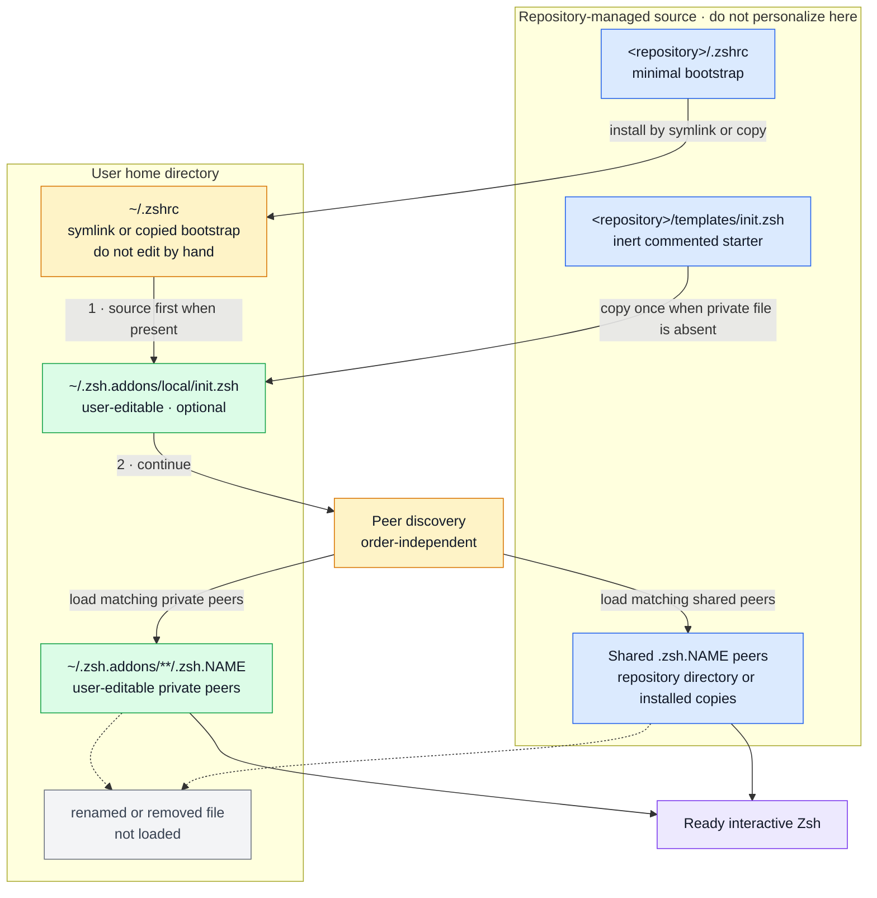

# Compozsh

A polished, self-contained Zsh setup with no frameworks, prompt themes, or
third-party plugins.

Before installing, read [Security and privacy](SECURITY.md) for the no-phone-home
boundary, the complete `sudo` and local-data inventory, and commands that let
you audit the exact commit yourself.

## Start with your next task

| What you want to do | Entry point | What happens next |
| --- | --- | --- |
| Browse a known folder | Type `~/`, `./`, `/`, or another directory path, then press Tab | Right enters a child; Left goes back; Enter inserts an editable path |
| Recall a visited folder | Option-Tab at the prompt | Filter this shell's native directory stack; Enter inserts its path, Ctrl-O browses it |
| Find a file below a folder | Path + Tab → Ctrl-F | Review the displayed source and scope, enter a discovery query, then press Enter |
| Act on a found file | Select it and press Enter | Choose Open with default app, Reveal in Finder, Copy path, or Insert path |
| Switch a local Git branch | `g` | Filter recent local branches; Enter switches, Ctrl-Y copies the name |
| Manage Git worktrees | `g -w` or `g --worktree` | Create, enter, move or remove checkouts through fuzzy choices and explicit reviews |
| Review Git changes | `g` → Ctrl-X | Read working changes or selected-branch commits, drill into files and colored diffs |
| Recall a command | Ctrl-R | Match remembered fragments in any order; selection returns an editable command |
| Discover your custom tools | `compozsh` | Explore loaded public functions and their safe help |

These tools share a responsive full-screen layout, visible action hints and a
**Ctrl-K keyboard guide**. Escape returns or cancels. Inserting a directory
does **not** change it immediately: review the visible path, then press Enter
at the normal prompt. File actions are explicit and use the exact selected item.

Ctrl-F defaults to scoped Git discovery within repositories, Spotlight at home
or root on macOS, and bounded filesystem search elsewhere. It shows the source,
scope and **Searching…** before capture; failed sources are reported separately
from empty results and never silently replaced with a home-directory crawl.
See [search coverage and limits](#filesystem-search-in-the-path-workspace).

Option-Tab needs [Option as Meta](#option-as-meta-one-time-setup) in the active
Terminal profile. Updating from 1.x? Read the [migration guide](#migration-from-d-and-f):
the filesystem workspace replaces the old `d` and `f` commands.

Using an AI chat alongside your shell? See the [native tab workflow](#chat-and-shell-in-native-terminal-tabs)
for full-sized sessions in one Terminal window.

## What it includes

- A compact two-line prompt that adds a project-runtime line only when relevant
- A compact Git summary with exact staged, modified, untracked, conflicted,
  stashed, ahead, and behind counts
- Clear Git operation warnings for merges, rebases, cherry-picks, and bisects
- Read-only Git review with staged/unstaged changes, local commit history,
  a file navigator and independently scrollable, numbered diff reader
- Command duration for commands that take at least two seconds
- Active Python virtual environment and background-job indicators
- Automatic runtime or toolchain detection for more than 35 project types,
  including native, web, JVM, .NET, functional, scientific, game, scripting,
  and infrastructure languages
- Package-manager, build-tool, framework, workspace, and container context
- Runtime mismatch warnings from project version files
- Shared, deduplicated shell history
- Protection against accidentally overwriting non-empty files with `>`
- Case-insensitive native Zsh completion plus a contextual fuzzy directory
  picker on `Tab`
- Prefix-based history search with Up/Down or `Ctrl-P`/`Ctrl-N`
- A native fuzzy `Ctrl-R` history picker with ranked, order-independent
  fragments and deduplicated results
- One path + Tab filesystem workspace with Browse, explicit scoped Search,
  separate Recents, and safe file actions
- A live `compozsh` tool explorer that discovers public add-on functions,
  searches them fuzzily, and opens their safe self-documentation
- A native bootable-media workspace with explicit media/target selection,
  raw-image verification, Apple `createinstallmedia`, safe Windows-media
  refusal, Finder drag and drop, and target-bound erase confirmation
- Live native history autosuggestions with character, word, and full acceptance
- `Ctrl-X Ctrl-E` to edit the current command in `$EDITOR`
- Live native syntax highlighting for commands, arguments, operators, strings,
  variables, comments, assignments, and redirections
- Searchable, arrow-driven recent-directory and Git-branch selectors with
  numbered direct shortcuts
- Terminal-only native colors for file listings, completion, and matches
- Automatic dark/light terminal palettes with a manual initializer override
- A consistent semantic Git palette for status, diffs, branches, and remotes
- Colored manual pages with highlighted headings, options, and references
- A useful terminal tab title and a few small navigation aliases
- `cpdir` to copy the current working directory without selecting terminal text
- An optional first-loaded `~/.zsh.addons/local/init.zsh` for machine setup
- Automatic loading of focused, order-independent `.zsh.addons/**/.zsh.<name>`
  files
- A native Xcode workspace for choosing schemes and destinations, then building,
  testing, analyzing, cleaning, or launching an app in Simulator
- An Xcode add-on that exports Apple-authored skills for common coding agents

The [`.zshrc`](.zshrc) file is only a tiny bootstrap. Every shared feature lives
as a native, readable peer in [`.zsh.addons`](.zsh.addons), with no framework or
plug-in manager.

## Configuration architecture

The configuration has one explicit initialization boundary followed by peers:
“Configuration base” means `${ZDOTDIR:-$HOME}` throughout this README. Diagrams
and examples use `~` for the normal layout when `ZDOTDIR` is unset; if it is
set, place the active `.zshrc`, initializer, and private peers beneath
`$ZDOTDIR` instead.



`NAME` represents any non-empty add-on name. For example,
`.zsh.company-tools` and `work/.zsh.ruby` both match the real
`.zsh.<name>` convention and load automatically.

Use the diagram as a placement rule:

- Treat the repository `.zshrc`, the contents of its shared `.zsh.<name>`
  peers, and an installed `~/.zshrc` as managed code. Do not place personal
  settings in them. Edit shared contents only when deliberately contributing
  to the project through Git.
- Put early machine setup—`PATH`, Homebrew, runtime selection, trusted vendor
  hooks, and environment inputs required by peers—in
  `~/.zsh.addons/local/init.zsh`.
- Put a cohesive personal feature in any file below `~/.zsh.addons` whose
  basename starts with `.zsh.`, such as `~/.zsh.addons/work/.zsh.company`.
  No manifest or registration step is required; start a new shell with
  `exec zsh` and it appears automatically.
- Disable an add-on by renaming it so the basename no longer starts with
  `.zsh.`, for example `.zsh.company` to `.disabled.zsh.company`, or remove it.
  Renaming a repository peer is the supported toggle, but it intentionally
  appears as a local change in `git status`; its contents remain untouched.

There is deliberately no “core feature” tier. Shell behavior, line editing,
prompt rendering, tools, and optional integrations are all add-ons with the
same status and naming convention. The optional local initializer is not a core
tier: it is the single ordered boundary for prerequisites that must exist before
peers initialize, such as Homebrew, `PATH`, a selected Ruby, trusted early
agent hooks, environment variables, and documented public defaults.
Its `init.zsh` basename intentionally does not match `.zsh.<name>`, so peer
discovery cannot load it twice.

Add-ons need no manifest or registration list: a correctly named file beside
the resolved bootstrap or in the user's add-on directory is enough, and
renaming it disables it. The loader uses lexical traversal only for reproducible
diagnostics. After the initializer, peer units cannot depend on traversal order:
renaming or loading the same enabled files in another order must produce the
same final shell. This prevents numeric prefixes, dependency metadata, extra
initialization phases, and other plug-in-manager ceremony from creeping in.

Repository layout:

```text
compozsh/
├── .agents/skills/        repository-scoped agent workflows
│   ├── compozsh-platform-review/
│   │   ├── SKILL.md       first-party macOS modernization audit
│   │   └── scripts/       privacy-safe native platform inventory
│   └── compozsh-release-draft/
│       └── SKILL.md       evidence-backed GitHub release drafting
├── .zshrc                 minimal initializer and peer-discovery bootstrap
├── .zsh.addons/           all shared peer features
│   ├── .zsh.appearance    color-scheme selection and light palette
│   ├── .zsh.shell         shell options, history, and native tool colors
│   ├── .zsh.editor        command/path completion, temporary-screen pickers, editing
│   ├── .zsh.find          bounded search, path details, and explicit file actions
│   ├── .zsh.git-review    read-only working changes, commits, files and diffs
│   ├── .zsh.git-worktree  guided worktree creation, entry, moving and removal
│   ├── .zsh.git-syntax    optional bounded system-Vim token snapshots
│   ├── .zsh.help          live tool discovery and help snapshots
│   ├── .zsh.highlighting  command-line syntax and semantic UI palette
│   ├── .zsh.navigation    directory/branch workspaces, details and copying
│   ├── .zsh.output        semantic palette, help styling, native output wrappers
│   ├── .zsh.prompt        prompt, Git state, and project/toolchain context
│   ├── .zsh.sudo-touch-id explicit macOS sudo Touch ID policy management
│   ├── .zsh.tools         small commands and safe Git cleanup
│   ├── .zsh.usb           external-disk formatting and bootable-media creation
│   ├── .zsh.xcode         native Xcode workspace and agent-skill integration
│   └── support/
│       └── git-syntax.vim  trusted adapter; not an autoloaded shell add-on
├── templates/
│   └── init.zsh           inert starter copied once for private initialization
├── install.zsh            safe symlink/copy installer with preview and rollback
├── docs/                  static showcase, independent of the shell
│   ├── index.html         accessible page and installation guide
│   ├── styles.css         responsive visual design
│   ├── app.mjs            safe browser-only demo interactions
│   ├── demo-data.mjs      synthetic task examples and preview outcomes
│   ├── search.mjs         small pure demo-search algorithm
│   └── README.md          local review and GitHub Pages configuration
├── tests/                 isolated shell and optional website checks
│   ├── run.zsh            dependency-free test runner
│   ├── support.zsh        assertions and disposable-shell helpers
│   ├── *_test.zsh         focused behavioral specifications
│   ├── site.test.mjs      optional Node tests for browser search
│   ├── site-scenes.test.mjs  optional Node checks for demo fixtures
│   └── site.browser.mjs   optional local browser interaction checks
├── SECURITY.md            security, privacy, privilege, and self-audit contract
├── LICENSE                GNU GPL version 3 or any later version
├── README.md              user-facing behavior and installation
└── AGENTS.md              contributor and coding-agent contract
```

### Shipped configuration units

The autoloaded convention is `.zsh.<name>`, not `.zshrc.<name>`. Each shipped
peer owns one focused concern and can still be sourced independently:

| File | Responsibility | Main user-facing behavior |
| --- | --- | --- |
| `.zsh.appearance` | Terminal appearance and adaptive defaults | One-shot color-scheme selection uses a passive terminal hint or an explicit preference to select coherent light or dark defaults across prompt, command line, workspaces, diffs, help, Git, and native file colors while preserving initializer overrides |
| `.zsh.shell` | Base interactive-shell policy | Safe redirection, shared history, directory-stack behavior, and terminal-aware native colors |
| `.zsh.editor` | Completion and ZLE editing | Native completion and directory argument browsing; the continuous-screen Browse/Search/Recents workspace and prompt Recents shortcut; location trail, captured file summaries, shallow previews, actions and Back bookmarks; shared screen lifecycle, layout, Control shortcuts, responsive Escape and keyboard guide; fuzzy `Ctrl-R` and history autosuggestions |
| `.zsh.find` | Workspace search and path actions | Scoped Git, home/root Spotlight and bounded filesystem defaults; explicit source choices and failure reporting; filename-first results and type-aware actions on exact files, folders and links |
| `.zsh.git-review` | Read-only Git review | `g` → Ctrl-X opens working changes or selected-branch commits; arrow-driven file → focused diff → full-context reading, Ctrl-R file-list/diff refresh, individual untracked files inside new directories, and single-frame bounded previews |
| `.zsh.git-worktree` | Git worktree actions | `g -w` / `g --worktree` expose Create, Enter, Move / rename, Remove and Refresh in the main menu; shared fuzzy choices compose exact targets and editable destinations, with effects after terminal restoration |
| `.zsh.git-syntax` | Optional captured-code syntax | Apple's system Vim supplies passive lexical tokens for the visible region of supported Git review files; one screen-session worker, latest-viewport publication, stable loading state, plain fallback and no new shortcut or configuration requirement |
| `.zsh.help` | Live tool discovery | `compozsh` fuzzily explores loaded public add-on functions with a responsive help inspector and canonical documentation |
| `.zsh.highlighting` | Live command-line semantics | Distinct styles for commands, aliases, functions, arguments, operators, paths, strings, variables, and comments; shared semantic UI and picker styles |
| `.zsh.navigation` | Native Recents and Git movement | Private native-stack provider and Recents view with editable path insertion for the filesystem workspace; `g` branch picker with commit/upstream details, worktree-mode dispatch, copying and small navigation aliases |
| `.zsh.output` | Semantic command-output colors | Terminal-aware colors for Git, `grep`, `man`, and optional help styling, driven by the customizable `ZSH_OUTPUT_COLORS` palette |
| `.zsh.prompt` | Prompt facts, layout, and rendering | Responsive prompt, Git state, command duration, jobs, virtual environments, and project/toolchain context |
| `.zsh.sudo-touch-id` | Opt-in sudo authentication | `compozsh-sudo-touch-id` inspects, enables, or safely disables Apple Touch ID through the system-supported `sudo_local` PAM policy |
| `.zsh.tools` | Focused utility commands | `mkcd`, `cpdir`, guarded `git-discard-all`, and `prompt-refresh` |
| `.zsh.usb` | External-disk preparation | `format-external-device` formats an explicitly selected whole external physical disk with any applicable personality advertised by Apple `diskutil`; `flash-usb` dispatches raw/hybrid images and full macOS installer apps to native verified handlers, while recognized Windows Setup media ends safely with an explanation before target selection |
| `.zsh.xcode` | Native Xcode integration | `xcode` opens a scheme/destination/action workspace over Apple’s CLI tools and reports bounded test outcomes with failure files; `update-xcode-skills` exports Apple-authored skills to detected coding agents |

`~/.zsh.addons/local/init.zsh` is different from those peers. It is a private,
user-editable initializer and the only file with a guaranteed position: it
loads first. The repository ships a valid, fully commented
[`templates/init.zsh`](templates/init.zsh) starter. Copy it once into the home
directory, then use the private copy only for inputs or prerequisites that must
exist before peers load: command paths, Homebrew or language-manager setup,
runtime selection, trusted early vendor hooks, and documented public defaults.
The tracked starter remains inert and immutable.

To add a new personal unit, create any regular file beneath
`~/.zsh.addons` whose basename follows `.zsh.<name>`:

```text
~/.zsh.addons/
├── local/
│   └── init.zsh              loaded first; private machine setup
├── .zsh.my-shortcuts         discovered automatically as a peer
└── work/
    └── .zsh.company-tools    nested peers work too
```

No list needs updating and no command installs the peer. Run `exec zsh` after
creating, renaming, or removing one.

## Requirements

- Zsh 5.9 or newer (current macOS releases ship with Zsh 5.9); older releases
  are deliberately unsupported
- Git, for cloning and the repository-aware prompt, navigation, and tools
- A terminal with Unicode and color support; no patched font is required
- Full Xcode, only for the optional native Xcode workspace; Xcode 27 or newer
  is required for the separate Apple skill exporter

Check the installed versions with:

```sh
zsh --version
git --version
```

## Security and privacy

Privacy, credential protection, data minimization, and user control are
top-level product goals. Features capture only the facts required for their
visible task, prefer temporary in-memory state, and keep every intentional
persistent boundary explicit.

All processing performed by Compozsh stays on the machine running Zsh.
Compozsh never transmits user or project data under any circumstance. This is a
non-negotiable product invariant, with no telemetry opt-in, debugging exception,
or future network mode. User-configured synced or network-mounted storage,
macOS clipboard synchronization, and programs you explicitly direct to
communicate—such as Git during `push`, `fetch`, `pull`, or `clone`—remain
separate trust boundaries. Compozsh does not configure those destinations or
add data, endpoints, or requests to external commands.

Compozsh has no telemetry, analytics, automatic update check, project server,
or runtime network client. It does retain expected local shell state, including
history and installer recovery backups. Administrator access occurs only in the
two explicitly confirmed external-media tools and the explicit
`compozsh-sudo-touch-id enable|disable` modes. Apple's `sudo` and PAM stack own
authentication input; subsequent privileged operations use non-prompting
`sudo -n` calls against fixed targets.

Read [SECURITY.md](SECURITY.md) for the precise scope and limitations, local
data inventory, website boundary, update-review workflow, vulnerability
reporting route, and copy-paste audit commands. The document is designed so the
claims can be checked against any specific commit without running Compozsh.

### Touch ID for sudo

On macOS Sonoma 14 or later, a compatible Mac with an enrolled Touch ID
fingerprint can opt the system `sudo` service into Apple's `pam_tid`
authenticator. This uses [Apple's update-persistent `sudo_local`
interface](https://support.apple.com/en-us/109030):

```sh
compozsh-sudo-touch-id          # inspect without administrator access
compozsh-sudo-touch-id enable   # install the fixed local PAM policy
```

The first authorization normally asks for your password because the policy is
not active yet. Later `sudo` authentication can use Touch ID. The rule is
`sufficient`, so unavailable or failed biometric authentication falls through
to the normal password authenticator; it does not grant sudo access to an
account that lacks it.

The Secure Enclave performs the local biometric match. `pam_tid` returns an
authentication result to PAM; Compozsh observes only `sudo`'s exit status,
never fingerprint or template data. Compozsh receives no reusable biometric
token; `sudo` can still refresh its separate credential timestamp as described
below. A successful Touch ID authentication avoids typing the sudo password and
therefore reduces password-capture, observation, and replay risk. It
authenticates the user but does not verify that the requested command is safe.

The PAM rule does not change sudo's timeout policy. The `enable` and `disable`
commands do run `sudo -v`, so they can refresh sudo's current cached credential
timestamp. Password and Touch ID authentication have the same ordinary sudo
cache boundary; a process already controlling that terminal session may benefit
from it until expiry. Run `sudo -k` to invalidate the current timestamp.

The command follows the system `/etc/pam.d/sudo_local.template`, verifies that
the system `sudo_local` include still has a later required password fallback, and
rejects ACL-bearing or writable policy paths. Enable creates a temporary file
beneath `/etc/pam.d`, strips inherited ACLs, then publishes only the persistent
`/etc/pam.d/sudo_local` policy as `root:wheel` mode `0444`. It refuses to
replace or remove existing custom policy. The setting persists across new
shells and macOS updates. Apple's `pam_tid` implementation requires a local
graphical session, so SSH and some remote or multiplexed contexts can fall
through to password authentication only when `sudo` has usable terminal input.
See [Apple's Touch ID setup
guide](https://support.apple.com/guide/mac-help/use-touch-id-mchl16fbf90a/mac)
for enrollment.

Because PAM policy controls system authentication, obtain administrator
approval before enabling this on a managed work Mac. Compozsh never enables it
during installation, startup, or updates.

To reverse the Compozsh-managed change:

```sh
compozsh-sudo-touch-id disable
```

Disable removes the file only when its complete contents still match the exact
policy Compozsh installed. If status reports additional hard links, disable
unlinks only `sudo_local`; it never removes the other links, which require
separate inspection. Run `compozsh-sudo-touch-id --help` for the complete safety
and recovery contract.

## Modern-first compatibility

Compozsh targets a deliberately modern Zsh baseline. The minimum supported
version advances when newer language or shell features materially improve
correctness, security, performance, or maintainability. Superseded
compatibility paths are removed instead of preserved indefinitely.

Apple's system shell defines the compatibility ceiling. Each major macOS
release triggers a review of its bundled Zsh, but Compozsh's minimum never
exceeds the version shipped by the latest generally available macOS. Running
Compozsh must not require a Homebrew, MacPorts, or user-compiled replacement
shell.

This is modern-first, not novelty-first. A newer mechanism must provide a
concrete benefit and pass the same correctness, safety, and performance checks
as any other change. Minimum-version increases are documented as breaking
changes so users can make an informed upgrade.

### Review a new macOS release

The repository ships a `compozsh-platform-review` agent skill for deliberate
reviews after macOS major, minor, or patch updates. Codex discovers it from the
repository's `.agents/skills` directory when a task is opened anywhere inside
the clone. Invoke it manually after updating:

```text
$compozsh-platform-review Audit this Mac after the macOS update and recommend evidence-backed Compozsh improvements.
```

The audit compares Apple's bundled Zsh, Terminal.app, and default command-line
tools with the current product. It separates locally observed capabilities,
official release documentation, and inferred opportunities; then evaluates
correctness, security, performance, UI ergonomics, code deletion and
architectural simplification. The default result is a read-only recommendation
report. It does not update software, change preferences, edit Compozsh, or
recommend third-party dependencies.

An exact before/after inventory is optional. Before upgrading, save one outside
the repository:

```sh
/bin/zsh .agents/skills/compozsh-platform-review/scripts/snapshot-platform.zsh \
  --output "$HOME/Documents/compozsh-platform-before.tsv"
```

After upgrading, include that file in the skill request. Without a baseline the
skill still uses the current system, primary release sources, local man pages,
isolated probes and measured prototypes, while disclosing the missing exact
comparison. Snapshots omit personal paths, names, host data, preferences and
hardware identifiers. The structure follows the current
[OpenAI skill guidance](https://learn.chatgpt.com/docs/build-skills).

### Draft a GitHub release

The repository also ships a `compozsh-release-draft` skill for preparing the
next tag, title and GitHub release body from verified evidence:

```text
Draft the next GitHub release from the latest published release and the current repository.
```

Codex can select the skill automatically from that ordinary request. Use
`$compozsh-release-draft` only when you want to force that specific workflow.

The workflow reads the actual latest published GitHub release and resolves its
exact commit before choosing a baseline; it never substitutes the newest local
tag. It then compares the baseline and candidate implementation, public help,
focused tests, README and security contract before including a claim. Explicit
allowlists and final dispatch paths define shipped coverage, so an underlying
tool's broader capabilities or an intermediate commit cannot silently expand
the notes.

Conflicting implementation, help, test or documentation evidence is reported
as a release blocker instead of being guessed away. The skill drafts metadata
only. It does not create a tag or release, commit, push, publish, or write to
the clipboard without a separate explicit request.

## Installation

The repository includes a native Zsh installer. It validates the tracked files,
shows its complete plan, preserves existing state, and rolls back an incomplete
activation. It does not download a framework or run code from another project.

### 1. Clone into a stable location

Save the location in `repo_dir`; every later command then works from any current
directory:

```sh
repo_dir="$HOME/Projects/compozsh"
git clone https://github.com/bitbemol/compozsh.git "$repo_dir"
```

If the repository is already cloned, skip `git clone` and set `repo_dir` to its
existing location. The clone already contains a complete `.zshrc`; do not
create, empty, or replace that repository file.

### 2. Preview the recommended installation

Run a dry run first:

```sh
zsh "$repo_dir/install.zsh" --symlink --dry-run
```

The plan names the active configuration base and every action. Zsh uses
`${ZDOTDIR:-$HOME}` as that base, so the familiar `~/.zshrc` paths below become
`$ZDOTDIR/.zshrc` when `ZDOTDIR` is set.

An existing active `.zshrc` may contain important setup. It does not need to be
empty, and you should not delete or truncate it. The installer archives it under
`.zsh-backups/compozsh-<timestamp>/` before replacement. It never
prints the old file's potentially private contents.

### 3. Install

Run the same command without `--dry-run`:

```sh
zsh "$repo_dir/install.zsh" --symlink
```

Review the displayed plan and answer `y` to continue. The installer then:

- links the active `.zshrc` to the repository bootstrap;
- keeps an existing private `.zsh.addons` tree intact;
- copies `templates/init.zsh` only when `local/init.zsh` is absent;
- archives any active `.zshrc` it replaces; and
- restores the prior state if activation fails.

Start a new shell after a successful installation:

```sh
exec zsh
```

### 4. Enable Option shortcuts in Terminal

For direct **Option-Tab → Recents** and the other Meta-based shortcuts, enable
**Terminal → Settings → Profiles → your active profile → Keyboard → Use Option
as Meta key**. Where separate left/right choices are available, enabling **Left
Option** is sufficient. Then hold that Option key and press Tab at the prompt.
This is a manual, per-profile preference; the installer leaves it unchanged.
See [Option as Meta: one-time setup](#option-as-meta-one-time-setup) for the
meaning, text-entry tradeoffs, and troubleshooting.

### Modes and safety options

| Option | Behavior |
| --- | --- |
| `--symlink` | Recommended. Link the bootstrap to the repository; shared peers stay beside it and update with Git. |
| `--copy` | Copy the bootstrap and shared peers into a marked `~/.zsh.addons/compozsh` namespace. Private peers remain separate. |
| `--dry-run` | Validate and print the exact plan without changing the filesystem. |
| `--clean` | Archive the active `.zshrc` and complete `.zsh.addons` tree, then install a fresh configuration. Nothing is deleted. |
| `--yes` | Accept a previously reviewed plan without an interactive prompt; useful for a non-interactive terminal. |
| `--help` | Show the installation, update, and recovery guide. |

Choose exactly one of `--symlink` or `--copy`. When an interactive terminal is
available, omitting both opens a small mode chooser. `--copy` marks the namespace
it owns and refuses to replace a same-named unmarked directory. Use `--clean`
only when you intentionally want to archive all private add-ons and begin with
the inert initializer again.

Clean mode affects only the active `.zshrc` and `.zsh.addons`. It does not touch
`.zshenv`, `.zprofile`, `.zlogin`, `.zlogout`, the repository, or exported agent
skills. The completion message prints the exact recovery-backup path whenever a
backup was created.

## Apply changes

Open a new terminal, or reload the current shell:

```sh
exec zsh
```

Using `exec zsh` is preferable to repeatedly sourcing `.zshrc`, because it
starts a clean shell instead of stacking hooks and other state.

## Updating

With the recommended symlink installation, pull the repository and start a
clean shell. The linked bootstrap and adjacent add-ons update together:

```sh
git -C "$repo_dir" pull
exec zsh
```

For a copied installation, pull and rerun the installer. It stages the complete
new shared namespace before replacing the marked old one:

```sh
git -C "$repo_dir" pull
zsh "$repo_dir/install.zsh" --copy
exec zsh
```

The symlink installer is idempotent, so rerunning it is also safe. Keep
repository peers unmodified; put machine setup in `local/init.zsh` and personal
features in private `.zsh.<name>` peers instead.

## Project website

The optional showcase lives in `docs/`: plain HTML, CSS, and browser JavaScript,
with no build step, framework, remote fonts, analytics, or shell dependency.
It demonstrates Compozsh with synthetic data; it never executes shell commands.
The README remains the authoritative source for complete product instructions.

The terminal groups examples into **Context**, **History**, **Files**, **Git**,
and **Tools**. Files includes Browse, Recents, scoped Git search and home-index
examples. Choose an example, refine its sample results, and select a file to
preview its action menu. All outcomes are simulations; sample actions never
open applications or access your clipboard. The feature guide below each task
links to its complete documentation.

To review it locally from the repository root, use any static server. If Python
3 is available as a development tool:

```sh
python3 -m http.server 4173 --bind 127.0.0.1 --directory docs
```

Open `http://127.0.0.1:4173/`. No server is installed or started by Compozsh.
See [website maintenance and GitHub Pages setup](docs/README.md) for browser
checks, deployment settings, and the local-review-before-publishing rule.

## Testing

### Is this native Zsh testing?

Yes. Zsh does not include a complete unit-test framework, so this repository
uses a deliberately small harness built from ordinary Zsh functions, arrays,
subshells, and exit statuses. There is no testing library, plug-in, package
manager, or downloaded test runner. A few tests invoke normal system tools such
as `mktemp`, `env`, and Git when those tools are part of the behavior being
tested.

Run the complete suite from the repository root:

```sh
zsh tests/run.zsh
```

The runner discovers every regular `tests/*_test.zsh` file and sources it. Each
file defines test functions and registers their human-readable descriptions
with `test_case`. Every registered test executes in its own subshell, so its
variables, options, directory changes, functions, aliases, and traps cannot
leak into the next test.

Tests that need a shell under test launch another Zsh through `env -i` with:

- a newly created temporary `HOME` and `ZDOTDIR`;
- a minimal fixed environment and locale;
- `-f` so normal startup files are skipped;
- `-d` so global startup files are skipped; and
- `-i` only when the behavior requires an interactive shell.

Consequently, the suite does not read or modify the active `~/.zshrc`, private
add-ons, or history. Destructive helper coverage creates its own disposable Git
repository. A validated cleanup trap removes only the temporary directory made
for that test.

Interactive regressions use Zsh's bundled `zsh/zpty` module to send keys and
real resize signals to an isolated terminal. Resize checks cover the painted
display, search and selection state, existing highlights, and cleanup; a
layout calculation alone does not establish that the redraw worked.
The repaint regression also observes Zsh's automatic refresh before the resize
handler, using a separate event pipe so test markers do not disturb the screen.
Screen-lifecycle checks verify paired alternate-screen entry/exit, cleanup on
selection, cancellation, Ctrl-C and failed input, and inline fallbacks. Full
screen clears must occur only inside the owned alternate screen; no test allows
scrollback erasure. Workspace checks cover anchored search/footer rows, visible
match spans, and exact restoration of a multiline draft and shell prompt after
a real resize. They also exercise redraws while the input reader has an empty
field separator, so rendering cannot depend on the reader's temporary state.
Terminal.app fullscreen/windowed transitions still need a manual visual check;
a PTY does not reproduce the application's scrollback reflow.

### How pass and fail work

Unix commands—including Zsh functions—finish with a numeric exit status. Zero
means success; any nonzero value means failure. The harness uses that same
native contract:

- an assertion returns `0` when its comparison is true;
- a failed assertion prints its expected and actual values to stderr and
  returns `1`;
- the surrounding test function propagates that failure;
- the runner prints `PASS` or `FAIL`, counts the results, and itself exits
  nonzero if any test failed.

For example:

```text
PASS  mkcd creates and enters exactly one requested directory
FAIL  fuzzy history finds unordered fragments and abbreviated commands

18 passed, 1 failed · 2200.0 ms
```

That final process status makes the same command suitable for local development
and future continuous integration. Inspect it manually when useful:

```sh
zsh tests/run.zsh
print -r -- "suite status: $?"  # 0 passed; nonzero failed
```

To run only tests whose descriptions contain a case-insensitive fragment:

```sh
zsh tests/run.zsh fuzzy
zsh tests/run.zsh git-discard-all
```

A filtered run shortens the inner TDD loop. Always run the complete unfiltered
suite before considering the change finished.

### Adding a test

Place the test beside the closest concern in an existing `*_test.zsh` file, or
create a focused new file with that suffix. Use an underscore-prefixed function
for the implementation and register it with a behavior-oriented description:

```zsh
_test_mkcd_rejects_a_missing_operand() {
  test_make_temp_dir || return
  local output='' exit_status=0

  output=$(test_run_noninteractive "$TEST_TMP_DIR/home" '
    source "$1/.zsh.addons/.zsh.tools"
    mkcd
  ' "$TEST_REPO_ROOT" 2>&1) || exit_status=$?

  test_assert_equal 2 "$exit_status" \
    'mkcd accepted a missing directory' || return
  test_assert_contains "$output" 'usage: mkcd <directory>' \
    'mkcd omitted its usage diagnostic'
}
test_case 'mkcd rejects a missing directory operand' \
  _test_mkcd_rejects_a_missing_operand
```

The structure is arrange, act, assert: create isolated state, exercise the
observable behavior, then compare the result. Guard setup and intermediate
assertions with `|| return` so a failure cannot be hidden by a later successful
command. Prefer a public command or durable state over private implementation
details; directly test an underscore-prefixed helper only when its algorithm is
the precise contract being protected.

The suite currently protects bootstrap and discovery behavior, initializer
precedence, order-independent and standalone add-ons, fuzzy history and
directory matching, contextual completion hierarchy and fallbacks, syntax
classification, palette extension, public tools, destructive-operation safety,
and synchronization between the shipped add-ons and this README.

### Strict TDD workflow

For every observable feature or bug fix:

1. Describe the intended behavior and edge cases.
2. Add the smallest test that expresses that behavior without implementing it.
3. Run its description filter and see `FAIL`. Confirm it fails because the
   behavior is missing or broken—not because the test has a syntax or setup
   mistake. This is the **red** phase.
4. Implement the smallest correct change and rerun the focused test until it
   says `PASS`. This is the **green** phase.
5. Improve names, boundaries, duplication, or performance without changing the
   behavior. Keep rerunning the test. This is the **refactor** phase.
6. Run `zsh tests/run.zsh`, syntax checks, and the relevant real-terminal
   checks before finishing.

Do not weaken an assertion merely to make it green. A regression test for a bug
must demonstrably fail against the buggy implementation and remain afterward
to prevent the bug from returning.

Interactive terminal behavior still needs a real PTY check. Automated child
shells can protect the underlying collector, layout calculation, state, and
fallback contracts, but they cannot fully prove colors, cursor placement,
resize behavior, or physical key ergonomics.

## Safe output redirection

The configuration enables Zsh 5.9's `CLOBBER_EMPTY` together with
`NO_CLOBBER`. A normal `>` redirection may create a file or reuse an existing
empty file, but it refuses to erase a non-empty file accidentally:

```sh
print 'replacement' > important.txt
```

When replacing the file is intentional, use Zsh's explicit force-redirection
operator:

```sh
print 'replacement' >| important.txt
```

## Command-line highlighting

The editable command line is highlighted live using Zsh's native lexer and line
editor; no plugin or background process is involved. Resolution follows Zsh's
own rules, so aliases, functions, builtins, external commands, suffix aliases,
global aliases, and `AUTO_CD` directories remain visually distinct.

Each region carries a Zsh 5.9 memo tag. Redrawing the command line therefore
replaces only this configuration's colors and preserves highlights owned by
other native ZLE widgets. To keep every redraw bounded, buffers longer than 512
characters or containing more than 128 lexer tokens remain plain until they
return below those limits; editing and execution are unaffected.

The style names below describe the established dark-background defaults. The
light palette retains each hue family and text attribute with a deeper shade.

| Dark-background style name | Meaning |
| --- | --- |
| Bold purple | Regular alias |
| Bold peach | Suffix alias |
| Bold underlined lavender | Global alias |
| Bold sky blue | Shell function |
| Bold turquoise | Zsh builtin such as `cd` or `print` |
| Bold green | External command such as `git` or `mkdir` |
| Bold underlined azure | Existing directory |
| Bold underlined lime | Executable file used as an argument |
| Underlined pink | Symbolic link |
| Bold underlined violet | Symbolic link to a directory |
| Underlined orange | Regular file with multiple hard links |
| Underlined light gray | Regular file |
| Bold underlined coral | Socket, FIFO, device, or other special file |
| Light gray | Ordinary argument |
| Cyan | Option or flag |
| Bold gold | Reserved word |
| Underlined pale yellow | Structural delimiter |
| Yellow | Conditional operator |
| Bold orange | Arithmetic expression |
| Bold pink | Pipeline operator |
| Bold coral | Boolean operator |
| Bold gray | List or case separator |
| Bold blue | Redirection operator |
| Underlined sand | Redirection target |
| Blue | Assignment |
| Khaki | Quoted string |
| Light blue | Variable expansion |
| Purple | Command or process substitution |
| Salmon | Glob or brace expansion |
| Bold pink-red | History expansion |
| Bright cyan | Escape sequence |
| Peach | Number |
| Gray | Comment |
| Dim gray | Unaccepted history autosuggestion |

The highlighter understands command positions, precommand modifiers, leading
assignments, declaration assignments, pipelines, boolean lists, redirections,
grouping, conditionals, arithmetic commands, loops, case blocks, function
declarations, and Zsh's contextual `always` keyword. Literal path arguments are
checked without evaluating substitutions or globs. Directory-stack paths such
as `~1` are resolved using Zsh's current stack.

Every shell category has a unique color-and-attribute signature. Related
concepts stay within recognizable color families, while prompt identity,
location, Git state, and project metadata use a separate public palette. An
unresolved command deliberately keeps the terminal's normal text color; it
does not turn red merely because the word is still being typed. Git subcommands
and other program-specific arguments remain arguments because only the invoked
program can interpret their meaning.

Compozsh selects a complete light- or dark-background palette once when a shell
starts. In automatic mode it reads the passive `COLORFGBG` environment hint,
when the terminal supplies a valid indexed background color. Because terminal
color indexes are customizable, this is best-effort; an absent or invalid hint
retains the established dark palette. Compozsh does not query the terminal or
read terminal input while loading. The light palette keeps the same semantic
hue families and attributes while using deeper foregrounds, pale diff
backgrounds, and dark native `ls` colors for contrast.

Terminal profiles are independent of the macOS system appearance. Compozsh
does not inspect the system light/dark setting or a Terminal.app profile name,
so a dark Terminal profile remains compatible while macOS is in light mode. If
a light profile does not export `COLORFGBG`—including stock Terminal.app's
usual configuration—set `ZSH_COLOR_SCHEME` explicitly in the local initializer:

```zsh
ZSH_COLOR_SCHEME=light  # auto (COLORFGBG hint), light, or dark
```

The selection is made for each new shell. Existing shells retain the palette
they started with.

A hard link has no unique shell syntax: every linked name is an ordinary file.
The orange hard-link style therefore means the filesystem reports a regular
file with a link count greater than one. Symlinks are separate filesystem
objects and can be identified directly.

Command-line syntax and prompt UI use separate public maps, so changing an
identity or path color cannot silently change a syntax category. Set only the
desired role in `~/.zsh.addons/local/init.zsh`. For example:

```zsh
typeset -gA ZSH_HIGHLIGHT_STYLES ZSH_PROMPT_COLORS
ZSH_HIGHLIGHT_STYLES[command]='fg=118,bold'
ZSH_HIGHLIGHT_STYLES[comment]='fg=243'
ZSH_PROMPT_COLORS[identity]=110
ZSH_PROMPT_COLORS[path]=117
```

## macOS keyboard shortcuts

The editor uses macOS-friendly Emacs navigation, so it does not depend on the
Home, End, or forward-Delete keys missing from compact Apple keyboards:

| Key | Action |
| --- | --- |
| `Ctrl-A` | Move to the beginning of the line |
| `Ctrl-E` | Move to the end of the line |
| `Ctrl-B` / `Ctrl-F` | Move backward / forward one character |
| `Option-B` / `Option-F` | Move backward / forward one word |
| `Option-Left` / `Option-Right` | Move backward / forward one word |
| `Ctrl-D` | Delete under the cursor; on an empty command line, send EOF (normally exits the shell) |
| `Option-Backspace` / `Ctrl-W` | Delete the previous word |
| `Option-D` | Delete the next word |
| `Ctrl-U` | Delete the editable line |
| `Ctrl-K` | Delete from the cursor to the end |
| `Ctrl-Y` | Restore the most recently deleted text |
| `Ctrl-_` | Undo the last edit |
| `Up` / `Down` or `Ctrl-P` / `Ctrl-N` | Search history using the typed prefix |
| `Tab` | Browse a lone `AUTO_CD` path or an explicit directory argument at line end; otherwise complete natively |
| `Option-Tab` | Open Recents directly; selection inserts an editable path, cancellation preserves the draft/cursor (requires Option as Meta) |
| `Shift-Tab` | Complete backward natively; switch panes in pickers, or go Back in the folder browser |
| `Ctrl-R` | Open fuzzy history search |
| `Ctrl-L` | Redraw a clean terminal screen |
| `Ctrl-X Ctrl-E` | Edit the command in `$EDITOR` |

Home, End, and `Fn`/Globe-based key sequences remain supported as optional aliases
when the terminal sends them.

`Cmd-C`, `Cmd-V`, `Cmd-K`, and other Command-key shortcuts remain owned by the
terminal application and macOS. They are intentionally not shadowed by Zsh;
the shell generally never receives those key combinations.
**Ctrl-Tab / Ctrl-Shift-Tab** also stay with Terminal's next/previous tab actions,
as listed in Apple's [Terminal shortcuts](https://support.apple.com/guide/terminal/keyboard-shortcuts-trmlshtcts/mac).

### Option as Meta: one-time setup

**Meta is a modifier role**, like Control or Shift, used by terminal programs
to distinguish extra shortcuts. Your keyboard does not need a key labeled
Meta: Terminal can assign that role to **Option (⌥)**. Notation such as `M-b`
means “hold Meta and press b.” Terminal-style Meta shortcuts commonly use an
Escape-prefixed character sequence; see the [GNU keyboard notation guide](https://www.gnu.org/software/bash/manual/html_node/Introduction-and-Notation.html).

Enable the setting for each Terminal profile you use:

1. Open **Terminal → Settings → Profiles** and select the profile used by your
   current window or tab.
2. Open **Keyboard** and enable **Use Option as Meta key**.
3. If your Terminal version offers separate left/right choices, **Left Option
   alone is enough**. Right Option can retain normal character entry. If the
   setting is a single checkbox, it may apply to both keys; follow that UI.
4. At the ordinary prompt, hold the enabled Option key and press **Tab**.
   **Recent directories** should open. Press Escape to return to your draft.

This is a **per-profile** preference, not a system-wide keyboard remapping.
Compozsh never changes it automatically. Apple's [Keyboard settings guide](https://support.apple.com/guide/terminal/change-profiles-keyboard-settings-trmlkbrd/mac)
documents the preference and its profile scope.

With Meta enabled, Option-Tab sends the `ESC TAB` sequence that Compozsh binds
to Recents. You press **Option-Tab together**; the bytes are transport details.
Inside a Compozsh full-screen tool, **Option-Up/Down** similarly pages the
focused pane. It complements the always-supported **Fn-Up/Down** page gesture.
Terminal.app versions and profiles may encode that gesture as either an xterm
modified-arrow sequence or a Meta prefix followed by an ordinary arrow;
Compozsh accepts both forms without exposing their bytes as filter text.
Standalone **Escape still cancels** a picker. Enabling Meta does not assign an
action to every Option combination; the receiving shell or application decides
which combinations it supports.

**Text-entry tradeoff:** a Meta-enabled Option key can stop producing the
alternate symbols or accents your keyboard layout normally assigns to it.
Keeping the other Option key in its normal mode, where supported, preserves
that access. This also affects other terminal programs using the same profile;
ordinary Command shortcuts remain with macOS and Terminal.

**No shell reload is needed for the Terminal preference itself.** Use `exec zsh`
after installing or updating Compozsh's code so its bindings are loaded. That
starts a fresh shell and resets its in-memory directory stack; Recents initially
contains the current folder and grows as you navigate.

If Option-Tab still completes like plain Tab, check the **active profile**, the
Option key you enabled, and custom keyboard mappings. Zsh cannot distinguish
gestures delivered as identical bytes. You can still reach Recents through
**path + Tab → Ctrl-X → Go to · Recent directories** without Meta enabled.
The rest of Compozsh, including path + Tab and Control-based picker commands,
works without this preference.

## Chat and shell in native Terminal tabs

Keep an AI CLI chat running in one tab and use another for navigation, Git review,
tests, and commands. Each tab fills the same Terminal window; switching tabs
leaves the other session running. This workflow uses Terminal.app's built-in
controls and needs no additional installation, Compozsh configuration, or
automation permission.

1. Start your usual AI CLI in the first tab.
2. Press **Cmd-T** to open a second tab for your working shell.
3. Press **Ctrl-Tab** to switch between them. With two tabs, it toggles directly
   between chat and shell, including while the AI CLI or a Compozsh view is open.
4. Optionally press **Ctrl-Cmd-F** to enter or leave full screen.

| Key | Action and owner |
| --- | --- |
| `Cmd-T` | Terminal: open a new tab |
| `Ctrl-Tab` / `Ctrl-Shift-Tab` | Terminal: select the next / previous tab |
| `Ctrl-Cmd-F` | Terminal: enter / leave full screen |
| `Option-Tab` at the prompt | Compozsh: open recent directories; requires [Option as Meta](#option-as-meta-one-time-setup) |
| `Ctrl-R` at the prompt | Compozsh: search command history |

Terminal owns tab switching, so these controls work while another program owns
the shell's input. See Apple's [Terminal shortcuts](https://support.apple.com/guide/terminal/keyboard-shortcuts-trmlshtcts/mac).

For optional refinements, open **Terminal → Settings → General**:

- Choose **New tabs open with → Same Working Directory** to start a new tab in
  the active tab's folder. Later directory changes remain independent.
- Enable **Use ⌘-1 through ⌘-9 to switch tabs** for direct access to numbered
  tabs, for example chat, shell, and tests. These are Terminal preferences;
  Compozsh does not change them. See Apple's [General settings guide](https://support.apple.com/guide/terminal/change-general-settings-trmlstrtup/mac).

Tabs have separate shell sessions, directory stacks, and scrollback. Compozsh
still shares command history, and tabs working in the same repository share its
files, index, and checked-out branch: coordinate edits and branch switches with
any running AI or build. Switching tabs preserves running programs; closing a
tab or quitting Terminal can terminate them. Tabs provide no detached-session
or restart-persistence guarantee.

## Contextual directory completion

The filesystem workspace has three named views: **Browse** for a folder's
children, **Search** for explicit discovery below that folder, and **Recents**
for this shell's visited locations. Use **Ctrl-X** for its actions/view menu.
A direct **Option-Tab** shortcut opens Recents from the ordinary prompt (with
Option as Meta enabled).
`g` stays separate because its scope and actions are Git-specific.

The two entry points serve the same navigation task with different starting
knowledge:

| Starting point | Gesture | Source and primary result |
| --- | --- | --- |
| A known folder (path-led) | `~/`, `./`, or another directory path + Tab | Browse that folder; Enter inserts an editable path |
| A remembered location (recall-led) | Option-Tab | Search this shell's directory stack; Enter inserts an editable path |

Both resolve an exact location and can continue in the same browser. From
Recents, **Ctrl-O** browses the selected folder; that folder can then scope a
Search. Recents never broadens into a whole-disk search. The visible Enter label
always names the next action, and Escape returns without applying it.

Both entry points finish at the ordinary prompt with the selected, safely quoted
path visible and the cursor at its end. A lone path or Recents selection replaces
the existing draft; selecting a directory argument replaces only that argument.
Selection does not change directory or execute the command. Review the draft,
then press **Enter at the prompt** to run it (a lone path uses Zsh's `AUTO_CD`).
Cancelling or copying keeps your original command, cursor and directory unchanged.

For example, `vim ~/Developer` + **Tab** browses that folder. Choosing `example/`
leaves `vim ~/Developer/example/` ready to edit or run. Explicit directory
arguments starting with `~/`, `/`, `./`, or `../` work without `AUTO_CD`, including
quoted absolute paths and escaped spaces. Earlier arguments remain unchanged.

A lone `AUTO_CD` directory path opens the same searchable picker:

```text
❯ ~/Projects/
Compozsh / Directory browser              Enter: insert · Results
Hidden: off · child directories · 3 files · 2 shown
~ › Projects
Filter folders ‹›
[1] ● example-app/
[2]   experiments/
⏎ insert · Esc cancel · ^K keys · ^Y copy · ↑↓ move
```

This condensed example shows the navigator's title, breadcrumb and search.
On a wide terminal, a quiet **Location** trail sits to the left of the main
folder list, with a secondary **Preview** pane on the right. The trail appears
from 120 columns; below that, the list and preview take priority. Below 100
columns the list uses the full width and previews become a focused view.
Shortcuts stay near the bottom; very short windows omit the breadcrumb.

**A folder with no child directories can still contain files.** The browser
shows its captured file count in the header. With no matching directories, the
main body distinguishes **no child directories**, **no visible entries**, and
**no directories match this filter**. It shows counts and up to eight
non-directory names from the same level capture, with a remaining-count notice.
These are informational: they have no selection numbers and cannot be inserted
or executed by Enter. Ctrl-F opens scoped Search and its file actions. Hidden names
follow the visibility setting; an empty visible scope does not mean the folder
has no hidden entries. Counts and samples refresh on entering/re-entering a
level or changing visibility; typing and resizing use the captured facts.

| Browser key | What it does |
| --- | --- |
| Right / Tab | Enter the selected folder |
| Left / Shift-Tab | Return to the preceding level, restoring selection and filter |
| Ctrl-O | Preview the selected folder; with no selection, preview the current folder |
| Ctrl-F | Search descendants of the displayed folder; Return submits the query |
| Ctrl-E / Ctrl-B | Focus the preview / return to the folder list |
| Ctrl-X | Open folder actions, including **use current folder** |
| Ctrl-T | Toggle hidden folders |
| Ctrl-Y | Copy the absolute path and close, if `pbcopy` is available |
| Ctrl-K | Open the shared keyboard guide |

Hold Control while pressing the letter; no sequential Escape chords or Meta
setting are required. Escape cancels with a short terminal-sequence decoding
allowance; Ctrl-G cancels immediately. Ordinary letters and punctuation remain
search input. These shortcuts apply only while the picker is open.

**Preview** reads only names and entry types from one explicitly requested
folder. `▸` marks a directory, `·` another entry, and `↗` a symbolic link.
It never reads file contents or traverses child symbolic links. Explicitly
previewing a selected link to a folder follows that requested target.
The sample stops at 40 entries in filesystem order, with a visible limit notice
when more exist. Hidden names follow the browser toggle. Moving selection,
filtering or resizing never loads a preview; press Ctrl-O again to refresh.
Only the most recently requested preview is retained, until you change levels
or close. A requested preview uses the available reading height; Ctrl-E and
page keys let you read longer snapshots. Narrow windows focus it immediately.
With no directory selected, the current-folder preview opens in the full main
body at any width. Ctrl-B returns to the informational summary; Ctrl-E returns
to that captured preview without scanning again.

**Ctrl-X options** offers insertion, explicit directory changes, copying,
opening with the default app, Finder reveal, scoped Search, and separate Recents
in one searchable menu:

| Group | Meaning |
| --- | --- |
| Selected folder | Actions on the highlighted folder, including insertion, directory change, copying, opening, and Finder reveal when available |
| Selected file / Selected link | Search-result actions on the exact highlighted item: insertion, copying, opening, and Finder reveal; directory links offer an explicit Enter linked directory action |
| Current folder | Actions on the opened folder, including insertion, directory change, Browse, and scoped Search; copying/opening/reveal target it when no item is selected |
| Go to | Independent navigation to Recent directories, sourced from this shell's native stack |

Rows stay together by group, and every row retains its group label when filtered
or paged. Details show the exact path an action uses. With an empty filter,
digits apply visible action rows directly; no extra group-selection step is needed.
Unavailable capabilities are omitted. Search always uses the current folder.
Escape closes the menu back to the same filter and selection. Apps launch only
after you select an action and the picker screen is restored. **Open with
default app** opens a folder in its registered app (normally Finder), or a file
in its associated app. **Reveal in Finder** opens the containing folder and
selects the exact item; it does not open that item.

The fragment already typed stays as a required fuzzy match, while the picker
query starts empty. A visible digit therefore inserts its row immediately; you
can instead type another fuzzy filter or move with `Up`/`Down` and
`Ctrl-P`/`Ctrl-N`. Press `Tab` or `Right Arrow` to open the selected directory
inside the same picker. `Shift-Tab` or `Left Arrow` returns to the previous
level reached during that picker session. Back restores that level's filter,
selected directory, and scroll position. The directory is identified by its
path, so a newly added sibling cannot silently change the selection. If the
selected path has disappeared, selection starts at the first remaining match.
Back at the starting level keeps the current view and explains the boundary.

A visible number or `Enter` inserts the selected full path and appends `/`; it
does not change directory or execute anything. Press `Enter` once the picker
closes to run the resulting command or let Zsh's native `AUTO_CD` enter a lone
path. Empty folders are usable levels: Ctrl-X → **current folder** selects them,
or Left goes Back.
Unreadable or removed children preserve the last usable level with a notice.

Press **Ctrl-T** to toggle hidden directories.
A plain `.` still filters normally. Hidden directories start off unless the
typed name begins with `.`, and the chosen visibility follows you through this
navigator session. Toggling preserves the filter and selected path where it
remains visible. An empty result view can be recovered by toggling again or
clearing the filter; the original typed path fragment remains a required match.

**Ctrl-Y** or **Option-W** (with Meta enabled) copies the selected **absolute
path**, without shell escaping or a trailing newline, and closes the navigator.
Your original editable command is preserved. Copy appears when `pbcopy` is
available; SSH sessions use the clipboard of the machine running Zsh. A copy
failure is reported without replacing the command line.

Only immediate child directories are collected. Symbolic links to directories
are included, and spaces or shell-special characters are escaped before
insertion or drill-down. Drill-down, Back, and hidden-folder toggles capture only
the requested level; a failed transition may recapture the previous level to
recover. Filtering, selection movement, and resizing use the captured children.
Browsing launches no subprocess and performs no
recursive scan or network access. Folder enumeration can still wait on a slow
or unavailable mounted filesystem. Explicit copying invokes `pbcopy`, and
explicit Finder reveal invokes `open -R`, after the picker screen is restored.
Captured children and navigation bookmarks are
released on exit, with no persistent index or saved navigation history.

Commands, options, ordinary arguments such as `git switch`, file arguments,
directory-argument prefixes with no matching directories, trailing whitespace,
and a cursor in the middle of the line delegate to Zsh's original
`expand-or-complete` widget. So do missing or unreadable parents, shell operators,
argument expansions or wildcard syntax, and quoted/escaped tildes. An exact
command name still wins over a same-named directory in command position.
Outside the picker, `Shift-Tab` continues to use native reverse completion.

At most ten rows are shown so every visible index remains a single direct key.
Arrows scroll through all matching children at the current level, and page keys
jump through the list. Right/Tab still opens a child; Left/Shift-Tab returns to
the parent. Scrolling does not traverse other directory levels.
Change the smaller bound from the local initializer when desired:

```zsh
ZSH_DIRECTORY_PICKER_MAX_RESULTS=8
```

## Filesystem search in the path workspace

Open a folder with **path + Tab**, then press **Ctrl-F**. In **Search descendants**,
enter the fragments you remember and press **Return** to capture results using
the source shown above the query. **Escape** returns to the same browsing filter,
selection, viewport and preview focus. The scope is the **displayed current
folder**, never the highlighted child:

| Starting path | Scope |
| --- | --- |
| `./` + Tab | Current directory and descendants |
| `~/` + Tab | Home and descendants |
| `/` + Tab | Filesystem root; defaults to Spotlight for indexed Mac-wide discovery on macOS |
| `~/Projects/` + Tab | That folder and descendants |

Opening any path only lists its immediate children. **Filter folders** narrows
that captured level. **Search descendants** is a separate, explicit discovery
step: typing, paging, moving selection, and resizing never start a deeper scan.
Inside a Git repository, a subfolder remains the scope; it is not silently
expanded to the repository root. Ctrl-F selects a default once on entry:

| Displayed folder | Default source |
| --- | --- |
| Inside a Git worktree | Git, scoped to that folder (takes precedence) |
| Exactly home (`~/`) or root (`/`) on macOS | Spotlight index |
| Other folders, or home/root on other systems | Bounded filesystem walk |

**Ctrl-X** offers explicit source choices. The resolved source stays fixed when
editing or retrying the query. A missing or failed Spotlight command never
triggers a fallback filesystem walk. To search a home subfolder through Spotlight,
choose **Search Spotlight index** in Ctrl-X.

| Search source in Ctrl-X | Coverage |
| --- | --- |
| Search filesystem | Bounded native breadth-first walk, including hidden entries; skips `.git`, unreadable folders, and traversal through directory symlinks |
| Search Git files | Tracked and non-ignored untracked files below the current folder, plus matching containing directories; empty folders may be absent |
| Search Spotlight index | macOS indexed paths below the current folder; seeds filenames with the longest query fragment |

Git and Spotlight entries appear when their commands are available. Git must
also recognize the chosen folder as part of a working tree. An unavailable
source or successful search with no matches stays inside the workspace with a
distinct explanation. If a source fails after returning some matches, those
remain usable with a failure and **partial** warning.
Spotlight can miss excluded, unavailable, or unindexed paths, and abbreviated
or directory-only seeds may miss even indexed files. Root scope is **not an
exhaustive search-until-found guarantee**. Mounted filesystems can still block.

**Searching…** is painted with the scope and query before capture starts.
Capture is synchronous: blocked source reads can delay keyboard input and
resize handling until they return. A first search can take longer while the OS
loads index data or checks access; Compozsh cannot bypass macOS privacy controls.
The waiting screen is a status, not a progress estimate. Results then use the
current window size; filtering, paging, and repainting do not recapture.

Matching is case-insensitive and operates on paths, not file contents.
Space-separated fragments may appear in any order; each fragment may also
abbreviate characters in order. For example, `net cli` can match
`Sources/Network/Client.swift`. Query text is literal; shell quoting is not
needed inside the workspace. Empty/whitespace-only search submissions do nothing.

After capture, **Filter results** refines only those captured paths. **Ctrl-F**
reopens the submitted query: edit it and press Return to capture again using
the same folder and source, or Escape to keep the existing results and position.
Use **Ctrl-X** to choose another source. The header preserves the source,
scope, original query, candidate count, and any **partial** warning.

Results show filenames first and quiet parent paths. `●` marks selection, `·`
marks a file, `▸` a directory, and `↗` a symbolic link. Full paths remain intact
for actions even when labels are abbreviated.

- Enter or a visible digit inserts a directory path into the editable line.
- For files and links, **Enter → choose an action** is the primary workflow:
  open the shared **File actions** menu, then choose Open, Reveal, Copy or Insert.
  No additional shortcut is needed for these actions.
- **Ctrl-X options** is optional: it also exposes source choices and folder
  operations. It opens grouped actions for the exact selected file, folder, or link;
  folder results also offer Open with default app and Reveal in Finder here.
- Ctrl-Y copies the literal absolute path and closes when `pbcopy` is available.
- Escape from file actions restores the same query, selection, and scroll
  position without recapturing. Ctrl-C aborts the entire workspace.

| File action | Effect |
| --- | --- |
| Open with default app | Explicitly use macOS associations; this can launch an application, so open only trusted files |
| Reveal in Finder | Open the containing folder and select the exact item using `open -R` |
| Copy path | Copy its absolute path without a trailing newline |
| Insert path into command line | Return a shell-quoted path to the editable prompt; review before running it |
| Enter linked directory | Explicitly follow a directory symlink and change directory |

Opening/revealing requires macOS `open`; copying requires `pbcopy`. Missing
actions are omitted, and broken links have no Open action. Actions operate on
the host running Zsh, after screen cleanup, and recheck mutable filesystem facts.
Selection never executes a file. Content previews are not provided.

The shared Path inspector displays captured type and full path; Ctrl-E/B or
Tab switches focus. It is secondary and width-aware, with a 48-column cap.
Resize and detail scrolling do not rediscover paths.

Direct walks inspect at most **20,000 entries**; every provider retains at
most **2,000 matches**. Partial results are labeled. Up to ten rows are visible
at once; arrows and the shared page keys reach later captured matches. Visible number
slots are local to the viewport; numbers become query text after typing.

```zsh
ZSH_FILE_SEARCH_MAX_RESULTS=10
ZSH_FILE_SEARCH_MAX_VISITED=20000
ZSH_FILE_SEARCH_MAX_CANDIDATES=2000
```

### Migration from d and f

This is a **breaking interface change in 2.0.0**. The shared configuration and
private add-on layout stay the same; the filesystem entry points change:

| Previous interface | Current workflow |
| --- | --- |
| `d` | Option-Tab at the ordinary prompt |
| `d --list` | Native `dirs -v` |
| `f query` | `./` + Tab → Ctrl-F → enter the query and submit |
| `f --home query` | `~/` + Tab → Ctrl-F → enter the query and submit |
| `f --root path query` | Open that path with Tab → Ctrl-F → enter the query and submit |
| Explicit `f` search-source flags | Ctrl-X options in the workspace; choose the desired source |
| `f --list` / `f --print0` | Native `find`, `git ls-files`, or `mdfind` for scripts |

Selecting a directory now inserts its quoted path for review; submit it at the
normal prompt to change directory. Escape is cancellation; use Control keys
for in-view actions and Ctrl-K to check the current map. Ctrl-F starts/edits
scoped search; Ctrl-E focuses details. Update private aliases or scripts that
called the retired commands; the installer does not rewrite personal files.

`d` and `f` have been removed. Recents is available through **Option-Tab**
(Option as Meta) at the prompt and **Ctrl-X → Go to · Recent directories** inside the path
workspace. Search scopes come from the path you open. `g` remains the separate
Git workspace.

The former `f --list` / `f --print0` scripting API is also removed. Use native
`find`, `git ls-files`, or `mdfind` with their documented quoting and NUL-output
options for scripting. `dirs -v` prints native stack indexes. Run `exec zsh`
after updating to clear functions and bindings held by the old shell.

`compozsh --help` includes the workspace reference; **Ctrl-K** shows the
contextual keyboard guide inside every view.

## History autosuggestions

As text is entered at the end of the command line, the unused suffix of the
newest matching history entry appears in dim gray:

```text
❯ git sw│itch feature/native-ghost
        └─ unaccepted suggestion
```

Suggestions use a case-sensitive literal prefix, which makes them stable and
predictable while typing. They are display-only: pressing `Enter` executes
exactly the editable text before the ghost suffix. Accept one explicitly with:

| Key | Action |
| --- | --- |
| `Right Arrow` or `Ctrl-F` | Accept one character |
| `Option-F` or `Option-Right` | Accept through the next word |
| `Ctrl-E` | Accept the complete suggestion when already at line end |

The wrapped keys retain their normal behavior when a suggestion is unavailable
or the cursor is not at the end of the line. Thus, the first `Ctrl-E` moves a
mid-line cursor to the end and a second accepts the visible suffix. End or
`Fn`/Globe-Right also accepts the complete suggestion when its escape sequence
is available. Accepted text participates in Zsh's normal undo history, so
`Ctrl-_` can undo an acceptance.

The redraw hook searches at most the 512 most recent Zsh history event numbers,
newest first, and caches the current match while its prefix grows. Older or
sparse entries outside that bounded window are intentionally omitted. It
launches no subprocess and writes no index.
It deliberately stays hidden for an empty or private leading-space command,
an active selection or completion suffix, a moved cursor, recursive editing,
multiline input, and any history entry containing terminal control bytes. The
`Ctrl-R` picker temporarily owns the display, then restores suggestions when it
closes.

Both behavior and appearance can be changed from the local initializer:

```zsh
typeset -gA ZSH_HIGHLIGHT_STYLES
ZSH_AUTOSUGGEST_ENABLED=0
ZSH_HIGHLIGHT_STYLES[autosuggestion]='fg=241'
```

## Fuzzy history search

Press `Ctrl-R` to open an in-memory history picker. Start typing any characters
you remember. A single fragment may be abbreviated in character order, so
`gtsw` can find `git switch feature/example`. Separate remembered fragments
with spaces and they may appear anywhere in the command: `-c swift` finds
`swift build -c release` even though the command stores them in the opposite
order. Search is case-insensitive and ranks results in predictable tiers:

1. Commands beginning with the literal query
2. Commands containing the literal query
3. Commands containing every literal fragment, in any order
4. If no literal-fragment result exists, character-ordered fuzzy matches for
   every fragment; each fragment stays within one command word to avoid noisy
   cross-word matches

Each tier is newest-first, and duplicate command lines are shown only once.
If the editable command line already contains text, that text becomes the
initial query. Press `Ctrl-U` inside the picker to clear it and browse recent
commands instead.

History, file, directory, and branch selectors share the same safe renderer. A stable
dedicated `Search ‹query›` row keeps user input separate from header metadata
and prevents the layout from shifting after the first character. Long queries
use the available row width and abbreviate visually while preserving the full
value for matching. Query fields, headers, indexes, selected rows, empty states,
and help rows use separate semantic colors that can be customized from
`~/.zsh.addons/local/init.zsh` without changing the picker logic:

```zsh
typeset -gA ZSH_HIGHLIGHT_STYLES
ZSH_HIGHLIGHT_STYLES[picker-header]='fg=75,bold'
ZSH_HIGHLIGHT_STYLES[picker-location]='fg=39'
ZSH_HIGHLIGHT_STYLES[picker-query]='fg=16,bg=44,bold'
ZSH_HIGHLIGHT_STYLES[picker-index]='fg=44,bold'
ZSH_HIGHLIGHT_STYLES[picker-selected]='fg=16,bg=75,bold'
ZSH_HIGHLIGHT_STYLES[picker-selected-inactive]='fg=252,bg=238'
ZSH_HIGHLIGHT_STYLES[picker-focus]='fg=75,bold'
ZSH_HIGHLIGHT_STYLES[picker-match]='fg=81,bold,underline'
ZSH_HIGHLIGHT_STYLES[picker-text]='fg=252'
ZSH_HIGHLIGHT_STYLES[picker-architecture]='fg=117,bold'
ZSH_HIGHLIGHT_STYLES[picker-architecture-selected]='fg=231,bold'
ZSH_HIGHLIGHT_STYLES[picker-size]='fg=221'
ZSH_HIGHLIGHT_STYLES[picker-size-selected]='fg=229,bold'
ZSH_HIGHLIGHT_STYLES[picker-muted]='fg=242'
ZSH_HIGHLIGHT_STYLES[picker-empty]='fg=203,bold'
```

Existing `history-search-*` overrides remain accepted and are migrated to the
corresponding shared picker role when the shared palette initializes.

| Key | Action |
| --- | --- |
| Type | Refine the fuzzy query |
| `Backspace` | Remove the last query character |
| `Option-Backspace` or `Ctrl-W` | Remove the last query word |
| `Ctrl-U` | Clear the query |
| `Ctrl-L` | Redraw a clean search screen |
| `Down`, `Ctrl-N`, `Tab`, or `Ctrl-R` | Select the next result |
| `Up`, `Ctrl-P`, or `Shift-Tab` | Select the previous result |
| `Fn-Down` / `Fn-Up` | Page down / up on Apple keyboards |
| `Option-Down` / `Option-Up` | Page down / up with Option-as-Meta enabled |
| `Ctrl-V` / `Ctrl-D` | Page down / up without requiring Option-as-Meta |
| `Enter` | Put the selected command on the editable line |
| `Esc` or `Ctrl-G` | Cancel and restore the original line |
| `Ctrl-C` | Hard-abort the search and current editable line |

Selection never executes a command. It returns the full original history entry,
including multiline commands, to the normal editor so it can be reviewed or
changed before pressing `Enter` again. Display rows make control characters
visible, truncate to the current terminal width, and reduce automatically in a
short terminal window.

All pickers use the same scrolling viewport: `Ctrl-R` history, Recents,
`g` branches, Files search, the `compozsh` tool explorer, and contextual directory
completion with Tab. Keep moving beyond the last visible row to reveal later
matches; move up to return. The header shows the visible range
and `more ↓` while additional matches may remain, then the exact total once
matching is exhausted. Movement stops at the beginning and end. Changing the
query resets to its first match. Page keys control whichever pane has focus,
including the Help, Branch, and Path detail panels, in wide and narrow layouts.
Focused readers derive their page distance from the currently visible pane
height and retain one overlapping line as a reading landmark. Resizing Terminal
or changing its font therefore changes the next page distance automatically.
Number shortcuts refer to the rows currently displayed and update as you
scroll; they never select hidden results. `Ctrl-R` keeps digits as search text.

Matching grows a buffered prefix only when needed. Ordinary navigation and
resize redraw the visible rows; closing the picker releases its result buffer.

### A full-screen workspace for every picker

In Terminal.app, each picker opens on the terminal's native **alternate screen**,
the same separate display buffer used by tools such as `less`. Your previous
terminal output is temporarily hidden and restored when the picker closes.
This applies to history, directories, branches, files and their action menus,
the tool explorer, and contextual directory completion.

The directory browser keeps that screen open throughout navigation. Entering
folders, going back, toggling hidden items, requesting a preview and returning
from folder actions update the same workspace. Your shell reappears when the
browsing session ends; copying, changing directory and opening Finder happen
after its screen has been restored.

A dedicated title bar identifies the tool: **Compozsh / Directory browser**,
**Compozsh / Branches**, **Compozsh / History**, and so on. When space allows,
the right side shows the selected item's Enter action and the focused view,
such as `Enter: switch · Results` or `Enter: insert · Preview`. It shows
`Keyboard guide` while the guide is open, and avoids advertising a selection
action when nothing is selected.

A quieter status row shows the captured source and result count, followed by
the separate location/source row, dedicated search and a quiet divider.
The title uses the existing first screen row, preserving result capacity.
Narrow windows hide optional title metadata, then the Compozsh prefix, before
abbreviating the tool name. The context row is omitted in very short windows.
Results and details occupy the body, with shortcuts anchored near the bottom.
Filtering down to one result keeps these landmarks in place. Your unfinished
command and prompt are hidden while browsing, then restored when you leave;
each tool keeps its existing accept and cancel behavior.

Every tool uses the same shortcut bar. **Enter**, **Escape**, and **Ctrl-K for
keys** have priority; other complete hints appear as space allows. The bar
names the actual action (`cd`, `switch`, `insert`, or file actions), and only
advertises copying or details when supported. It never cuts a shortcut in half.

Press **Ctrl-K** to open the **keyboard guide**. Arrow keys scroll line by line;
Fn/Option-Up/Down or Ctrl-V/Ctrl-D scroll by a page. Ctrl-K, Escape, Ctrl-G or Enter closes the guide and restores
the exact search, selection, scroll position and pane focus. Ctrl-C aborts the
whole picker. Typing or pressing a number in the guide cannot apply a result.
A plain `?` remains searchable. Primary shortcuts use Control and require no
Terminal profile changes. Escape has a 20 ms allowance to distinguish a lone
key from terminal sequences such as arrows and bracketed paste; it no longer
waits half a second for a following letter. Ctrl-G has no decoding delay.
Option-Up/Down, Option-V, Option-W and Option-Backspace remain optional Meta
alternatives for paging, page-up, copy and word deletion. Fn-Up/Down also page
when sent by the terminal.
There is no need to type Escape followed by a letter for any picker action.

These are **modal picker controls**: for example, Ctrl-K shows keys and Ctrl-D
pages up here. After closing, normal shell editing is unchanged: Ctrl-K deletes
to the end of the line and Ctrl-D retains Zsh's delete/EOF behavior. Command-key
shortcuts continue to belong to Terminal.app.

| Shared key | Behavior |
| --- | --- |
| Up/Down or Ctrl-P/N | Move results; scroll when details have focus |
| Enter | Apply the action named in the footer |
| Escape / Ctrl-G | Cancel, or go back from a secondary view |
| Ctrl-C | Abort |
| Ctrl-U / Ctrl-W | Clear the filter / delete its last word |
| Fn-Up/Down or Option-Up/Down | Page up/down in the focused view; Option requires Meta |
| Ctrl-V / Ctrl-D | Page down / up without requiring Option-as-Meta |
| Tab / Shift-Tab | Switch list/details focus when a panel exists |
| Ctrl-Y / Option-W | Copy the selected value and close, when available |
| Ctrl-K | Open or close the keyboard guide |
| Ctrl-L | Redraw |
| Ctrl-F | Search descendants in Browse; edit discovery query in Search results |
| Ctrl-E / Ctrl-B | Focus details / list, when available |
| Ctrl-O | Browse a selected recent location; inside the browser, preview a folder |
| Ctrl-X | Open **review** on Branches; **options** for filesystem actions/sources/views |
| Right / Left in Git review | Progress files → focused diff → full-file context / reverse those steps |
| Ctrl-R in Git review | Refresh the selected snapshot, preserving focus and source area |
| Ctrl-T | Toggle hidden folders in the browser |

This is the shared Compozsh picker key map. The footer and Ctrl-K guide show
available actions. The documented Git-reader controls apply only within review:
Ctrl-R still opens history at the prompt and advances results in other pickers.
Ctrl-X is inactive in the reader; the arrow flow handles context disclosure.

The directory browser has one explicit hierarchy convention: Right/Tab
enters a folder and Left/Shift-Tab goes Back; Ctrl-E/B focuses preview/list.
Ctrl-F is available only in Browse and Search results; other pickers leave it
inert. These modal controls do not change ordinary prompt editing or suggestions.
Its guide shows previews, folder actions and hidden-folder controls.
History selection always inserts an editable command;
it never runs it. Other tools retain their documented primary actions.

This design applies [recognition cues](https://www.nngroup.com/articles/recognition-and-recall/),
[consistency](https://www.nngroup.com/articles/consistency-and-standards/) and
[progressive disclosure](https://www.nngroup.com/articles/progressive-disclosure/).
These are usability principles informing the layout, not proof that a particular
terminal interface is neurologically optimal. Real keyboard tests and user
feedback remain the acceptance criteria.

Typed filter fragments receive visible emphasis in result rows, including
ordered-character abbreviations. The selected row keeps its selection color
and underlines those fragments. This is display-only: matching, ranking, full
paths, and action values are unchanged. Only complete fragments visible in the
rendered label can be emphasized; queries over 256 characters or 16 fragments
still search normally but skip this extra decoration.

The result list retains its existing row limits and number shortcuts: eight
rows for history and ten for navigation by default, reduced in short windows.
Information panels stay secondary and compact. Focusing a panel gives its
captured text the available body height, making long help easier to read;
returning to the list restores the compact preview. Capture limits are unchanged.

Window and font-size changes repaint the temporary screen from the captured results,
preserving the query and selection. Selection, cancellation, and Ctrl-C release
that screen before any subsequent navigation, clipboard, file, or help action.
The normal screen and scrollback are never cleared to remove picker frames.
Terminals without paired alternate-screen capabilities retain the inline picker.
`compozsh --list` retains its plain-output mode. See the filesystem migration
section for the removal of `d` and `f`.

### History search bounds

The picker captures Zsh's loaded `history` when opened and uses its native
pattern engine, with no subprocess, extra history file, or disk index. It
can search up to 50,000 entries retained across shell restarts and shows at most
eight rows at a time by default. Matching considers the full loaded history,
and scrolling can reach later matches; the result limit only bounds the picker
display. Override that bounded value from
the local initializer if desired:

```zsh
ZSH_HISTORY_SEARCH_MAX_RESULTS=12
```

## Colored manual pages

Running `man` uses the native formatting already embedded in each manual page
and renders it through `less` with the prompt palette:

```sh
man git-switch
man zshoptions
```

Headings and bold terms are cyan, underlined references are yellow, and
standout or search matches use a cyan background. The colors are scoped to the
`man` function, so opening an ordinary file with `less` is unaffected.

The function respects an existing `MANPAGER`, `MANCOLOR`, or
`LESS_TERMCAP_*` value. Set one in the local initializer to replace an
individual default without editing the shared configuration.

## Colored command output

Interactive output uses color only where the producing tool exposes reliable
semantics. Compozsh supplies the active light or dark semantic palette to those
native engines; it never parses and repaints arbitrary command text. Pipes,
substitutions, and redirected data therefore remain byte-compatible.

| Output family | Behavior |
| --- | --- |
| `ls`, `ll`, and `la` | Native file-type colors for directories, links, executables, sockets, pipes, devices, privileged files, writable directories, and dataless files |
| File completion | The same file-type families rendered with the 256-color syntax palette |
| `grep` | Matching text uses the shared match color when stdout is a terminal |
| Git porcelain | Native semantic colors for status, diffs, logs, branches, interactive prompts, advice, and remote success/warning/error messages used by commands such as `clone`, `fetch`, `pull`, and `push` |
| `curl` | curl's own styled HTTP headers are preserved on terminals; response bodies are deliberately untouched |
| Compilers, runtimes, and TUIs | Their own native color and terminal behavior is preserved |
| Man pages | Scoped heading, reference, selection, and search-match colors through `less` |
| Compozsh help | Shared heading, option, example, and safety emphasis for known help text on 256-color terminals; exact plain output elsewhere |
| JSON, CSV, logs, arbitrary tables, and binary data | Left unchanged because their meaning cannot be inferred safely from plain bytes |

Long `ls` metadata such as permissions, owners, sizes, and timestamps remains
neutral; filenames carry the file-type color. Parsing the human-readable column
layout would break on spaces, locales, ACL markers, and unusual filenames.
Likewise, a curl body may be JSON, HTML, source text, an image, or compressed
data. Only curl can safely decide how to render its protocol metadata.

The Git wrapper adds temporary `-c color.*` values only for known human-facing
subcommands when stdout or stderr is a terminal. Git still performs the
terminal detection, explicit options come last, and configuration inspection
or plumbing commands receive the original argv. This explicitly disables color
for one invocation:

```sh
git -c color.ui=never log
```

The automatic behavior is terminal-aware. These stay plain and safe:

```sh
ls -la > files.txt
git diff > change.patch
matches=$(grep TODO README.md)
grep TODO README.md | wc -l
curl https://example.invalid/data > response.bin
```

To intentionally preserve grep colors through a pager, request it explicitly:

```sh
grep --color=always TODO README.md | less -R
```

The public `ZSH_OUTPUT_COLORS` map keeps Git, grep, manual-page, and help emphasis
consistent. Override only desired semantic roles in the local initializer
before peers load:

```zsh
typeset -gA ZSH_OUTPUT_COLORS
ZSH_OUTPUT_COLORS[success]=118
ZSH_OUTPUT_COLORS[warning]=221
ZSH_OUTPUT_COLORS[error]=203
ZSH_OUTPUT_COLORS[match]=199
```

Available roles are `heading`, `accent`, `success`, `warning`, `error`,
`info`, `muted`, `match`, and `text`; values are terminal color indexes
from 0 through 255. Invalid local values fall back safely to the active
background palette. Existing
`GREP_COLOR`, `GREP_COLORS`, and `LESS_TERMCAP_*` values retain precedence.
Set `LSCOLORS` separately for BSD `ls` to replace its adaptive default, or
unset `CLICOLOR` in the local initializer to disable automatic file-listing
colors on a particular machine. An existing `LS_COLORS` value retains
precedence for completion file types.

## Local user and machine settings

The bootstrap optionally loads `~/.zsh.addons/local/init.zsh` before every peer
add-on. Its one responsibility is establishing pre-peer inputs and
prerequisites: Homebrew or language-manager setup, command and completion paths,
selected toolchain versions, trusted hooks that require early loading,
environment variables, and documented public defaults.

The installer creates the private file from the inert tracked starter only when
it does not already exist. To recreate it manually without running a complete
installation, use the active Zsh configuration base:

```sh
config_base=${ZDOTDIR:-$HOME}
if [[ ! -s "$repo_dir/templates/init.zsh" ]]; then
  print -u2 -r -- 'Initializer setup stopped: set repo_dir correctly first.'
else
  mkdir -p "$config_base/.zsh.addons/local"
  if [[ ! -e "$config_base/.zsh.addons/local/init.zsh" &&
        ! -L "$config_base/.zsh.addons/local/init.zsh" ]]; then
    cp "$repo_dir/templates/init.zsh" \
      "$config_base/.zsh.addons/local/init.zsh"
  else
    print -r -- 'Keeping the existing private initializer.'
  fi
fi
```

The starter is copied, never symlinked: the repository version stays immutable,
and later updates cannot overwrite private machine data. Its examples are all
commented, so the untouched file is valid Zsh and has no effect.

Aliases, ordinary functions, and app-specific behavior usually do not need the
first-load exception. Give them focused private peers instead—for example,
`~/.zsh.addons/work/.zsh.work-shortcuts`:

```sh
alias cdmywork='cd "$HOME/Developer/Work"'

startwork() {
  cd -- "$HOME/Developer/Work" || return
  git status --short --branch
}
```

This is the only source-order exception. It establishes the environment peers
need, but it must not call peer functions during source because they are not
loaded yet. Shared scalar defaults, palettes, extension arrays, and convenience
aliases preserve values established here. To replace a shared command or full
prompt, disable its peer instead of defining a colliding private peer.

To load the initializer from a different location, export `ZSH_LOCAL_INIT`
before Zsh starts, usually from `.zshenv` or the parent process:

```sh
export ZSH_LOCAL_INIT="$HOME/.config/zsh/machine-init.zsh"
```

Keep passwords and API tokens out of the repository even when adding examples.
Prefer the system keychain or a dedicated secret store. The committed
[initializer starter](templates/init.zsh) contains no active configuration;
each user's real `init.zsh` remains outside the repository in their home
directory.

Migrating an older installation is a one-time move:

```sh
config_base=${ZDOTDIR:-$HOME}
legacy_init="$config_base/.zshrc.local"
private_init="$config_base/.zsh.addons/local/init.zsh"
if [[ -f $legacy_init && ! -e $private_init && ! -L $private_init ]]; then
  mkdir -p "$config_base/.zsh.addons/local"
  mv "$legacy_init" "$private_init"
elif [[ -f $legacy_init ]]; then
  print -r -- 'Keeping both files; review and merge the legacy initializer manually.'
fi
exec zsh
```

Review the moved file instead of preserving it as a catch-all. Keep only genuine
pre-peer prerequisites in `init.zsh`; move aliases, ordinary functions, and
app-specific behavior into focused private `.zsh.<name>` peers. Any action that
needs a shared peer must run later from an interactive command, hook, or widget.

## Peer add-ons

After the local initializer, the bootstrap recursively loads every regular file
matching `.zsh.addons/**/.zsh.<name>`. A symlink installation loads shared peers
beside the resolved repository `.zshrc` and private peers from the configuration
base's `.zsh.addons`. A copied installation places a marked, installer-owned
shared namespace inside that user add-on tree and scans the complete tree once.
Do not personalize the managed namespace: change shared code in the repository
and rerun `install.zsh --copy`; keep private peers beside it.

```text
.zsh.addons/
├── .zsh.xcode
└── work/
    └── .zsh.company-tools
```

There is no registration list and no core-module list. Create a matching file
and the next shell loads it automatically. Disable one without deleting it by
changing its prefix, for example from `.zsh.xcode` to
`.disabled.zsh.xcode`, or remove the file.

Add-ons are executable shell configuration, not data. Keep this directory under
the same ownership and code-review boundary as `.zshrc`. The loader never
discovers code from the current project and does not follow nested symlink
directories.

Lexical loading makes errors repeatable, but it is not a dependency mechanism.
Each file owns its defaults, helpers, hooks, cleanup, and fallback behavior. It
must not call a peer while being sourced or rely on its filename sorting before
another. Optional collaboration is checked only when the feature runs, so a
missing unit degrades cleanly and every permutation of the same enabled files
converges on the same shell state.

### Creating an add-on

Put a shared integration under the repository's `.zsh.addons` directory. Put a
private peer under the configuration base's `.zsh.addons`. In copy mode, the
installer-owned shared namespace is nested beside those private peers; it is
not a place for personal edits. Nested concern directories are allowed, but the
file itself must begin with `.zsh.`:

```text
.zsh.addons/
└── database/
    └── .zsh.postgres
```

Keep startup work minimal: define functions and settings while the file loads,
then perform tool discovery, filesystem writes, or expensive work only when the
user calls the public command. Do not add dependencies or an ordering prefix;
make the unit stand on its own. A small add-on follows this shape:

```zsh
_postgres_tools_available() {
  (( $+commands[psql] ))
}

_compozsh_help_postgres-status() {
  local -a printer=(print -rl --)
  (( ${+functions[_output_print_help]} )) && printer=(_output_print_help)
  "${printer[@]}" 'usage: postgres-status' \
    'List the PostgreSQL databases available to psql.' \
    '' \
    '  Requires psql on PATH and a reachable configured PostgreSQL server.' \
    '  Uses normal psql connection settings and may prompt to authenticate.' \
    '  Takes no arguments; --help shows this guide without connecting.' \
    '' \
    'Examples:' \
    '  postgres-status    Run psql --list with your current settings.'
}

postgres-status() {
  emulate -L zsh

  if (( $# == 1 )) && [[ $1 == --help ]]; then
    _compozsh_help_postgres-status
    return 0
  fi
  (( $# == 0 )) || {
    print -u2 -r -- 'usage: postgres-status'
    return 2
  }
  _postgres_tools_available || {
    print -u2 -r -- 'postgres-status: psql is not installed'
    return 1
  }
  command psql --list
}
```

Start a clean shell with `exec zsh` after adding or renaming an add-on. Keep only
genuine pre-peer prerequisites in `local/init.zsh`; use a focused private peer
for aliases, functions, apps, defaults, hooks, optional requirements, or other
behavior that does not require that ordered boundary.

### Public and internal functions

Function names beginning with `_` are internal implementation details. Zsh does
not enforce private access, but the leading underscore is this repository's
explicit “do not call or override” convention. Internal helpers may change,
move, or disappear during a refactor without preserving compatibility.

Documented names without a leading underscore form the user-facing interface.
For example, call:

```sh
update-xcode-skills
```

Do not call its helpers directly:

```sh
# Internal implementation details—not user commands:
_detect_xcode_skill_vendor
_install_xcode_skills_for_agent
```

New add-ons should follow the same rule: choose a clear unprefixed name only
for a command users are meant to run, document it here, and prefix supporting
functions and state with `_`.

### Self-documenting commands

Every public add-on function intended to be run directly supports `--help`, so
its current usage is discoverable without opening this README. The complete
shipped add-on command surface is:

```sh
mkcd --help
cpdir --help
git-discard-all --help
prompt-refresh --help
compozsh-sudo-touch-id --help
g --help
flash-usb --help
format-external-device --help
xcode --help
update-xcode-skills --help
compozsh --help
```

All Compozsh-owned help follows one stable contract:

- The first line, ignoring color codes, begins with lowercase `usage:` and
  shows the command's exact invocation syntax.
- The second line explains what the command does in one concise sentence.
- Further lines explain defaults, data sources, search scope and limits,
  options, keys, fallbacks, and practical examples where applicable. Commands
  that change state describe their targets, confirmation, and recovery limits.
- Help returns status `0` on standard output and writes no error diagnostics.
  On supported 256-color terminals, the optional output peer adds semantic
  emphasis. Pipes, redirects, command substitutions, unsupported terminals,
  and a nonempty `NO_COLOR` retain identical plain text.
- Asking for help never navigates, copies, scans, detects tools, changes files,
  prompts for input, uses the network, or requires optional dependencies.

This makes `--help` safe to inspect anywhere, including a machine that does not
have the command's optional tools installed.

Usage and section headings use `ZSH_OUTPUT_COLORS[heading]`, option labels use
`accent`, descriptions and example commands use `info`, and safety/limit or
recovery headings use `warning`. Body text stays neutral. The same renderer
styles direct help and `compozsh help <command>`; disabling `.zsh.output` leaves
all guides usable as plain text. Help styling only checks terminal capabilities
and runs no external commands. For example:

```zsh
g --help                   # Colored in a supported terminal.
NO_COLOR=1 g --help        # Plain for this invocation.
g --help > branch-help.txt # Plain, copyable documentation.
```

The standalone `zsh install.zsh --help` stays plain so displaying installation
help never loads shell add-ons or private configuration.

For your own tools, the optional printer pattern in the add-on example above
uses the same colors. Keep headings unindented, body text indented by two
spaces, and option/example labels separated from explanations by at least two
spaces. Name the examples section `Examples:`. Existing plain-print providers
continue working unchanged.

Use the guides to answer questions such as “does this search the whole disk?”,
“why is this branch missing?”, “does selection run the tool or just show help?”,
and “what happens to my existing files?”. Simple utilities keep their guides
short; search, navigation, installation, and export tools document their wider
behavior. `zsh install.zsh --help` covers installation separately, including
symlink/copy updates, private files, and recovery backups.

Run the explorer with no arguments for the fuzzy picker:

```sh
compozsh
```

### Browse tools with the help inspector

The explorer shows the selected tool's help beside its result list at widths
of 100 columns or more. Narrower windows use a switchable full-width detail
view. This interface uses native Zsh 5.9 and macOS Terminal.app capabilities;
no additional application or UI package is required.

All information panels—Help, Location, Branch, Path, and file-action descriptions—share
one list-first layout. The list receives about two thirds of the usable width;
details use the remaining third, capped at 48 columns. Extra width goes to the
list. Below 100 columns, the list stays full-width until you focus details.

Beside short lists, passive details use up to six rows with quieter headings.
Focusing the panel uses the available body height on the owned full screen;
the inline fallback allows up to twelve reading rows. Longer result lists retain
their visible rows; passive details use that same
height. Warnings keep their emphasis, and longer content remains scrollable.
Moving focus keeps pane widths stable. Every split panel uses the same focus
language: list focus keeps the selected row bright blue; detail focus subdues
that row and marks the active panel with a cyan `┃` rail plus its `▸` heading.
The selected item therefore remains visible while the emphasis identifies
which pane receives movement and page keys. Single-pane narrow layouts use the
focused heading without drawing a divider. Resizing preserves selection and
uses the captured data without rerunning providers.

| Key | Action |
| --- | --- |
| Up/Down or Ctrl-P/N | Select a tool, or scroll when the help pane has focus |
| Right or Ctrl-E | Focus the help pane |
| Left or Ctrl-B | Return to the tool list |
| Tab or Shift-Tab | Switch panes |
| Fn-Up/Down | Page up/down in the focused pane on Apple keyboards |
| Option-Up/Down | Page up/down with Option-as-Meta enabled |
| Ctrl-V / Ctrl-D | Page down/up without requiring Option-as-Meta |
| Type or paste | Refine the filter and return to the list |
| Enter | Close the browser and print the selected tool's complete help |
| Visible digit, with an empty filter and list focus | Show that tool's full help |
| Escape or Ctrl-G | Cancel; Ctrl-C aborts |

Search and selection survive switching panes and resizing. The focused help
pane has the shared focus rail and `▸` marker, a scroll position, and contextual keyboard hints. Help
uses the shared semantic output palette when available; missing peers retain
the ordinary picker and plain documentation paths.

Help companions are captured once when opening the browser: at most 64
providers, 32,768 characters per provider, and 256 wrapped preview lines.
Truncated previews are labeled, and Enter still shows the complete guide.
Scrolling, filtering, and resizing consume the in-memory snapshot without
executing tools or rereading files. Closing the browser releases the snapshot.
These bounds limit preview data; they do not sandbox a private help provider.
As with `--help`, user-defined companions must return promptly and be static
and side-effect-free. Functions lacking a same-file companion are never run.

Use its noninteractive forms when you want copyable output or already know the
command name:

```sh
compozsh --list
compozsh help g
```

Set the maximum visible picker rows before peers load, normally in the private
initializer:

```zsh
ZSH_TOOL_PICKER_MAX_RESULTS=12
```

The catalog is regenerated from Zsh's live in-memory function-source metadata
every time it is requested. It does not scan files, maintain a registry, write a
cache, or depend on add-on loading order. Public functions defined directly in
`~/.zsh.addons/local/init.zsh` or any private `.zsh.<name>` peer appear
automatically; removing or redefining one updates the next view immediately.
Functions from external hooks outside an add-on tree and names beginning with
`_` remain hidden.

The explorer never invokes a public function to test whether it understands
`--help`. Instead, a documented command owns a private companion named
`_compozsh_help_<command>` in the same file. The public command calls that
provider for `--help`, and the explorer calls the same provider directly. This
keeps documentation DRY and makes exploration safe. A user function without a
matching provider still appears as `no help`; selecting it reports its source
without executing it.

Add-on authors must give every new public command the same contract. Define its
companion provider beside it and handle `--help` before detection or operational
logic; the `.zsh.postgres` example above is the canonical starting shape.

`g --help` documents Compozsh's branch picker and worktree workspace; use `git --help` for Git's
own documentation.

Programmatic extension functions such as `prompt_add_project_segment` are APIs,
not terminal commands, and document their call signature where they are used.
Transparent wrappers such as `grep` and `man` preserve the help behavior of the
underlying system command.

### Formatting an external device

Open the native three-step formatter with:

```sh
format-external-device
```

Step 1 captures currently attached whole external physical disks through
`diskutil`. Internal, virtual, read-only, and partition-slice devices are
excluded. Each row identifies the media name, capacity, protocol, and exact
`/dev/diskN`; no action relies on a remembered disk number. The same shared
provider used by `flash-usb` bounds each native plist capture to 1 MiB, 4,096
device entries, and 64 whole-disk candidates. Press **Ctrl-R** to replace the
temporary device snapshot without leaving the workspace. An ejected disk can
remain physically connected while absent from `diskutil`; reconnect it or
power-cycle its hub, then retry the capture.

After selecting a disk, Step 2 asks `diskutil listFilesystems -plist` for the
filesystem personalities available on the current Mac. It shows every
advertised entry instead of maintaining a static format list, including
installed filesystem bundles and special personalities such as **Free Space**.
Details show the user-visible name, exact personality passed to `eraseDisk`,
and Apple’s reported minimum and maximum sizes. A personality outside the
selected disk’s bounds stays visible with an unavailable label and cannot begin
an erase. Going back returns to drive selection; no selection formats anything.

Step 3 asks for the initial volume name with two choices. **Use default name ·
External** continues immediately with `External`; **Give the volume a custom
name…** opens a literal text field. APFS and HFS names accept up to 255 printable
characters without `/`, `:`, control characters, or leading/trailing spaces.
Other formatted personalities use a conservative 11-character subset of
letters, numbers, spaces, underscores, and hyphens. Invalid input stays in the
name field with a concrete format-specific reason and cannot reach confirmation.
Going back returns to the format choices.

Acceptance restores the ordinary terminal and names the exact drive, format,
and chosen volume name. The operation requires the target-bound
phrase `ERASE diskN`, then administrator authorization. Compozsh revalidates
the captured disk fingerprint plus external, physical, writable, whole-disk
eligibility before authorization and again immediately before calling:

```sh
diskutil eraseDisk <personality> <volume-name> /dev/diskN
```

`diskutil` chooses its native partition scheme. Special personalities that do
not create a mounted filesystem may ignore the supplied volume name. Formatting
destroys every existing partition and all data on the selected whole disk. If
`diskutil` fails after beginning the operation, the previous layout may already
be changed; Compozsh cannot restore the partition map or files. Native command
output remains visible so a device or filesystem-driver failure keeps Apple’s
specific diagnostic. On supported 256-color terminals, the shared semantic
palette distinguishes the erase heading, live stages, native field labels, and
successful completion. `NO_COLOR`, redirects, pipes, unsupported terminals,
and a missing output peer retain the exact plain `diskutil` stream and final
summary. Styling does not change native diagnostics or exit status.

### Bootable external-media workspace

Open the media workspace with discovered media or one exact path:

```sh
flash-usb
flash-usb ~/Downloads/Fedora-Silverblue.iso
flash-usb "/Applications/Install macOS Tahoe.app"
```

With no argument, the Media view asks Spotlight—the same index Finder uses—for
regular `.iso` and `.img` files beneath `~/`, then merges shallow captures from
the current folder and `~/Downloads`. It also captures complete **Install macOS**
applications from `/Applications` and `~/Applications`. The direct sources help include a newly
downloaded or local image before Spotlight has indexed it. The snapshot retains
up to 500 indexed candidates and up to 200 direct candidates per folder, never
follows symbolic links, and may omit files excluded from Spotlight, not yet
indexed, or beyond those bounds. Pass or drop an exact path when needed.

Captured images appear by creation time from newest to oldest, falling back to
modification time when creation time is unavailable. This is presentation only:
the workspace never accepts the newest image automatically. Every run requires
an explicit selection. Press **Ctrl-R** in Step 1 to replace the snapshot with a
fresh Spotlight capture under `~/` plus fresh shallow reads of the current
folder and `~/Downloads`. The active filter remains in place, and the exact
selected image stays highlighted when it is still available. This makes a
newly completed download visible without restarting `flash-usb` or waiting for
Spotlight indexing.

The screen follows one visible sequence: **Step 1 Media → Step 2 External drive
→ Step 3 Flash**. Step 1 places **Custom path to media…** first, ahead of any
captured media, and uses a compact secondary panel for the highlighted item’s
format, filename-derived architecture hint, size, creation time, modification
time, and exact path. It opens a
bounded file browser at `~/` that shows the current path, child folders, and
applicable `.iso`/`.img` files and complete **Install macOS** apps. **Left** moves to the parent, **Right** or
**Return** opens a folder, and **Return** on supported media selects it and advances to
Step 2. Like Tab navigation, Left restores only levels opened during the current
browser session. Typing applies the same prefix, substring, then in-order fuzzy
matching used by Compozsh path navigation. Use the exact-path field, command
argument, or drag and drop for an image outside home or absent from the indexed
snapshot. If `mdfind` cannot supply the home catalog, the shallow direct sources
and Custom path remain available.

Recognized `amd64`/`x86_64` and `arm64`/`aarch64` names display **x86-64** or
**ARM64** equally in the image row, details, final review, confirmation, and
progress context. Step 1 gives every recognized architecture the same semantic
accent and renders image sizes with a separate neutral accent, including sizes
inside Custom path; selected-row variants retain the active background while
keeping both facts distinct. Architecture is informational and never adds an interruption
or treats one platform as abnormal. The writer Mac’s architecture is irrelevant;
the image still needs to match its eventual boot hardware. Images without a
recognized token display **Architecture not detected** without an invented
compatibility claim.

Finder drag and drop works in both natural macOS forms. Type `flash-usb `,
drag media into Terminal, and press Return to pass that exact shell-quoted
path. Or open **Custom path to media…**, choose **Paste or drop an exact media
path…**, and drop the file or application into its literal field. The workspace removes one
quoting layer as path data and never evaluates dropped shell text. If macOS asks
Terminal for **Removable Volumes** access, granting it retains the established
step and selection; **Retry** performs a fresh read-only capture and displays
the concrete failure in the same screen.

After selection, a private dispatcher resolves the media family before target
selection or mutation. Regular `.img` files and non-Windows `.iso` files use the
raw/hybrid writer. ISO classification temporarily mounts the image read-only
and hidden, checks canonical Windows Setup payload markers within a 65,536-entry
safety limit, and always detaches the probe. Recognized Windows Setup media
never reaches drive selection. A terminal **Windows unsupported** screen makes
**Done** the primary action and explains the complete no-effect boundary.

Microsoft specifies FAT32 for portable ordinary Windows Setup USB media. FAT32
cannot store a file larger than 4,294,967,295 bytes, while current Windows 11
media can contain a larger `sources/install.wim`. Microsoft’s supported
resolution is DISM on Windows to create an `install.swm` series. Stock macOS has
no supported WIM splitter, UEFI does not guarantee exFAT or NTFS for removable
boot, and a Windows optical ISO is not a hybrid raw USB image. Compozsh therefore
does not create Windows USB installers or substitute an unverified raw, exFAT,
NTFS, or multipartition layout. Nothing is written or targeted. See Microsoft’s
[Windows USB procedure](https://learn.microsoft.com/en-us/windows-hardware/manufacture/desktop/install-windows-from-a-usb-flash-drive?view=windows-11)
and [DISM platform support](https://learn.microsoft.com/en-us/windows-hardware/manufacture/desktop/dism-supported-platforms?view=windows-11).
A clean read-only mount refusal remains eligible for the raw/hybrid handler so
Linux images continue to work; a partial attachment or failed inspection cleanup
fails closed.

A complete `Install macOS <name>.app` uses its Apple-provided
`Contents/Resources/createinstallmedia` executable. A downloaded `.dmg` or
`.pkg` is only a container: open it first so it installs the full app, then
select that app. Compozsh validates the Apple code signature during review and
again at the effect boundary, revalidates the exact external-disk identity,
prepares one Mac OS Extended volume on the chosen whole disk, and feeds the
already accepted `ERASE diskN` confirmation to `createinstallmedia`. Native
output drives a live progress screen; success and failure use a dedicated
macOS result screen, and the whole disk is ejected afterward. Apple documents
the source-app and capacity requirements in [Create a bootable installer for
macOS](https://support.apple.com/101578).

After the image is established, `diskutil` captures currently attached whole
external physical disks. Internal, virtual, read-only, partition-slice, and
undersized devices are excluded. USB sticks, external USB SSDs, Thunderbolt
drives, and other external transports are eligible. Each row shows the media
name, capacity, protocol, and exact `/dev/diskN`; selection never relies on a
previously remembered disk number. Each refresh bounds native plist output to
1 MiB, 4,096 device entries, and 64 whole external-disk candidates. Compozsh
resolves the filesystem containing the selected image through `df` and
`diskutil`, then excludes its parent whole disk from the target snapshot. An
external disk can therefore hold the image or be the target, but never both in
the same operation. If no target is visible yet, connect one and press
**Ctrl-R** in Step 2. A drive that macOS ejected can remain physically plugged
in while absent from `diskutil`; Ctrl-R alone cannot reactivate it. Unplug and
reconnect the drive, or power-cycle its hub, then press Ctrl-R or Enter. The same
shortcut refreshes a populated multi-drive list; it recaptures external-device
facts without losing the selected image.

For raw/hybrid images, Step 3 defaults to **Start flash & verify**, offers **Flash without
verification**, and includes **Add image checksum…**. The optional checksum
field accepts one SHA-256 or SHA-512 digest as bare hexadecimal, standard
`shasum` output, or a BSD `SHA256 (file) = …` line. Step 3 immediately hashes
the complete local image and shows **Verified**, **mismatch**, or a read error;
a failed integrity check cannot start flashing. Without a checksum it says
**Image integrity · Not verified · no checksum provided**. It keeps the selected
image, drive, and checksum state visible and lets each choice be changed before
the effect. The complete integrity row uses the shared semantic palette: bold
red when the image is unverified or validation failed, and bold green after a
supplied checksum matches. Selection retains its blue background while keeping
the safety state visually distinct.
Selecting another image clears the digest so a checksum cannot silently carry
into a different image context. Compozsh then restores the ordinary terminal,
shows the exact image, target, and checksum state, and requires the text
`ERASE diskN`. After an incomplete or mismatched phrase it reports the exact confirmation
and writes nothing. After `sudo` authorization it revalidates the image
fingerprint, disk identity, external/physical/writable/whole eligibility, and
capacity. A changed, disconnected, reused, or newly ineligible target stops
before the unmount or write. The same target identity is checked again after
unmounting, immediately before opening the raw device. When a checksum is
present, Apple’s `shasum` validates the complete image before the external drive
is changed; a mismatch shows the expected and actual digest and writes nothing.
The image identity is checked again after writing, and a supplied digest is
recalculated to catch a source change during the write. If `sudo` expires during
a long write, a named authorization stage appears before read-back; verification
subprocesses themselves remain noninteractive.

On a supported 256-color terminal, only the required `ERASE diskN` phrase uses
the shared warning color so the target-bound confirmation is easy to spot.
`NO_COLOR`, redirected input, and unsupported terminals retain the identical
plain prompt.

The raw handler uses Apple’s `diskutil unmountDisk` and `/bin/dd` against the raw
`/dev/rdiskN` device. One privileged raw-device session remains open across the
image write, filesystem sync, physical-tail cleanup, and verification. That
session opens the source once with no-follow semantics, verifies the held file
descriptor against the captured device, inode, size, and modification time,
then reads and verifies through that same descriptor. A same-size path
replacement cannot become the flashed source. Input is bounded to the image’s
captured 512-byte sector count and aggregated into 4 MiB output blocks. The
final `dd` byte count must equal the captured image size;
early EOF, growth, or any incomplete transfer is a failure. The target’s native
logical block size is captured before unmounting and checked again afterward.
An image or target size that cannot be written in complete logical blocks is
refused before any target data changes.

Before writing, Compozsh zeroes a logical-block-aligned range covering at least
the final 33 sectors outside the image extent so a stale whole-disk backup GPT
from the target's previous layout cannot conflict with the flashed image. Before
the held session closes, Apple `dd` reopens the named raw device with uncached
input, compares every image byte, and reads the cleared physical tail back as
zero. Only complete write, read, comparison, and tail-cleanup evidence can
produce success. The raw handler does not pre-format the target.
The Step 3 screen remains visible through validation, unmount, writing,
verification, and eject. Apple `dd status=progress` supplies transferred bytes
once per second. Compozsh reads Apple’s live `bytes (…) transferred` records,
producing an honest determinate bar with completed size, total size, percentage,
and elapsed time. This is a dedicated status view rather than an input picker:
it removes the query row and bottom footer, keeps the active stage, image,
target, progress, and disconnect warning together near the top, and uses
semantic heading, success, information, and warning colors. The progress bar
grows on wide terminals while remaining bounded and readable.
Verification uses the same determinate status surface inside that uninterrupted
raw-device session. Its uncached raw `dd` reader publishes bytes read, total
bytes, percentage, and elapsed time while `cmp` remains the authoritative
equality check. Large ranges use aligned 4 MiB reads. The progress log is
consumed incrementally, so long writes and readbacks remain bounded without
discarding earlier stage context. `shasum` emits only its completed digest
during the separate source-integrity check.
Native subprocess status output is captured or silenced while this view owns
the terminal, and the temporary write worker disables interactive job
notifications so subprocess messages do not overwrite the frame.

Read-back compares the complete image, including boot and filesystem metadata,
before the held raw session releases the device. No filesystem-metadata bytes
are exempted. A supplied trusted checksum validates every byte of the source
image before and after writing; the raw comparison independently proves target
fidelity to that source. Short device reads, source-read errors, byte mismatches,
tail-cleanup mismatches, and incomplete success evidence remain distinct
failures. After verified evidence exists and the raw session closes, macOS may
legitimately mount and update filesystem bookkeeping before the final unmount
and eject; that later mount-time state does not invalidate the captured
pre-mount equality proof.

The target is ejected after success, and an eject is attempted after write or
verification failure. A final screen remains until **Done** and reports bytes
written, total duration, average write rate, image-integrity status, USB
verification scope, and whether the drive is
safe to remove. Done is its only selectable row; outcome, timing, integrity,
verification, and recovery facts are passive status rows. Failures retain a direct reason and recovery state
instead of disappearing into terminal history. An interrupted or failed raw
write may leave the disk unusable until it is rewritten or reformatted;
overwritten bytes cannot be rolled back. A failed macOS handler can likewise
leave the selected disk erased or partially prepared; rerun the workflow or
erase the whole physical device in Disk Utility before reuse.

### Native Xcode workspace

Run this anywhere inside an Xcode project:

```sh
xcode
```

Compozsh walks upward to the nearest directory containing a literal
`.xcworkspace` or `.xcodeproj`; it does not recursively search the repository.
When both exist at that scope, the workspace is offered first. The full-screen
dashboard then uses Xcode to discover shared schemes and concrete destinations.
Choose either setting directly, then apply **Build**, **Rebuild**, **Test**,
**Rebuild & Test**, **Analyze**, or **Clean**. **Build** and **Test** use Xcode's
normal incremental graph, so Xcode recompiles products it determines have
changed. **Rebuild** and **Rebuild & Test** are slower recovery paths when a
product or result appears to use older source: they run ordered `clean build` or
`clean test` actions for that exact scheme and destination. They do not remove
the entire DerivedData tree or disable Xcode's package and compilation caches.
Selecting a Simulator also exposes incremental **Build & Run** and recovery
**Rebuild & Run**; each boots that exact simulator, installs the resulting app,
and launches its bundle. Physical-device launching remains in Xcode.

Compozsh does not guess build freshness or target membership from Git changes or
file timestamps. Those signals cannot describe generated files, package inputs,
custom build locations, or Xcode's complete target dependency graph. Add a new
project source to a target built or tested by the selected scheme, either
explicitly or through an Xcode buildable folder assigned to that target. If a
rebuild still runs older behavior, check target membership, the selected test
plan where applicable, target dependencies, and custom script input/output
declarations in Xcode.

The scheme view retains every validated scheme in Xcode’s bounded response and
pages through the complete captured list. A pathological response above 4,096
schemes is rejected explicitly with no partial list, rather than silently
hiding later schemes.

Destination discovery is reused only inside the current dashboard. Compozsh
keeps a least-recently-used set of up to four successful, validated destination
snapshots, so switching back to a scheme does not start another
`xcodebuild -showdestinations`. Choose **Refresh destinations** after connected
devices or installed runtimes change; it replaces the current scheme’s snapshot
and preserves the selected destination when that exact identifier remains.
Closing and reopening `xcode` discards these snapshots and performs fresh
discovery. No project-specific disk or shell-session cache is created.

The dashboard coordinates the first-party tools already installed with Xcode:
`xcodebuild`, `xcrun`, `simctl`, `open`, and `plutil`. Its filtering, focus,
resize behavior, guide, and temporary-screen cleanup are the same shared
Compozsh interaction system used by the other full-screen tools. No additional
package, daemon, project file, or registration step is introduced.
Apple documents the underlying surface in the
[Xcode command-line tool reference](https://developer.apple.com/documentation/xcode/xcode-command-line-tool-reference)
and its guidance for
[running and interpreting tests](https://developer.apple.com/documentation/xcode/running-tests-and-interpreting-results).

Opening the workspace performs read-only Xcode discovery. Captured scheme and
destination output is size-bounded. Discovery and actions disable automatic
package resolution and package updates and require versions from
`Package.resolved`; Compozsh does not enable provisioning updates or bypass
package-plugin or macro validation. Xcode can still inspect project and package
metadata during discovery.

Build-related choices are explicit execution boundaries. A project can contain
build scripts, package plugins, macros, tests, and application code, so review
an unfamiliar repository before applying an action. The full-screen dashboard
closes before the selected action starts, leaving Xcode’s native output in the
normal terminal. After either test action finishes, the dashboard reopens with
a result snapshot that identifies **Incremental Test** or **Rebuild & Test**. A
successful run is shown with the shared success color and its test totals. A
failed run uses the shared error color and lists up to 20 failed tests
plus up to 20 build-stage errors; selecting one shows Xcode’s failure reason,
target, and every structured source location retained for that item. Xcode does
not attach a source location to every failure, and the result view says so when
no involved file was reported. If structured results cannot be read, the view
still reports the native action status and labels totals/details as unavailable.

When `pbcopy` is available, the final result window also offers
**Copy report and done**. After restoring the terminal, this explicit action
writes a plain-text report containing the result, native status, test mode,
project or workspace container, scheme, destination and identifier, totals,
every retained failed-test name, test identifier, target, reason and involved
file, retained build errors, and any capture limitation. The report is built
only from the bounded result snapshot: it does not read source files or
attachments. The native `xcodebuild` status remains the command status. During
SSH, the report is written to the clipboard of the machine running Zsh, and
macOS may synchronize that clipboard according to the user's operating-system
settings.

For either dashboard test action, Compozsh asks Xcode for a temporary `.xcresult`
bundle beneath `${TMPDIR:-/tmp}`. It reads only bounded summaries, failure
details, source locations, and build issues through `xcresulttool`; it does not
read attachments or source-file contents, and disables Xcode’s verbose test
diagnostic collection for this transient bundle. The bundle is removed before
the result window opens. Direct `xcode` arguments remain unmodified
`xcodebuild` access and do not add this result window.

Arguments keep direct access to the underlying CLI and preserve its status:

```sh
xcode -version
xcode -showBuildSettings -scheme App
```

In a noninteractive or dumb terminal, bare `xcode` runs a safe `xcodebuild -list`
for the nearest container. Full Xcode must be selected through
`xcode-select`; the standalone Command Line Tools package does not provide this
workspace’s complete build and Simulator surface.

### Export Apple-authored Xcode skills

Xcode 27 includes Apple-authored agent skills, but an external Codex
installation may not discover them automatically. Apple documents this in the
[Xcode 27 release notes](https://developer.apple.com/documentation/xcode-release-notes/xcode-27-release-notes).
The `.zsh.xcode` add-on provides:

```sh
update-xcode-skills
```

The function first detects compatible coding agents installed locally, whether
through their CLI or standard macOS application. It then checks the Xcode
selected by `xcode-select`, exports its portable skills once, and installs real
copies only for the detected agents:

| Agent | Detected installation | Destination |
| --- | --- | --- |
| Codex | `codex`, `ChatGPT.app`, or `Codex.app` | `~/.agents/skills/` and Xcode's Codex directory |
| Claude Code | `claude` or `Claude.app` | `~/.claude/skills/` |
| Gemini CLI | `gemini` | `~/.agents/skills/` |
| Google Antigravity | `agy`, `antigravity`, or `Antigravity.app` | `~/.gemini/config/skills/` |
| Kiro | `kiro-cli`, `kiro`, or `Kiro.app` | `~/.kiro/skills/` |

CLI names must resolve through `PATH`. Applications are checked in the system
and per-user Applications directories. The updater does not create configuration
directories for absent vendors, and it stops before exporting anything when no
supported local coding agent is found.

The installer marks only the skill directories it creates. A refresh builds a
complete sibling copy and swaps it into place only after the copy succeeds, so
stale files disappear and a failed refresh leaves the previous skill intact. A
same-named personal skill without the marker is preserved and reported instead
of overwritten. Detected agents do not need to be open, running, authenticated,
or configured when the function runs.

The shared `~/.agents/skills` directory follows the current
[Codex skill convention](https://developers.openai.com/codex/skills/) and is
also discovered by
[Gemini CLI](https://github.com/google-gemini/gemini-cli/blob/main/docs/cli/using-agent-skills.md).
The remaining locations follow the native conventions documented by
[Claude Code](https://code.claude.com/docs/en/skills) and
[Kiro](https://kiro.dev/docs/cli/skills/). Xcode's Codex-specific destination
comes from Apple's release-note workaround. Using the shared directory avoids
installing a duplicate Gemini copy that could appear twice in its selector.
[Antigravity](https://codelabs.developers.google.com/getting-started-google-antigravity)
uses its documented global skill directory across its IDE and CLI.

Start a new agent session after a successful export. Gemini CLI can discover
the changes immediately with `/skills reload`; Claude Code also notices changes
live when its top-level skills directory already existed. Kiro can confirm the
result with `/context show`.

Exporting happens only when `update-xcode-skills` is called. Opening a shell
never launches Xcode or writes skill files.

Xcode also exposes live project operations to external agents through
`xcrun mcpbridge`. That complements static skills: exported skills provide
Apple's guidance, while the bridge provides live Xcode tools for the project
currently open in Xcode. After allowing external agents in Xcode's Intelligence
settings, configure Codex once with:

```sh
codex mcp add xcode -- xcrun mcpbridge
```

See Apple's
[external-agent setup](https://developer.apple.com/documentation/xcode/giving-external-agents-access-to-xcode)
for the required Xcode setting and workflow.

## Navigation stacks

The navigation peer ships five small aliases and preserves an initializer value
when the same alias already exists:

| Alias | Expands to |
| --- | --- |
| `..` | `cd ..` |
| `...` | `cd ../..` |
| `....` | `cd ../../..` |
| `ll` | `ls -lah` |
| `la` | `ls -A` |

Zsh already remembers recently visited directories because this configuration
enables its native directory stack. At the prompt, hold **Option** and press
**Tab** to open **Recents** directly, even with an unfinished command or the
cursor in its middle. Enable Option as Meta in the active Terminal profile as
described in [macOS keyboard shortcuts](#macos-keyboard-shortcuts). Inside path + Tab, use
**Ctrl-X → Go to · Recent directories**. Recents is a
separate view of visited locations; it is never mixed into a folder's children:

```text
Recent directories · this shell · 3 shown
Current: ~/Projects/example-app
Search ‹›
[ 0] ● example-app/       current · ~/Projects
[ 1]   api/               previous · ~/Work
[ 2]   api/               visited · ~/Personal
⏎ insert · Esc cancel · ^K keys · ^Y copy · ↑↓ move · Tab details
```

Folder names are primary, with quiet parent paths so identically named folders
stay distinguishable. Filtering still searches the **complete captured path**,
including parents. Current and previous-location cues help you regain context.
The Location pane shows the full absolute path, native `~N` stack index, whether
the entry is a directory or link, and its availability when the picker opened.
Unavailable entries remain visible. Selection inserts their path; Zsh checks
the destination when you submit it at the prompt.

**Tab** or Right focuses details; Shift-Tab or Left returns to the list. **Ctrl-Y**
(or Option-W) copies the literal absolute path without a trailing newline
and closes the picker, without changing directory. It requires `pbcopy`; failures
are reported. **Ctrl-K** opens the shared keyboard guide.

The workspace checks type and availability for the first 200 visited entries
when opened. Later entries remain searchable and show `Not checked` in details.
Opening Recents never lists their children, reads project files, runs Git, or builds
a second directory history. **Ctrl-O** explicitly opens the selected
location in the same [folder browser](#contextual-directory-completion).
Browse children with Right/Tab, preview with Ctrl-O, and use Enter/digits to
insert a path. Ctrl-X offers explicit directory changes; **current folder** lets you use
an empty location. In that browser, Escape returns to your unchanged recent-list
filter and selection; browsing alone never changes the shell's directory.
Copying, revealing or inserting a path closes without changing directory.
Filtering, paging and resize use that snapshot; a new invocation refreshes it.
Directory changes are revalidated by `cd`. With no previous locations, your
current folder is still useful for details or copying. Private directories and
bookmarks are not persisted by this UI.

With an empty filter, press any visible digit from `0` through `9` to insert its
quoted path directly. You can also use the arrows or `Ctrl-P`/`Ctrl-N`, type to
filter, and press `Enter`. Both return to the normal prompt with that path
visible, replacing any unfinished command. **Press Enter at the prompt to change
directory**, just as with path + Tab. Escape or copying preserves your draft and
cursor instead. Once filtering begins,
digits become normal search text so names containing numbers remain searchable.
On the initial unfiltered screen, slot `0` is the current directory. Slot
numbers update while scrolling; they are not native directory-stack indexes.
Run `dirs -v` for a native list with actual stack indexes.

Zsh's native `~1`, `~2`, and other directory-stack expansions still work. They
are shell syntax rather than a feature owned by this configuration; the visual
selector is now the primary direct interface.

Inside a Git working tree, run `g` without arguments for the branch selector.
Its compact list view looks like this:

```text
Branches · recent checkouts · 3 shown
example-app
Search ‹›
[ 0] ● feature/prompt-navigation
[ 1]   main
[ 2]   feature/runtime-line
⏎ switch · Esc cancel · ^K keys · ^X review · ^Y copy · ↑↓ move
```

The familiar Git shorthand remains intact: `g status`, `g switch`, and other
Git arguments delegate directly to `git`. Compozsh reserves `g --help`, `g -w`
and `g --worktree`; the two worktree aliases accept no extra arguments. With an empty filter,
press a visible digit to switch immediately; after typing a filter, digits are
search text.

The **Branch** panel shows the full name, current-branch indicator, latest
commit ID and subject, and configured upstream. At 100 columns or more it sits
beside a wider branch list, capped at 48 columns and compact until focused.
Smaller windows use a switchable full-width detail view. Right/`Ctrl-E`
focuses details, Left/`Ctrl-B` returns to the list, and Tab switches panes.
Up/Down scrolls focused details; typing returns to filtering. Enter still
switches branches, and copying works from either pane. Immediate digit
selection requires an empty query and focus on the visible list.

An additional read-only Git batch captures these details before opening the
picker. It reads at most 262,144 characters across up to 401 recent refs and
shows at most 512 characters per commit subject. Unavailable or capped records
show a notice while their branches remain selectable. No fetch is performed;
upstream names describe local configuration, not server freshness. Rerun `g`
to refresh the snapshot.

Select a row and press `Option-W` or `Ctrl-Y` to copy its branch name without
switching. Modified keys intentionally leave every printable character,
including `c`, available for fuzzy filtering. Clipboard support uses macOS's
built-in `pbcopy`; the hint and action disappear on hosts where it is missing.
During SSH, this copies to the clipboard of the machine running Zsh, not
automatically to the client Mac.

The branch list starts with the current local branch, then uses up to 200
matching checkout entries in Git's HEAD reflog. It includes switches recorded
there through `git switch`, an IDE, or another terminal without maintaining a
second history file. Deleted branches, detached commit IDs, remote-only refs,
and local branches absent from that recent history are omitted. Use `g branch`
to list every local branch, or `g branch -a` to include remote refs. Selection
uses `git switch --no-guess`, so Git will still refuse unsafe switches when
local changes conflict or a branch is already checked out in another worktree.

Both navigation selectors use captured in-memory labels while typing and
resizing. Directory collection launches no process; branch discovery runs Git
during the initial capture, with no further Git calls while filtering. The
number of visible rows is bounded by
the terminal height and defaults to ten. Arrows and page keys can reach every
match in the captured list, with no extra Git commands or directory scans.
Override the viewport size locally if desired:

```zsh
ZSH_NAVIGATION_PICKER_MAX_RESULTS=12
```

### Git worktree workspace

Run **`g -w`** or **`g --worktree`** inside any checkout with a commit. Both
open the same fuzzy workspace, scoped to that repository's registered
worktrees. `g worktree list` and other ordinary Git arguments retain native Git
behavior. Disabling `.zsh.git-worktree` leaves the recent-branch picker intact
and makes either worktree alias report the missing capability.

The main menu centers on five operations:

| Operation | Flow |
| --- | --- |
| **Create worktree…** | Choose a branch and destination, review the editable summary, then create |
| **Enter worktree…** | Fuzzy-find a registered checkout, inspect its details, then enter its folder |
| **Move / rename worktree…** | Choose a linked checkout, edit its parent or folder name, then review and move |
| **Remove worktree…** | Choose a linked checkout, check its files, then confirm folder removal |
| **Refresh worktrees** | Replace the registered-worktree catalog explicitly |

Worktree choices match their branch and full folder path. Main/current, locked,
prunable and detached metadata come from the captured Git catalog. No operation
scans every checkout for file changes. In the Enter list, **Ctrl-X options**
offers Enter, Move and Remove for the selected checkout as shortcuts to the same
flows. Back retains the caller's filter, exact selection, viewport and focus.

Creation follows these steps:

1. Choose **New branch** or **Existing local branch**. New branch asks for a
   literal name and starts from the captured current HEAD commit. Existing
   branch offers all captured local branches not assigned to another worktree,
   including branches absent from `g`'s recent history. Remote-only refs are
   excluded; missing registered worktrees still reserve branches and paths.
2. Review the editable branch, starting point, parent folder, new folder name
   and action. The suggested destination is beside the main checkout:
   `example-app-feature-search` for branch `feature/search`. Slashes are changed
   only in this suggested folder name; the branch stays exact. Existing edits
   remain in their original checkout. The new worktree uses committed content.
3. Choose **Create and enter** (the default) or toggle to **Create and stay**.
   **Inspect Git operation…** shows quoted operation arguments and the local
   execution policy. This text is never evaluated. The action revalidates the
   repository, branch and destination after restoring the terminal.

The parent chooser lists actual child directories, excluding symlinks. Use
Right/Tab to enter, Left/Shift-Tab to go up, Ctrl-T for hidden folders, and
**Use this folder** to choose the parent. The new folder must be absent and
outside every registered worktree; an existing file, folder or link is never
overwritten. A custom folder name is preserved when changing the branch.

Every list uses the same case-insensitive, character-ordered fuzzy matching as
`g`, with literal prefix and substring matches ranked first. Ten rows at most
are visible; arrows and paging reach later captured matches. Empty-filter
digits accept visible rows only with list focus. Branch/folder-name entry uses
digits as text, with no shell expansion. Ctrl-K opens the shared guide;
Escape/Ctrl-G returns, and Ctrl-C aborts. Tab or Ctrl-E/B focuses details/list
outside the parent chooser. Back preserves the calling filter, selection,
viewport and focus. Filtering, scrolling and resize do not run Git or enumerate
folders.

**Move / rename worktree…** changes the folder location without changing its
branch. Select a linked checkout, edit **Parent** or **Folder name**, then review
the exact old/new paths before choosing **Move worktree**. Moving carries tracked
edits, untracked and ignored files with the checkout, and leaves this shell in
its current folder. The destination must be absent, outside registered
worktrees and on the same filesystem. Main/current, locked, missing and
in-progress checkouts and submodules are refused. Native Git performs the move;
no checkout filters, force, cross-volume copy or automatic rollback are added.
Stop other tools writing there before moving. A failed move can leave changed
paths or registration; inspect both folders and `g worktree list` before retrying.

Choose **Remove worktree…** from the main menu, fuzzy-select a checkout, then
review and confirm the exact folder. Typing `delete` also finds the removal
action. The chooser excludes main/current, locked, missing and detached
worktrees using the captured catalog; it checks file cleanliness only after
selection. Back restores the calling filter and selection. **Ctrl-X options**
on a worktree continues to offer the same removal action.

Removal checks the exact selected checkout, then offers explicit folder
removal with its branch and commits preserved. It refuses the main
checkout, the current shell's folder or ancestor, locked/missing/detached
worktrees, active Git operations, tracked changes, untracked **and ignored**
files, sparse/unmerged indexes and assume-unchanged entries. Removal has no
Undo. These checks deliberately go beyond ordinary Git removal, which may
remove ignored files. Files can still change between checks and execution;
avoid removing a checkout while another tool is writing to it.

Creation and removal refuse configured checkout filters, including Git LFS,
and checkouts containing submodules. This conservative first version neither
runs those filters nor silently replaces their output with unfiltered content.
Creation registers the worktree without checkout, then checks the new branch's
effective configuration before populating its full committed tree. A filter
enabled only by that branch or directory can therefore leave a registered,
empty checkout when refused; the error explains what remains.
Use explicit Git commands when those features are needed. Worktree operations
disable hooks, filesystem monitors, lazy fetches, network transport, automatic
maintenance and submodule recursion. No stash, force, branch reset, package
installation or editor launch is added.

Captures retain at most 256 KiB each, 1,000 registered worktrees, 1,000 local
branches, and 1,000 child folders per parent. An exceeded bound refuses the
capture instead of treating partial results as a complete safety check. These
are output limits; synchronous Git and mounted storage can still take time.
Reopen creation to capture newly added branches. Noninteractive/dumb-terminal
calls, or calls without the shared picker, print a sanitized worktree list and
perform no action.

Git action failures preserve their status. Failed creation can leave a branch or a
partial checkout; inspect `g worktree list`, `g branch` and the destination
before retrying. No automatic deletion or rollback follows failure. If folder
entry fails after creation, the created worktree remains and the error says so.
Created folders and Git metadata persist until explicitly removed; uninstalling
Compozsh preserves them. See [Security and privacy](SECURITY.md) for the full
data and execution boundary.

### Read-only Git review

Run **`g` → Ctrl-X review** to choose a review context:

| View | Scope | Enter does |
| --- | --- | --- |
| Working changes | The current checkout, independent of the highlighted branch | Focus the selected staged or unstaged diff |
| Branch commits | Captured local history of the selected branch | List that commit's changed files |
| Commit files | Selected commit versus its first parent, or the empty tree for a root commit | Focus the selected file's diff |

Working changes and Commit files use a **two-pane review workspace**. A narrow
file navigator sits on the left; the selected file's continuous diff occupies
most of the width on the right. Selecting another file updates the reader
directly. Focus is visible independently from selection: the active file list
uses its bright blue selected row; while reading, that row becomes subdued and
a cyan `┃` rail plus `▸` heading marks the active document. This preserves the
selected-file landmark without implying that arrow keys still move the list.
Below 90 columns the focused document owns the full width, so its heading is
the focus cue and no pane divider is drawn. **Focused diff is the default**:
changes with three unchanged lines
before and after each hunk, with old/new line numbers. Nearby hunks can merge.
**Green row backgrounds and `+`** mark additions; **red backgrounds and `-`**
mark removals. Syntax colors remain on the code itself. Unchanged rows keep
the terminal background. Addition/removal counts describe the retained diff.

The optional `.zsh.git-syntax` peer adds **prototype code highlighting** using
Apple's `/usr/bin/vim`. Initial coverage is Swift, Zsh (`.zshrc`, `.zsh.*`,
`*.zsh`), shell (`*.sh`), JSON and Python. Nothing is installed, and your Vim
configuration is not needed. Highlighting is passive in both panes: selecting a
supported file is enough, with no focus step or shortcut. The selected file's
status reports syntax coverage or a plain fallback. Navigation and reading work
the same in either case.

This is lexical highlighting of the **captured source fragments**, not IDE
semantic analysis. Old and new sides are analyzed separately, with fresh
lexical context at gaps between hunks. A focused hunk starting inside an omitted
multiline string/comment can be colored imperfectly; full-file context provides
the captured preceding source when available. Apple controls which Vim version
and syntax definitions ship with each macOS release. OS updates may improve
coverage; they do not automatically enable additional languages here.

Entering a file-and-diff workspace starts one private system-Vim process. It is
reused only while that review screen is open and is killed and reaped as soon
as the screen exits—there is no daemon or persistent syntax service. Vim keeps
one scratch buffer per supported language, so grammar setup is reused instead
of repeated for every selected file.

File-list navigation and preview loading are separate. Every Up/Down sequence
moves and paints the selected row immediately. While arrows continue arriving,
the reader keeps a stable loading surface; after a short quiet interval,
Compozsh captures only the newest selected file. No input is flushed or treated
as accidental repeat. This prevents a sequence of intermediate Git reads from
continuing after you release the key.

After layout determines the exact reader viewport, Compozsh schedules one
bounded multi-page syntax window around it without waiting in the keyboard
loop. It normally retains three visible spans of read-ahead on each side (up to
256 guard rows), shrinking that margin when the independent byte bound requires
it. Two visible spans before an interior edge, Compozsh begins replacing the
window while the current highlighted rows remain installed. Exactly one syntax
request may be in flight. If selection or page navigation moves again, the
completed older result is discarded and only the latest document, snapshot and
viewport may publish. When no highlighted window covers the reader, supported
source retains its row geometry behind a stable **Preparing highlighted
preview…** surface until validated tokens are ready. Ordinary line scrolling
and **Option/Fn-Up/Down** page moves use the retained colored window while its
replacement is prepared, so they do not expose blank or plain intermediate
frames. Every complete arrow sequence remains user input; Compozsh does not
flush or guess at Terminal's input queue.

Completed viewport metadata is cached with its retained file/context snapshot.
Revisiting a covered region performs no new syntax request; resizing merely
changes the next bounded viewport. Syntax has its own **64 KiB input**, **3,000
document-row**, **2,048-character source-line**, **4,096-token** and **128 KiB
response** limits. Vim analysis has an 800 ms child guard and the asynchronous
request has a one-second liveness deadline; neither blocks keyboard input.
Exceeding a limit, an unsupported file type or unavailable Vim leaves the full
retained diff readable with its row backgrounds; code is never truncated just
to color it. A transient provider failure retries the current settled viewport
once and never disables highlighting for unrelated files or the whole review.
Rendering/metadata work and Git capture have separate costs.
Unicode syntax requires a UTF-8 shell locale; other locales keep a plain
fallback for non-ASCII source so character offsets remain safe.

Vim receives captured text through private FIFOs, never a repository file. The adapter
disables user configuration, modelines, plugins, swap and Vim history; it loads
an allowlist of system syntax definitions. No source snapshots are written to
temporary files. Only validated numeric token spans return to the shared ZLE
renderer. This is configuration hardening, not an OS sandbox. Both installer
modes include the adapter automatically; disabling `.zsh.git-syntax` keeps
ordinary diff review available.

Review colors live in `ZSH_HIGHLIGHT_STYLES`: `review-added`, `review-removed`,
`review-keyword`, `review-string`, `review-number`, `review-comment`, `review-type`,
`review-function` and `review-variable`. Set overrides in your private initializer.
Keep foreground roles legible against both diff backgrounds; the blue file-list
selection remains independent. Token foregrounds inherit their diff-row style.

**Tab / Shift-Tab** switches panes; **Enter / Ctrl-E** focuses the diff and
**Ctrl-B** returns to files. **Up/Down** scrolls line by line; **Fn-Up/Down** or
**Option-Up/Down** pages the focused pane, with **Ctrl-V / Ctrl-D** as Control
alternatives. The page stride follows the current reader height and retains one
overlapping source line, so resizing or changing font size updates it
automatically. Reading stops at the end of that file; returning
to a file restores its reading position. Typing filters captured file paths
and change status. Empty-filter digits select visible slots and focus reading.
Below **90 columns**, the focused pane occupies the full width.

**Right** progressively discloses **files → focused diff → full-file context**.
**Left** reverses those steps. At either end, another arrow leaves the view
unchanged. Tab and Ctrl-E/B are direct pane-focus shortcuts and preserve the
current context mode; Right from the file navigator always enters focused diff.
The context mode stays until changed through disclosure; new workspaces start
focused. This also works in the single-pane layout on narrower terminals.

**Ctrl-R refreshes the file list and selected diff**, preserving your filter,
exact file/change kind, pane focus and source area when still available.
It also works with an empty list or a filter that currently has no matches.
**Ctrl-X** remains **review** on the main Branches screen and is
inactive inside the reader. **Ctrl-K** shows the complete keyboard guide.

Expanding keeps the current source area visible, using the first visible code
line as its anchor (including wrapped continuations). Collapsing retains that
line when it is still present. If you scrolled into unchanged code omitted by
focused mode, it selects the **nearest retained context line**, preferring
earlier context on an exact tie; the status reports that adjustment. Removed
lines use old-file coordinates; additions and unchanged lines use new-file
coordinates. Each visited file retains its own anchor across mode changes.
Selecting the already-active mode leaves the reading position alone.

**Untracked files** are files Git is not tracking yet. Selecting an individual
regular text file previews its contents as numbered green additions—every line
is new. Files inside new directories appear individually too. Their full
relative path is the primary navigator label and a separate compact **New**
column states what happened: `parent/folder/file.ext   New`. The renderer may
middle-abbreviate the path when space is tight, while the reader header retains
it exactly. The review subtitle and detail context keep Git's precise
**Untracked** term, and filtering matches the full relative path. This prevents
the state and folder from collapsing into one ambiguous truncated token.
Ignored files remain excluded. Git owns this enumeration at entry/refresh;
movement and redraw never scan directories. New-file previews and metadata
notices have a single reading level:
Right enters the reader, Left returns to files. No extra expansion is offered.
This does not stage or execute the file, even if it has
executable permissions. Large previews retain the limits below.

Refresh also seeks the current source line. Positions refer to line numbers,
not content tracking across concurrent edits. Truncated captures seek the
nearest available line with a limit notice; metadata-only or failed reads
start at their notice. The viewport may clamp near the end of a document.

**Escape goes Back** through files → commits → branches, retaining
each list's filter, selection and viewport. The entire journey owns one
alternate-screen session, including resize and loading states. Branch
selection still switches and Ctrl-Y still copies on the main branch screen;
review views have no staging, discard, commit, checkout or clipboard actions.

Entering review captures the file list. Selecting a file requests a bounded
diff outside the renderer and then paints one frame containing the matching
selection and document; the four most recently read file/context snapshots are
reused until refresh or workspace exit. Selecting a file through filtering may
load its diff too. Optional syntax arrives independently for the visible region,
whether the file list or reader owns keyboard focus. Scrolling can request the
next overlapping syntax window; guide and resize reuse captured Git facts.
To follow edits from an AI or another editor, keep **Working changes** open and
press **Ctrl-R** whenever you want the latest observation. New and removed
changes update the navigator; only the selected diff is loaded immediately.
Other files are captured when selected. Refresh clears all cached diff/syntax
views and other files' reading bookmarks, so changing context mode cannot bring
back an older snapshot. Updates are manual; there is no background watcher or
automatic movement while you read.

If the selected path/change kind is no longer among the filtered results, the
status explains the change and focus returns to the file list at its first
match (or an empty state). Your filter is retained; **Ctrl-U** clears it.
A failed file-list refresh retains the previous snapshot with a visible retry
message. **Ctrl-R** retries; **Ctrl-L** only redraws existing data.
If Git's safety configuration cannot be refreshed, cached documents remain
readable and new captures wait for a successful retry.
Commit-file refresh keeps the captured commit ID; reopen branch history to see
new commits.
A working diff is a new observation: it can reflect edits made after its file
list was captured. Commit browsing resolves the branch tip once and uses full
object IDs thereafter, even if that branch moves. Nothing is fetched. An
unborn repository can still review working changes through Ctrl-X.
Replacement refs are ignored so review reads the literal captured objects.

Coverage is deliberately bounded and labeled:

- Each capture retains at most **256 KiB**, with up to **1,000 change rows**
  or **200 commits**. A file with both staged and unstaged edits has two rows.
  Status labels use `M` modified, `A` added, `D` deleted, and `T` type change.
- Each document retains **10,000 logical lines**, with up to **20,000 wrapped
  display lines**. All captured hunks share one scrollable reader. Limits are
  labeled; choose focused diff or use ordinary Git for larger files.
- At most four raw diff snapshots (up to **1 MiB** combined) are cached for the
  current workspace, plus bounded syntax metadata, the selected document and
  small reading bookmarks. Refresh replaces both diff and token snapshots.
- Binary diffs and conflicts show notices. For untracked previews, a NUL byte
  in the captured prefix produces a binary notice; this is a bounded content
  check, not a universal file-format detector. Empty files have their own notice.
  Symlinks are not followed, including parent-directory symlinks; missing,
  special or unreadable files report unavailable. A nested Git repository may
  still appear as a folder notice; review it from its own repository instead.
  Submodules are excluded;
  renames appear as separate deletion/addition entries.
- Git's bounds above limit output/retention, **not elapsed time**. Large worktrees or
  slow storage can delay a synchronous read. Listing individual files in large
  untracked trees does more work than grouped-folder status. Busy and failure states are
  explicit. Syntax uses one deadline-bound child resident only for the current
  Git review screen; there is no daemon or persistent review cache.

Review disables external diff and text-conversion commands, configured
clean/process filters, filesystem-monitor hooks, optional index writes and
Git network transport for its own calls. Repository configuration is untouched.
Files that normally use filters can consequently look different from your
configured command-line diff; review shows Git's unfiltered comparison. This
is a defensive read-only workflow, not a sandbox for Git or the filesystem.

The optional `.zsh.git-review` peer supplies these views. Disabling it leaves
`g` switching and copying unchanged. **`g --help`** includes this workflow and
its limits; `g <arguments>` continues to delegate to ordinary Git.

## Prompt legend

Inside a Git repository, the prompt can show:

| Mark | Meaning |
| --- | --- |
| `✓` | clean working tree |
| `+2` | two staged files |
| `!3` | three modified files |
| `?1` | one untracked file |
| `x1` | one conflicted file |
| `≡2` | two stashes |
| `⇡3` / `⇣1` | commits ahead of / behind the upstream branch |
| `⚡rebase` | an in-progress Git operation |

Git colors are green for clean, yellow for local changes, cyan when behind,
magenta when detached, and red for conflicts or an in-progress operation.

## Project runtime line

When the current directory is inside a recognized project, the prompt inserts a
second line and moves the input arrow to a third line:

```text
╭─ user@host ~/Projects/web-app git:main ✓
├─ web-app node 24.5.0 · pnpm · next · workspace · docker
╰─ ❯
```

Detection walks upward from the current directory, so the line remains visible
inside project subdirectories. It recognizes standard project files such as
`Package.swift`, `package.json`, `pyproject.toml`, `Cargo.toml`, `go.mod`,
`CMakeLists.txt`, `composer.json`, `build.zig`, `project.godot`, `gleam.toml`,
`dune-project`, `fpm.toml`, Terraform files, Scheme/Lisp source files, and their
equivalents for the other supported runtimes.

The top row also responds to the current terminal width. Git stays inline when
the location and complete summary fit:

```text
╭─ user@host ~/Projects/app git:main ✓
├─ app swift 6.3 · xcode
╰─ ❯
```

On a narrower window or a long branch, Git moves to its own tree-aligned row:

```text
╭─ user@host ~/Projects/example-app
├─ git:codex/topic-noncopyable-ownership no-upstream
├─ example-app swift 6.3 · xcode
╰─ ❯
```

Zsh updates `$COLUMNS` when the window or font size changes. The active command
line is redrawn immediately, without waiting for Enter and without rerunning Git
or toolchain detection for every resize event. If the Git summary itself cannot
fit on a very narrow row, its middle is temporarily abbreviated with `…`;
widening the window restores the complete text.

At extremely narrow widths, the first-row location follows the same rule after
Git has moved down. It keeps the beginning and current-directory end visible,
for example `~/Pro…mple-app`, rather than allowing the row to wrap. The full
location returns as soon as it fits again.

The project row is responsive too. It always keeps the project name, then shows
complete runtime, tool, framework, and environment items from left to right for
as long as they fit. Narrowing the terminal hides trailing items; widening it
restores them from the in-memory result without rerunning project detection.

The right-side clock remains on completed prompts, providing a useful historical
timestamp. Completed prompts are ordinary terminal scrollback rather than live
Zsh UI, so neither their layout nor their clock can be repositioned after a
resize; the terminal may reflow them at very narrow widths. The active prompt
continues to adapt immediately.

Built-in language and toolchain coverage includes:

- Native and systems: C/C++, Objective-C, Assembly, Rust, Go, Zig, and Fortran
- Apple, web, and scripting: Swift, Node.js, Deno, TypeScript, PHP, Ruby, Perl,
  Lua, Bash, PowerShell, and Python
- JVM and .NET: Java, Kotlin, Scala, Groovy, C#, F#, and Visual Basic
- Functional and BEAM: Haskell, OCaml, Scheme, Racket, Common Lisp, Elixir,
  Erlang, and Gleam
- Scientific, game, and infrastructure: R, Julia, Dart, Godot/GDScript, and
  Terraform/OpenTofu

The detected project directory appears first, followed by every applicable
runtime and its installed version. A missing tool is shown as `not-installed`.
Runtime versions are cached per project and executable so prompt rendering stays
fast and version-manager shims can differ between repositories. Outside a
recognized project, the extra line disappears and the prompt stays two lines.
Runtime commands are resolved from the user's `PATH`; the prompt never executes
programs from a repository's `node_modules`, build directory, or wrapper scripts
merely because the user entered that directory.

The contextual labels cover the major supporting ecosystems without parsing
dependency files or executing repository code:

| Area | Recognized context |
| --- | --- |
| Native builds | CMake, Meson, Autotools, Bazel, Conan, vcpkg, xmake, Make, Ninja, Just, Task |
| Apple | Xcode workspaces, SwiftPM, CocoaPods, Carthage, Tuist, XcodeGen, SwiftLint, SwiftFormat, Fastlane, Mint |
| JavaScript and web | npm, pnpm, Yarn, Bun, Turbo, Nx, Lerna, Rush, Next.js, Nuxt, Vite, Astro, Remix, Gatsby, Angular, SvelteKit, Expo, React Native, Electron, Storybook, Prisma |
| Python and data | uv, Poetry, PDM, Pixi, Hatch, Pipenv, Conda, pip, Jupyter, Django, MkDocs |
| JVM and .NET | Maven, Gradle, sbt, Mill, solutions, NuGet, Android |
| Other language ecosystems | Cargo, Go modules, buf, Stack, Cabal, Hpack, Bundler, Composer, pub, Melos, Mix, renv, pak, LuaRocks, CPAN, Carton, Dist::Zilla, fpm, dune, opam, rebar3 |
| Infrastructure | Terraform/OpenTofu, Terragrunt, TFLint, Pulumi, Helm, Kustomize, Serverless, Supabase |
| Development environments | Workspaces, Docker, Dev Containers, Nix, devenv, mise, direnv, Vagrant |

These labels describe files present in the project. They do not claim that the
corresponding package-manager or build command is installed.

Installed runtime versions are cached for prompt speed. After installing or
upgrading a tool without opening a new shell, refresh them with:

```sh
prompt-refresh
```

For example, the adaptive line can look like:

```text
├─ storefront node 24.5.0 · typescript 6.0.1 · pnpm · next · docker
├─ edge-api deno 2.5.0 · task
├─ ios-client objective-c clang 21.0.0 · xcode · xcworkspace · cocoapods · swiftlint
├─ mobile kotlin gradle-managed · gradle · android
├─ docs python 3.14.0 · pdm · jupyter · mkdocs
├─ services dotnet 10.0.100 · solution · nuget
├─ game godot 4.5.1
├─ infrastructure terraform 1.14.0-tofu · terragrunt · tflint · helm
├─ numerical-model fortran gfortran 15.2.0 · fpm
```

Version files such as `.nvmrc`, `.node-version`, `.deno-version`, `.python-version`,
`.swift-version`, `.ruby-version`, `.java-version`, `.php-version`,
`.kotlin-version`, `.lua-version`, `.terraform-version`, `go.mod`, and
`.tool-versions` are compared with the active runtime. The other built-ins also
accept a matching `.<language>-version` file where that convention is useful.
Mismatches are placed at the end of the line in red:

```text
├─ web-app node 24.5.0 · pnpm · next · ⚠ node wants 22
```

Compiled and Lisp-family languages show the implementation that actually runs
the code rather than inventing a language version:

```text
├─ native-app c/c++ clang 21.0.0 · asm nasm 2.16.03 · cmake
├─ sicp scheme mit-scheme 12.1
├─ lisp-notes lisp sbcl 2.5.7 · asdf
```

C/C++, Objective-C, Assembly, and Fortran detection looks for common source
extensions in the project root and conventional source directories. Scheme
recognizes `.scm` and `.ss`, Racket recognizes `.rkt`, and Common Lisp
recognizes `.lisp`, `.cl`, and `.asd`. Because shell scripts often appear as
helpers in otherwise unrelated repositories, Bash is shown only when a
directory looks like a shell-first project.

### Adding another language locally

There are too many useful languages and toolchains to hard-code all of them.
The prompt therefore exposes two extension points that can live in a focused
private peer such as `~/.zsh.addons/.zsh.project-v`:

```sh
typeset -ga PROMPT_PROJECT_MARKERS PROMPT_PROJECT_CONTEXT_FUNCTIONS
PROMPT_PROJECT_MARKERS+=(v.mod)

v_prompt_context() {
  [[ -f "$1/v.mod" ]] || return

  local version
  version=$(v version 2>/dev/null) || version='not-installed'
  prompt_add_project_segment "v ${version}" cyan
}

PROMPT_PROJECT_CONTEXT_FUNCTIONS+=(v_prompt_context)
```

`PROMPT_PROJECT_MARKERS` teaches the upward project-root search about a new
manifest. Each function in `PROMPT_PROJECT_CONTEXT_FUNCTIONS` receives that
root path. `prompt_add_project_segment` safely escapes and colors the text before
placing it on the project line. Because the arrays preserve earlier values and
the function runs only during prompt collection, this remains independent of
peer traversal order.

## Copy the current directory

Run `cpdir` to place the exact current working-directory path on the macOS
clipboard without selecting terminal text or copying the output of `pwd`:

```sh
cpdir
```

The copied value has no trailing newline, so it can be pasted directly into a
command, editor, or file dialog. The terminal prints a short confirmation after
the copy succeeds. Directory names containing spaces are preserved exactly.

Only the displayed path is colored, using `ZSH_PROMPT_COLORS[path]`; the
surrounding sentence stays neutral. `NO_COLOR`, redirects, unsupported terminals,
or an unavailable/invalid path palette keep the confirmation plain. Clipboard
contents always remain the exact path, with no styling bytes.

`cpdir` uses macOS's built-in `pbcopy` and fails with a clear diagnostic when
that command is unavailable. In an SSH session it copies to the clipboard of
the remote machine running Zsh, not automatically to the client Mac.

## Easy customization

The prompt implementation, including `PROMPT`, `RPROMPT`, project detection,
and `_prompt_update`, lives in `.zsh.addons/.zsh.prompt`. Prefer documented
palette and extension-point defaults in `~/.zsh.addons/local/init.zsh`; edit
that focused unit only when changing shared prompt behavior such as the duration
threshold.

## Discard all Git changes

`git-discard-all` provides a guarded equivalent of an IDE's “Discard All
Changes” action. It works from any subdirectory, previews every affected path,
and requires a `y` confirmation before changing anything:

```sh
git-discard-all
```

It restores both staged and unstaged tracked files to `HEAD`, then deletes
untracked files and directories throughout the repository. It deliberately
keeps ignored files, stashes, commits, submodule contents, and nested Git
repositories. It also refuses to run without an existing commit or while a
merge, rebase, cherry-pick, revert, or bisect operation is active.

Inspection and restore disable repository-configured content filters, hooks,
filesystem monitors, required-filter enforcement, and lazy fetches, so the
guarded cleanup does not execute project-controlled filter commands. After the
confirmation, Compozsh revalidates the repository root, Git directory, `HEAD`,
active-operation state, configured filter names, and the listed path states;
if they changed, it leaves the repository untouched and asks you to run the
preview again.

This operation is irreversible for changes that have not been committed or
stashed. Use `git stash --include-untracked` instead when the work may be needed
later.

## Uninstall

The optional sudo policy persists independently of the shell configuration.
Before archiving Compozsh, inspect it and remove it if desired while the guarded
command is still available:

```sh
compozsh-sudo-touch-id status
compozsh-sudo-touch-id disable
```

Disable preserves custom policy and is still available if an OS update changed
the enable prerequisites. If Compozsh was already archived, source the
trusted archived `.zsh.sudo-touch-id` peer from the same release and use its
`status` and `disable` modes; do not remove an unverified `sudo_local` file.

Use the same configuration base as installation, then inspect the active
bootstrap without printing its contents:

```sh
config_base=${ZDOTDIR:-$HOME}
ls -ld "$config_base/.zshrc"
```

Archive the active object rather than deleting it. Moving a symlink does not
move or alter the repository target:

```sh
stamp=$(date +%Y%m%d-%H%M%S)
mv "$config_base/.zshrc" "$config_base/.zshrc.uninstalled.$stamp"
```

Inspect the add-on tree next:

```sh
ls -la "$config_base/.zsh.addons"
```

For a copy installation that should retain private configuration, archive only
the installer-owned shared namespace outside the recursively discovered add-on
tree:

```sh
uninstall_backup="$config_base/.zsh-backups/uninstall-$stamp"
mkdir -p "$uninstall_backup"
mv "$config_base/.zsh.addons/compozsh" \
  "$uninstall_backup/copied-addons"
```

For a complete removal, archive the whole add-on tree instead:

```sh
mv "$config_base/.zsh.addons" \
  "$config_base/.zsh.addons.uninstalled.$stamp"
```

Do not archive the complete tree when keeping `local/init.zsh` or private peers.
With a symlink installation, the tree contains only those private files, so it
can remain untouched. Agent skills exported by `update-xcode-skills` are
independent managed copies and remain installed.

Installer-created recovery snapshots remain under `.zsh-backups`. List them and
restore deliberately after first archiving any new active objects:

```sh
ls -lt "$config_base/.zsh-backups"
backup="$config_base/.zsh-backups/compozsh-YYYYMMDD-HHMMSS"
ls -la "$backup"
```

## License

This project is free software licensed under the
[GNU General Public License v3.0 or later](LICENSE), identified by SPDX as
`GPL-3.0-or-later`.

You may use, study, modify, share, and sell the software under those terms.
When you convey covered versions, the GPL requires the corresponding source and
the same freedoms to remain available to recipients; it does not allow covered
work to be turned into proprietary software. See [`LICENSE`](LICENSE) for the
complete terms.
