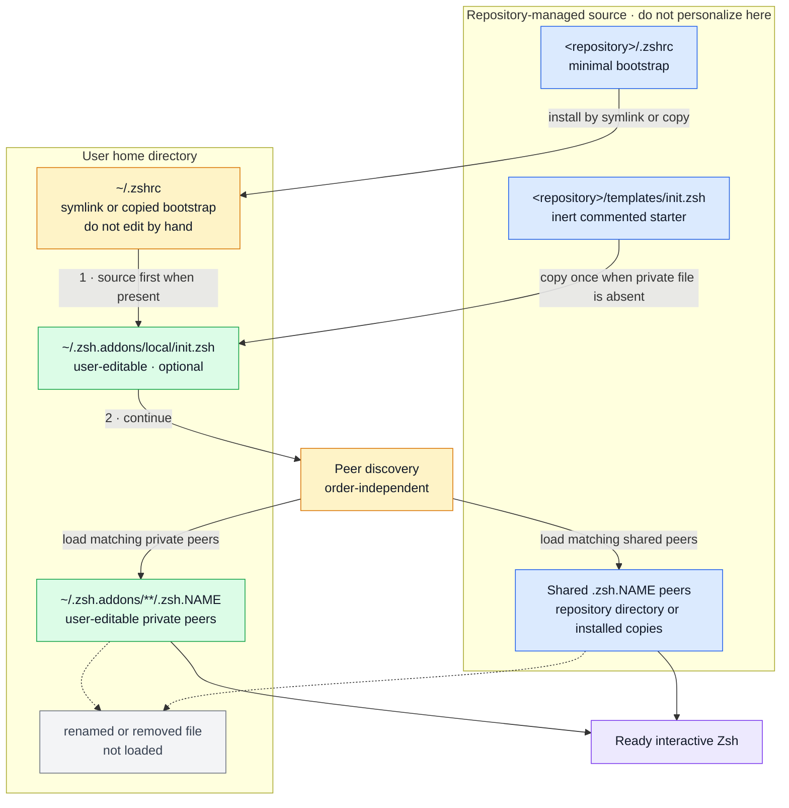

# Compozsh

A polished, self-contained Zsh setup with no frameworks, prompt themes, or
third-party plugins.

## What it includes

- A compact two-line prompt that adds a project-runtime line only when relevant
- A compact Git summary with exact staged, modified, untracked, conflicted,
  stashed, ahead, and behind counts
- Clear Git operation warnings for merges, rebases, cherry-picks, and bisects
- Command duration for commands that take at least two seconds
- Active Python virtual environment and background-job indicators
- Automatic runtime or toolchain detection for more than 35 project types,
  including native, web, JVM, .NET, functional, scientific, game, scripting,
  and infrastructure languages
- Package-manager, build-tool, framework, workspace, and container context
- Runtime mismatch warnings from project version files
- Shared, deduplicated shell history
- Protection against accidentally overwriting non-empty files with `>`
- Case-insensitive native Zsh completion with a selectable menu
- Prefix-based history search with Up/Down or `Ctrl-P`/`Ctrl-N`
- A native fuzzy `Ctrl-R` history picker with ranked, order-independent
  fragments and deduplicated results
- Live native history autosuggestions with character, word, and full acceptance
- `Ctrl-X Ctrl-E` to edit the current command in `$EDITOR`
- Live native syntax highlighting for commands, arguments, operators, strings,
  variables, comments, assignments, and redirections
- Searchable, arrow-driven recent-directory and Git-branch selectors with
  numbered direct shortcuts
- Terminal-only native colors for file listings, completion, and search matches
- Colored manual pages with highlighted headings, options, and references
- A useful terminal tab title and a few small navigation aliases
- An optional first-loaded `~/.zsh.addons/local/init.zsh` for machine setup
- Automatic loading of focused, order-independent `.zsh.addons/**/.zsh.<name>`
  files
- An Xcode add-on that exports Apple-authored skills for common coding agents

The [`.zshrc`](.zshrc) file is only a tiny bootstrap. Every shared feature lives
as a native, readable peer in [`.zsh.addons`](.zsh.addons), with no framework or
plug-in manager.

## Configuration architecture

The configuration has one explicit initialization boundary followed by peers:
“Configuration base” means `${ZDOTDIR:-$HOME}` throughout this README. Diagrams
and examples use `~` for the normal layout when `ZDOTDIR` is unset; if it is
set, place the active `.zshrc`, initializer, and private peers beneath
`$ZDOTDIR` instead.



`NAME` represents any non-empty add-on name. For example,
`.zsh.company-tools` and `work/.zsh.ruby` both match the real
`.zsh.<name>` convention and load automatically.

Use the diagram as a placement rule:

- Treat the repository `.zshrc`, the contents of its shared `.zsh.<name>`
  peers, and an installed `~/.zshrc` as managed code. Do not place personal
  settings in them. Edit shared contents only when deliberately contributing
  to the project through Git.
- Put early machine setup—`PATH`, Homebrew, runtime selection, trusted vendor
  hooks, and environment inputs required by peers—in
  `~/.zsh.addons/local/init.zsh`.
- Put a cohesive personal feature in any file below `~/.zsh.addons` whose
  basename starts with `.zsh.`, such as `~/.zsh.addons/work/.zsh.company`.
  No manifest or registration step is required; start a new shell with
  `exec zsh` and it appears automatically.
- Disable an add-on by renaming it so the basename no longer starts with
  `.zsh.`, for example `.zsh.company` to `.disabled.zsh.company`, or remove it.
  Renaming a repository peer is the supported toggle, but it intentionally
  appears as a local change in `git status`; its contents remain untouched.

There is deliberately no “core feature” tier. Shell behavior, line editing,
prompt rendering, tools, and optional integrations are all add-ons with the
same status and naming convention. The optional local initializer is not a core
tier: it is the single ordered boundary for prerequisites that must exist before
peers initialize, such as Homebrew, `PATH`, a selected Ruby, trusted early
agent hooks, environment variables, and documented public defaults.
Its `init.zsh` basename intentionally does not match `.zsh.<name>`, so peer
discovery cannot load it twice.

Add-ons need no manifest or registration list: a correctly named file beside
the resolved bootstrap or in the user's add-on directory is enough, and
renaming it disables it. The loader uses lexical traversal only for reproducible
diagnostics. After the initializer, peer units cannot depend on traversal order:
renaming or loading the same enabled files in another order must produce the
same final shell. This prevents numeric prefixes, dependency metadata, extra
initialization phases, and other plug-in-manager ceremony from creeping in.

Repository layout:

```text
compozsh/
├── .zshrc                 minimal initializer and peer-discovery bootstrap
├── .zsh.addons/           all shared peer features
│   ├── .zsh.shell         shell options, history, and native tool colors
│   ├── .zsh.editor        completion, editing, fuzzy history, and suggestions
│   ├── .zsh.highlighting  command-line syntax and semantic UI palette
│   ├── .zsh.navigation    directory and Git branch navigation pickers
│   ├── .zsh.prompt        prompt, Git state, and project/toolchain context
│   ├── .zsh.tools         small commands and terminal-aware output wrappers
│   └── .zsh.xcode         optional Xcode/agent-skill integration
├── templates/
│   └── init.zsh           inert starter copied once for private initialization
├── install.zsh            safe symlink/copy installer with preview and rollback
├── tests/                  isolated native-Zsh regression suite
│   ├── run.zsh            dependency-free test runner
│   ├── support.zsh        assertions and disposable-shell helpers
│   └── *_test.zsh         focused behavioral specifications
├── LICENSE                GNU GPL version 3 or any later version
├── README.md              user-facing behavior and installation
└── AGENTS.md              contributor and coding-agent contract
```

### Shipped configuration units

The autoloaded convention is `.zsh.<name>`, not `.zshrc.<name>`. Each shipped
peer owns one focused concern and can still be sourced independently:

| File | Responsibility | Main user-facing behavior |
| --- | --- | --- |
| `.zsh.shell` | Base interactive-shell policy | Safe redirection, shared history, directory-stack behavior, and terminal-aware native colors |
| `.zsh.editor` | Completion and ZLE editing | Completion menus, macOS-friendly bindings, the shared visual picker, fuzzy `Ctrl-R`, and history autosuggestions |
| `.zsh.highlighting` | Live command-line semantics | Distinct styles for commands, aliases, functions, arguments, operators, paths, strings, variables, and comments |
| `.zsh.navigation` | Fast directory and Git movement | `d` directory picker, `g` Git/branch picker, recent stacks, numbered selection, and small navigation aliases |
| `.zsh.prompt` | Prompt facts, layout, and rendering | Responsive prompt, Git state, command duration, jobs, virtual environments, and project/toolchain context |
| `.zsh.tools` | Focused commands and safe output wrappers | `mkcd`, `git-discard-all`, `prompt-refresh`, colored terminal `grep`, and colored `man` pages |
| `.zsh.xcode` | Optional Xcode integration | `update_xcode_skills` exports Apple-authored skills to detected coding agents |

`~/.zsh.addons/local/init.zsh` is different from those peers. It is a private,
user-editable initializer and the only file with a guaranteed position: it
loads first. The repository ships a valid, fully commented
[`templates/init.zsh`](templates/init.zsh) starter. Copy it once into the home
directory, then use the private copy only for inputs or prerequisites that must
exist before peers load: command paths, Homebrew or language-manager setup,
runtime selection, trusted early vendor hooks, and documented public defaults.
The tracked starter remains inert and immutable.

To add a new personal unit, create any regular file beneath
`~/.zsh.addons` whose basename follows `.zsh.<name>`:

```text
~/.zsh.addons/
├── local/
│   └── init.zsh              loaded first; private machine setup
├── .zsh.my-shortcuts         discovered automatically as a peer
└── work/
    └── .zsh.company-tools    nested peers work too
```

No list needs updating and no command installs the peer. Run `exec zsh` after
creating, renaming, or removing one.

## Requirements

- Zsh 5.9 or newer (current macOS releases ship with Zsh 5.9); older releases
  are deliberately unsupported
- Git, for cloning and the repository-aware prompt, navigation, and tools
- A terminal with Unicode and color support; no patched font is required
- Xcode 27 or newer, only for the optional Apple skill exporter

Check the installed versions with:

```sh
zsh --version
git --version
```

## Modern-first compatibility

Compozsh targets a deliberately modern Zsh baseline. The minimum supported
version advances when newer language or shell features materially improve
correctness, security, performance, or maintainability. Superseded
compatibility paths are removed instead of preserved indefinitely.

Apple's system shell defines the compatibility ceiling. Each major macOS
release triggers a review of its bundled Zsh, but Compozsh's minimum never
exceeds the version shipped by the latest generally available macOS. Running
Compozsh must not require a Homebrew, MacPorts, or user-compiled replacement
shell.

This is modern-first, not novelty-first. A newer mechanism must provide a
concrete benefit and pass the same correctness, safety, and performance checks
as any other change. Minimum-version increases are documented as breaking
changes so users can make an informed upgrade.

## Installation

The repository includes a native Zsh installer. It validates the tracked files,
shows its complete plan, preserves existing state, and rolls back an incomplete
activation. It does not download a framework or run code from another project.

### 1. Clone into a stable location

Save the location in `repo_dir`; every later command then works from any current
directory:

```sh
repo_dir="$HOME/Projects/compozsh"
git clone https://github.com/bitbemol/compozsh.git "$repo_dir"
```

If the repository is already cloned, skip `git clone` and set `repo_dir` to its
existing location. The clone already contains a complete `.zshrc`; do not
create, empty, or replace that repository file.

### 2. Preview the recommended installation

Run a dry run first:

```sh
zsh "$repo_dir/install.zsh" --symlink --dry-run
```

The plan names the active configuration base and every action. Zsh uses
`${ZDOTDIR:-$HOME}` as that base, so the familiar `~/.zshrc` paths below become
`$ZDOTDIR/.zshrc` when `ZDOTDIR` is set.

An existing active `.zshrc` may contain important setup. It does not need to be
empty, and you should not delete or truncate it. The installer archives it under
`.zsh-backups/compozsh-<timestamp>/` before replacement. It never
prints the old file's potentially private contents.

### 3. Install

Run the same command without `--dry-run`:

```sh
zsh "$repo_dir/install.zsh" --symlink
```

Review the displayed plan and answer `y` to continue. The installer then:

- links the active `.zshrc` to the repository bootstrap;
- keeps an existing private `.zsh.addons` tree intact;
- copies `templates/init.zsh` only when `local/init.zsh` is absent;
- archives any active `.zshrc` it replaces; and
- restores the prior state if activation fails.

Start a new shell after a successful installation:

```sh
exec zsh
```

### Modes and safety options

| Option | Behavior |
| --- | --- |
| `--symlink` | Recommended. Link the bootstrap to the repository; shared peers stay beside it and update with Git. |
| `--copy` | Copy the bootstrap and shared peers into a marked `~/.zsh.addons/compozsh` namespace. Private peers remain separate. |
| `--dry-run` | Validate and print the exact plan without changing the filesystem. |
| `--clean` | Archive the active `.zshrc` and complete `.zsh.addons` tree, then install a fresh configuration. Nothing is deleted. |
| `--yes` | Accept a previously reviewed plan without an interactive prompt; useful for a non-interactive terminal. |
| `--help` | Show the command summary. |

Choose exactly one of `--symlink` or `--copy`. When an interactive terminal is
available, omitting both opens a small mode chooser. `--copy` marks the namespace
it owns and refuses to replace a same-named unmarked directory. Use `--clean`
only when you intentionally want to archive all private add-ons and begin with
the inert initializer again.

Clean mode affects only the active `.zshrc` and `.zsh.addons`. It does not touch
`.zshenv`, `.zprofile`, `.zlogin`, `.zlogout`, the repository, or exported agent
skills. The completion message prints the exact recovery-backup path whenever a
backup was created.

## Apply changes

Open a new terminal, or reload the current shell:

```sh
exec zsh
```

Using `exec zsh` is preferable to repeatedly sourcing `.zshrc`, because it
starts a clean shell instead of stacking hooks and other state.

## Updating

With the recommended symlink installation, pull the repository and start a
clean shell. The linked bootstrap and adjacent add-ons update together:

```sh
git -C "$repo_dir" pull
exec zsh
```

For a copied installation, pull and rerun the installer. It stages the complete
new shared namespace before replacing the marked old one:

```sh
git -C "$repo_dir" pull
zsh "$repo_dir/install.zsh" --copy
exec zsh
```

The symlink installer is idempotent, so rerunning it is also safe. Keep
repository peers unmodified; put machine setup in `local/init.zsh` and personal
features in private `.zsh.<name>` peers instead.

## Testing

### Is this native Zsh testing?

Yes. Zsh does not include a complete unit-test framework, so this repository
uses a deliberately small harness built from ordinary Zsh functions, arrays,
subshells, and exit statuses. There is no testing library, plug-in, package
manager, or downloaded test runner. A few tests invoke normal system tools such
as `mktemp`, `env`, and Git when those tools are part of the behavior being
tested.

Run the complete suite from the repository root:

```sh
zsh tests/run.zsh
```

The runner discovers every regular `tests/*_test.zsh` file and sources it. Each
file defines test functions and registers their human-readable descriptions
with `test_case`. Every registered test executes in its own subshell, so its
variables, options, directory changes, functions, aliases, and traps cannot
leak into the next test.

Tests that need a shell under test launch another Zsh through `env -i` with:

- a newly created temporary `HOME` and `ZDOTDIR`;
- a minimal fixed environment and locale;
- `-f` so normal startup files are skipped;
- `-d` so global startup files are skipped; and
- `-i` only when the behavior requires an interactive shell.

Consequently, the suite does not read or modify the active `~/.zshrc`, private
add-ons, or history. Destructive helper coverage creates its own disposable Git
repository. A validated cleanup trap removes only the temporary directory made
for that test.

### How pass and fail work

Unix commands—including Zsh functions—finish with a numeric exit status. Zero
means success; any nonzero value means failure. The harness uses that same
native contract:

- an assertion returns `0` when its comparison is true;
- a failed assertion prints its expected and actual values to stderr and
  returns `1`;
- the surrounding test function propagates that failure;
- the runner prints `PASS` or `FAIL`, counts the results, and itself exits
  nonzero if any test failed.

For example:

```text
PASS  mkcd creates and enters exactly one requested directory
FAIL  fuzzy history finds unordered fragments and abbreviated commands

18 passed, 1 failed · 2200.0 ms
```

That final process status makes the same command suitable for local development
and future continuous integration. Inspect it manually when useful:

```sh
zsh tests/run.zsh
print -r -- "suite status: $?"  # 0 passed; nonzero failed
```

To run only tests whose descriptions contain a case-insensitive fragment:

```sh
zsh tests/run.zsh fuzzy
zsh tests/run.zsh git-discard-all
```

A filtered run shortens the inner TDD loop. Always run the complete unfiltered
suite before considering the change finished.

### Adding a test

Place the test beside the closest concern in an existing `*_test.zsh` file, or
create a focused new file with that suffix. Use an underscore-prefixed function
for the implementation and register it with a behavior-oriented description:

```zsh
_test_mkcd_rejects_a_missing_operand() {
  test_make_temp_dir || return
  local output='' exit_status=0

  output=$(test_run_noninteractive "$TEST_TMP_DIR/home" '
    source "$1/.zsh.addons/.zsh.tools"
    mkcd
  ' "$TEST_REPO_ROOT" 2>&1) || exit_status=$?

  test_assert_equal 2 "$exit_status" \
    'mkcd accepted a missing directory' || return
  test_assert_contains "$output" 'usage: mkcd <directory>' \
    'mkcd omitted its usage diagnostic'
}
test_case 'mkcd rejects a missing directory operand' \
  _test_mkcd_rejects_a_missing_operand
```

The structure is arrange, act, assert: create isolated state, exercise the
observable behavior, then compare the result. Guard setup and intermediate
assertions with `|| return` so a failure cannot be hidden by a later successful
command. Prefer a public command or durable state over private implementation
details; directly test an underscore-prefixed helper only when its algorithm is
the precise contract being protected.

The suite currently protects bootstrap and discovery behavior, initializer
precedence, order-independent and standalone add-ons, fuzzy matching, syntax
classification, palette extension, public tools, destructive-operation safety,
and synchronization between the shipped add-ons and this README.

### Strict TDD workflow

For every observable feature or bug fix:

1. Describe the intended behavior and edge cases.
2. Add the smallest test that expresses that behavior without implementing it.
3. Run its description filter and see `FAIL`. Confirm it fails because the
   behavior is missing or broken—not because the test has a syntax or setup
   mistake. This is the **red** phase.
4. Implement the smallest correct change and rerun the focused test until it
   says `PASS`. This is the **green** phase.
5. Improve names, boundaries, duplication, or performance without changing the
   behavior. Keep rerunning the test. This is the **refactor** phase.
6. Run `zsh tests/run.zsh`, syntax checks, and the relevant real-terminal
   checks before finishing.

Do not weaken an assertion merely to make it green. A regression test for a bug
must demonstrably fail against the buggy implementation and remain afterward
to prevent the bug from returning.

Interactive terminal behavior still needs a real PTY check. Automated child
shells can protect the underlying collector, layout calculation, state, and
fallback contracts, but they cannot fully prove colors, cursor placement,
resize behavior, or physical key ergonomics.

## Safe output redirection

The configuration enables Zsh 5.9's `CLOBBER_EMPTY` together with
`NO_CLOBBER`. A normal `>` redirection may create a file or reuse an existing
empty file, but it refuses to erase a non-empty file accidentally:

```sh
print 'replacement' > important.txt
```

When replacing the file is intentional, use Zsh's explicit force-redirection
operator:

```sh
print 'replacement' >| important.txt
```

## Command-line highlighting

The editable command line is highlighted live using Zsh's native lexer and line
editor; no plugin or background process is involved. Resolution follows Zsh's
own rules, so aliases, functions, builtins, external commands, suffix aliases,
global aliases, and `AUTO_CD` directories remain visually distinct.

Each region carries a Zsh 5.9 memo tag. Redrawing the command line therefore
replaces only this configuration's colors and preserves highlights owned by
other native ZLE widgets.

| Style | Meaning |
| --- | --- |
| Bold purple | Regular alias |
| Bold peach | Suffix alias |
| Bold underlined lavender | Global alias |
| Bold sky blue | Shell function |
| Bold turquoise | Zsh builtin such as `cd` or `print` |
| Bold green | External command such as `git` or `mkdir` |
| Bold underlined azure | Existing directory |
| Bold underlined lime | Executable file used as an argument |
| Underlined pink | Symbolic link |
| Bold underlined violet | Symbolic link to a directory |
| Underlined orange | Regular file with multiple hard links |
| Underlined light gray | Regular file |
| Bold underlined coral | Socket, FIFO, device, or other special file |
| Light gray | Ordinary argument |
| Cyan | Option or flag |
| Bold gold | Reserved word |
| Underlined pale yellow | Structural delimiter |
| Yellow | Conditional operator |
| Bold orange | Arithmetic expression |
| Bold pink | Pipeline operator |
| Bold coral | Boolean operator |
| Bold gray | List or case separator |
| Bold blue | Redirection operator |
| Underlined sand | Redirection target |
| Blue | Assignment |
| Khaki | Quoted string |
| Light blue | Variable expansion |
| Purple | Command or process substitution |
| Salmon | Glob or brace expansion |
| Bold pink-red | History expansion |
| Bright cyan | Escape sequence |
| Peach | Number |
| Gray | Comment |
| Dim gray | Unaccepted history autosuggestion |

The highlighter understands command positions, precommand modifiers, leading
assignments, declaration assignments, pipelines, boolean lists, redirections,
grouping, conditionals, arithmetic commands, loops, case blocks, function
declarations, and Zsh's contextual `always` keyword. Literal path arguments are
checked without evaluating substitutions or globs. Directory-stack paths such
as `~1` are resolved using Zsh's current stack.

Every shell category has a unique color-and-attribute signature. Related
concepts stay within recognizable color families, while prompt identity,
location, Git state, and project metadata use a separate public palette. An
unresolved command deliberately keeps the terminal's normal text color; it
does not turn red merely because the word is still being typed. Git subcommands
and other program-specific arguments remain arguments because only the invoked
program can interpret their meaning.

A hard link has no unique shell syntax: every linked name is an ordinary file.
The orange hard-link style therefore means the filesystem reports a regular
file with a link count greater than one. Symlinks are separate filesystem
objects and can be identified directly.

Command-line syntax and prompt UI use separate public maps, so changing an
identity or path color cannot silently change a syntax category. Set only the
desired role in `~/.zsh.addons/local/init.zsh`. For example:

```zsh
typeset -gA ZSH_HIGHLIGHT_STYLES ZSH_PROMPT_COLORS
ZSH_HIGHLIGHT_STYLES[command]='fg=118,bold'
ZSH_HIGHLIGHT_STYLES[comment]='fg=243'
ZSH_PROMPT_COLORS[identity]=110
ZSH_PROMPT_COLORS[path]=117
```

## macOS keyboard shortcuts

The editor uses macOS-friendly Emacs navigation, so it does not depend on the
Home, End, or forward-Delete keys missing from compact Apple keyboards:

| Key | Action |
| --- | --- |
| `Ctrl-A` | Move to the beginning of the line |
| `Ctrl-E` | Move to the end of the line |
| `Ctrl-B` / `Ctrl-F` | Move backward / forward one character |
| `Option-B` / `Option-F` | Move backward / forward one word |
| `Option-Left` / `Option-Right` | Move backward / forward one word |
| `Ctrl-D` | Delete the character under the cursor |
| `Option-Backspace` / `Ctrl-W` | Delete the previous word |
| `Option-D` | Delete the next word |
| `Ctrl-U` | Delete the editable line |
| `Ctrl-K` | Delete from the cursor to the end |
| `Ctrl-Y` | Restore the most recently deleted text |
| `Ctrl-_` | Undo the last edit |
| `Up` / `Down` or `Ctrl-P` / `Ctrl-N` | Search history using the typed prefix |
| `Tab` / `Shift-Tab` | Complete forward / backward |
| `Ctrl-R` | Open fuzzy history search |
| `Ctrl-L` | Redraw a clean terminal screen |
| `Ctrl-X Ctrl-E` | Edit the command in `$EDITOR` |

Option-based shortcuts require the terminal to send Option as Meta. In Terminal,
enable **Use Option as Meta key** in the active profile if they type accented or
special characters instead. `Esc`, then `B` or `F`, is the terminal-independent
equivalent. Home, End, and `Fn`/Globe-based key sequences remain supported as
optional aliases when the terminal sends them.

`Cmd-C`, `Cmd-V`, `Cmd-K`, and other Command-key shortcuts remain owned by the
terminal application and macOS. They are intentionally not shadowed by Zsh;
the shell generally never receives those key combinations.

## History autosuggestions

As text is entered at the end of the command line, the unused suffix of the
newest matching history entry appears in dim gray:

```text
❯ git sw│itch feature/native-ghost
        └─ unaccepted suggestion
```

Suggestions use a case-sensitive literal prefix, which makes them stable and
predictable while typing. They are display-only: pressing `Enter` executes
exactly the editable text before the ghost suffix. Accept one explicitly with:

| Key | Action |
| --- | --- |
| `Right Arrow` or `Ctrl-F` | Accept one character |
| `Option-F` or `Option-Right` | Accept through the next word |
| `Ctrl-E` | Accept the complete suggestion when already at line end |

The wrapped keys retain their normal behavior when a suggestion is unavailable
or the cursor is not at the end of the line. Thus, the first `Ctrl-E` moves a
mid-line cursor to the end and a second accepts the visible suffix. End or
`Fn`/Globe-Right also accepts the complete suggestion when its escape sequence
is available. Accepted text participates in Zsh's normal undo history, so
`Ctrl-_` can undo an acceptance.

The redraw hook searches Zsh's live in-memory history and caches the current
match while its prefix grows. It launches no subprocess and writes no index.
It deliberately stays hidden for an empty or private leading-space command,
an active selection or completion suffix, a moved cursor, recursive editing,
multiline input, and any history entry containing terminal control bytes. The
`Ctrl-R` picker temporarily owns the display, then restores suggestions when it
closes.

Both behavior and appearance can be changed from the local initializer:

```zsh
typeset -gA ZSH_HIGHLIGHT_STYLES
ZSH_AUTOSUGGEST_ENABLED=0
ZSH_HIGHLIGHT_STYLES[autosuggestion]='fg=241'
```

## Fuzzy history search

Press `Ctrl-R` to open an in-memory history picker. Start typing any characters
you remember. A single fragment may be abbreviated in character order, so
`gtsw` can find `git switch feature/example`. Separate remembered fragments
with spaces and they may appear anywhere in the command: `-c swift` finds
`swift build -c release` even though the command stores them in the opposite
order. Search is case-insensitive and ranks results in predictable tiers:

1. Commands beginning with the literal query
2. Commands containing the literal query
3. Commands containing every literal fragment, in any order
4. If no literal-fragment result exists, character-ordered fuzzy matches for
   every fragment; each fragment stays within one command word to avoid noisy
   cross-word matches

Each tier is newest-first, and duplicate command lines are shown only once.
If the editable command line already contains text, that text becomes the
initial query. Press `Ctrl-U` inside the picker to clear it and browse recent
commands instead.

History, directory, and branch selectors share the same safe renderer. A stable
dedicated `Search ‹query›` row keeps user input separate from header metadata
and prevents the layout from shifting after the first character. Long queries
use the available row width and abbreviate visually while preserving the full
value for matching. Query fields, headers, indexes, selected rows, empty states,
and help rows use separate semantic colors that can be customized from
`~/.zsh.addons/local/init.zsh` without changing the picker logic:

```zsh
typeset -gA ZSH_HIGHLIGHT_STYLES
ZSH_HIGHLIGHT_STYLES[picker-header]='fg=75,bold'
ZSH_HIGHLIGHT_STYLES[picker-query]='fg=16,bg=44,bold'
ZSH_HIGHLIGHT_STYLES[picker-index]='fg=44,bold'
ZSH_HIGHLIGHT_STYLES[picker-selected]='fg=16,bg=75,bold'
ZSH_HIGHLIGHT_STYLES[picker-text]='fg=252'
ZSH_HIGHLIGHT_STYLES[picker-muted]='fg=242'
ZSH_HIGHLIGHT_STYLES[picker-empty]='fg=203,bold'
```

Existing `history-search-*` overrides remain accepted and are migrated to the
corresponding shared picker role when the shared palette initializes.

| Key | Action |
| --- | --- |
| Type | Refine the fuzzy query |
| `Backspace` | Remove the last query character |
| `Option-Backspace` or `Ctrl-W` | Remove the last query word |
| `Ctrl-U` | Clear the query |
| `Ctrl-L` | Redraw a clean search screen |
| `Down`, `Ctrl-N`, `Tab`, or `Ctrl-R` | Select the next result |
| `Up`, `Ctrl-P`, or `Shift-Tab` | Select the previous result |
| `Enter` | Put the selected command on the editable line |
| `Esc` or `Ctrl-G` | Cancel and restore the original line |
| `Ctrl-C` | Hard-abort the search and current editable line |

Selection never executes a command. It returns the full original history entry,
including multiline commands, to the normal editor so it can be reviewed or
changed before pressing `Enter` again. Display rows make control characters
visible, truncate to the current terminal width, and reduce automatically in a
short terminal window.

The picker uses Zsh's live `history` parameter and pattern engine; it does not
launch a subprocess, maintain another history file, or build a disk index. It
can search up to 50,000 entries retained across shell restarts and shows at most
eight results by default. Matching considers the full loaded history; the
result limit only bounds the picker display. Override that bounded value from
the local initializer if desired:

```zsh
ZSH_HISTORY_SEARCH_MAX_RESULTS=12
```

## Colored manual pages

Running `man` uses the native formatting already embedded in each manual page
and renders it through `less` with the prompt palette:

```sh
man git-switch
man zshoptions
```

Headings and bold terms are cyan, underlined references are yellow, and
standout or search matches use a cyan background. The colors are scoped to the
`man` function, so opening an ordinary file with `less` is unaffected.

The function respects an existing `MANPAGER`, `MANCOLOR`, or
`LESS_TERMCAP_*` value. Set one in the local initializer to replace an
individual default without editing the shared configuration.

## Colored command output

Interactive output uses color only where the producing tool exposes reliable
semantics. This keeps terminal output expressive without corrupting data sent
through a pipe, command substitution, or file redirection.

| Output family | Behavior |
| --- | --- |
| `ls`, `ll`, and `la` | Native file-type colors for directories, links, executables, sockets, pipes, devices, privileged files, writable directories, and dataless files |
| File completion | The same file-type families rendered with the 256-color syntax palette |
| `grep` | Matching text is pink when stdout is a terminal |
| Git, compilers, runtimes, and TUIs | Their own native color and terminal behavior is preserved |
| Man pages | Scoped heading, reference, and search-match colors through `less` |
| JSON, CSV, logs, arbitrary tables, and binary data | Left unchanged because their meaning cannot be inferred safely from plain bytes |

Long `ls` metadata such as permissions, owners, sizes, and timestamps remains
neutral; filenames carry the file-type color. Parsing the human-readable column
layout would break on spaces, locales, ACL markers, and unusual filenames.

The automatic behavior is terminal-aware. These stay plain and safe:

```sh
ls -la > files.txt
matches=$(grep TODO README.md)
grep TODO README.md | wc -l
```

To intentionally preserve grep colors through a pager, request it explicitly:

```sh
grep --color=always TODO README.md | less -R
```

The defaults remain customizable without changing the shared file. Set
`LSCOLORS`, `GREP_COLOR`, or `GREP_COLORS` in the local initializer; unset
`CLICOLOR` there to disable automatic `ls` colors on a particular machine.

## Local user and machine settings

The bootstrap optionally loads `~/.zsh.addons/local/init.zsh` before every peer
add-on. Its one responsibility is establishing pre-peer inputs and
prerequisites: Homebrew or language-manager setup, command and completion paths,
selected toolchain versions, trusted hooks that require early loading,
environment variables, and documented public defaults.

The installer creates the private file from the inert tracked starter only when
it does not already exist. To recreate it manually without running a complete
installation, use the active Zsh configuration base:

```sh
config_base=${ZDOTDIR:-$HOME}
if [[ ! -s "$repo_dir/templates/init.zsh" ]]; then
  print -u2 -r -- 'Initializer setup stopped: set repo_dir correctly first.'
else
  mkdir -p "$config_base/.zsh.addons/local"
  if [[ ! -e "$config_base/.zsh.addons/local/init.zsh" &&
        ! -L "$config_base/.zsh.addons/local/init.zsh" ]]; then
    cp "$repo_dir/templates/init.zsh" \
      "$config_base/.zsh.addons/local/init.zsh"
  else
    print -r -- 'Keeping the existing private initializer.'
  fi
fi
```

The starter is copied, never symlinked: the repository version stays immutable,
and later updates cannot overwrite private machine data. Its examples are all
commented, so the untouched file is valid Zsh and has no effect.

Aliases, ordinary functions, and app-specific behavior usually do not need the
first-load exception. Give them focused private peers instead—for example,
`~/.zsh.addons/work/.zsh.work-shortcuts`:

```sh
alias cdmywork='cd "$HOME/Developer/Work"'

startwork() {
  cd -- "$HOME/Developer/Work" || return
  git status --short --branch
}
```

This is the only source-order exception. It establishes the environment peers
need, but it must not call peer functions during source because they are not
loaded yet. Shared scalar defaults, palettes, extension arrays, and convenience
aliases preserve values established here. To replace a shared command or full
prompt, disable its peer instead of defining a colliding private peer.

To load the initializer from a different location, export `ZSH_LOCAL_INIT`
before Zsh starts, usually from `.zshenv` or the parent process:

```sh
export ZSH_LOCAL_INIT="$HOME/.config/zsh/machine-init.zsh"
```

Keep passwords and API tokens out of the repository even when adding examples.
Prefer the system keychain or a dedicated secret store. The committed
[initializer starter](templates/init.zsh) contains no active configuration;
each user's real `init.zsh` remains outside the repository in their home
directory.

Migrating an older installation is a one-time move:

```sh
config_base=${ZDOTDIR:-$HOME}
legacy_init="$config_base/.zshrc.local"
private_init="$config_base/.zsh.addons/local/init.zsh"
if [[ -f $legacy_init && ! -e $private_init && ! -L $private_init ]]; then
  mkdir -p "$config_base/.zsh.addons/local"
  mv "$legacy_init" "$private_init"
elif [[ -f $legacy_init ]]; then
  print -r -- 'Keeping both files; review and merge the legacy initializer manually.'
fi
exec zsh
```

Review the moved file instead of preserving it as a catch-all. Keep only genuine
pre-peer prerequisites in `init.zsh`; move aliases, ordinary functions, and
app-specific behavior into focused private `.zsh.<name>` peers. Any action that
needs a shared peer must run later from an interactive command, hook, or widget.

## Peer add-ons

After the local initializer, the bootstrap recursively loads every regular file
matching `.zsh.addons/**/.zsh.<name>`. A symlink installation loads shared peers
beside the resolved repository `.zshrc` and private peers from the configuration
base's `.zsh.addons`. A copied installation places a marked, installer-owned
shared namespace inside that user add-on tree and scans the complete tree once.
Do not personalize the managed namespace: change shared code in the repository
and rerun `install.zsh --copy`; keep private peers beside it.

```text
.zsh.addons/
├── .zsh.xcode
└── work/
    └── .zsh.company-tools
```

There is no registration list and no core-module list. Create a matching file
and the next shell loads it automatically. Disable one without deleting it by
changing its prefix, for example from `.zsh.xcode` to
`.disabled.zsh.xcode`, or remove the file.

Add-ons are executable shell configuration, not data. Keep this directory under
the same ownership and code-review boundary as `.zshrc`. The loader never
discovers code from the current project and does not follow nested symlink
directories.

Lexical loading makes errors repeatable, but it is not a dependency mechanism.
Each file owns its defaults, helpers, hooks, cleanup, and fallback behavior. It
must not call a peer while being sourced or rely on its filename sorting before
another. Optional collaboration is checked only when the feature runs, so a
missing unit degrades cleanly and every permutation of the same enabled files
converges on the same shell state.

### Creating an add-on

Put a shared integration under the repository's `.zsh.addons` directory. Put a
private peer under the configuration base's `.zsh.addons`. In copy mode, the
installer-owned shared namespace is nested beside those private peers; it is
not a place for personal edits. Nested concern directories are allowed, but the
file itself must begin with `.zsh.`:

```text
.zsh.addons/
└── database/
    └── .zsh.postgres
```

Keep startup work minimal: define functions and settings while the file loads,
then perform tool discovery, filesystem writes, or expensive work only when the
user calls the public command. Do not add dependencies or an ordering prefix;
make the unit stand on its own. A small add-on follows this shape:

```zsh
_postgres_tools_available() {
  (( $+commands[psql] ))
}

postgres-status() {
  emulate -L zsh
  _postgres_tools_available || {
    print -u2 -r -- 'postgres-status: psql is not installed'
    return 1
  }
  command psql --list
}
```

Start a clean shell with `exec zsh` after adding or renaming an add-on. Keep only
genuine pre-peer prerequisites in `local/init.zsh`; use a focused private peer
for aliases, functions, apps, defaults, hooks, optional requirements, or other
behavior that does not require that ordered boundary.

### Public and internal functions

Function names beginning with `_` are internal implementation details. Zsh does
not enforce private access, but the leading underscore is this repository's
explicit “do not call or override” convention. Internal helpers may change,
move, or disappear during a refactor without preserving compatibility.

Documented names without a leading underscore form the user-facing interface.
For example, call:

```sh
update_xcode_skills
```

Do not call its helpers directly:

```sh
# Internal implementation details—not user commands:
_detect_xcode_skill_vendor
_install_xcode_skills_for_agent
```

New add-ons should follow the same rule: choose a clear unprefixed name only
for a command users are meant to run, document it here, and prefix supporting
functions and state with `_`.

### Export Apple-authored Xcode skills

Xcode 27 includes Apple-authored agent skills, but an external Codex
installation may not discover them automatically. Apple documents this in the
[Xcode 27 release notes](https://developer.apple.com/documentation/xcode-release-notes/xcode-27-release-notes).
The `.zsh.xcode` add-on provides:

```sh
update_xcode_skills
```

The function first detects compatible coding agents installed locally, whether
through their CLI or standard macOS application. It then checks the Xcode
selected by `xcode-select`, exports its portable skills once, and installs real
copies only for the detected agents:

| Agent | Detected installation | Destination |
| --- | --- | --- |
| Codex | `codex`, `ChatGPT.app`, or `Codex.app` | `~/.agents/skills/` and Xcode's Codex directory |
| Claude Code | `claude` or `Claude.app` | `~/.claude/skills/` |
| Gemini CLI | `gemini` | `~/.agents/skills/` |
| Google Antigravity | `agy`, `antigravity`, or `Antigravity.app` | `~/.gemini/config/skills/` |
| Kiro | `kiro-cli`, `kiro`, or `Kiro.app` | `~/.kiro/skills/` |

CLI names must resolve through `PATH`. Applications are checked in the system
and per-user Applications directories. The updater does not create configuration
directories for absent vendors, and it stops before exporting anything when no
supported local coding agent is found.

The installer marks only the skill directories it creates. A refresh builds a
complete sibling copy and swaps it into place only after the copy succeeds, so
stale files disappear and a failed refresh leaves the previous skill intact. A
same-named personal skill without the marker is preserved and reported instead
of overwritten. Detected agents do not need to be open, running, authenticated,
or configured when the function runs.

The shared `~/.agents/skills` directory follows the current
[Codex skill convention](https://developers.openai.com/codex/skills/) and is
also discovered by
[Gemini CLI](https://github.com/google-gemini/gemini-cli/blob/main/docs/cli/using-agent-skills.md).
The remaining locations follow the native conventions documented by
[Claude Code](https://code.claude.com/docs/en/skills) and
[Kiro](https://kiro.dev/docs/cli/skills/). Xcode's Codex-specific destination
comes from Apple's release-note workaround. Using the shared directory avoids
installing a duplicate Gemini copy that could appear twice in its selector.
[Antigravity](https://codelabs.developers.google.com/getting-started-google-antigravity)
uses its documented global skill directory across its IDE and CLI.

Start a new agent session after a successful export. Gemini CLI can discover
the changes immediately with `/skills reload`; Claude Code also notices changes
live when its top-level skills directory already existed. Kiro can confirm the
result with `/context show`.

Exporting happens only when `update_xcode_skills` is called. Opening a shell
never launches Xcode or writes skill files.

Xcode also exposes live project operations to external agents through
`xcrun mcpbridge`. That complements static skills: exported skills provide
Apple's guidance, while the bridge provides live Xcode tools for the project
currently open in Xcode. After allowing external agents in Xcode's Intelligence
settings, configure Codex once with:

```sh
codex mcp add xcode -- xcrun mcpbridge
```

See Apple's
[external-agent setup](https://developer.apple.com/documentation/xcode/giving-external-agents-access-to-xcode)
for the required Xcode setting and workflow.

## Navigation stacks

The navigation peer ships five small aliases and preserves an initializer value
when the same alias already exists:

| Alias | Expands to |
| --- | --- |
| `..` | `cd ..` |
| `...` | `cd ../..` |
| `....` | `cd ../../..` |
| `ll` | `ls -lah` |
| `la` | `ls -A` |

Zsh already remembers recently visited directories because this configuration
enables its native directory stack. Run `d` to open a searchable selector:

```text
Directories · recent locations · 3 shown
Search ‹›
[ 0] ● ~/Developer/current-project
[ 1]   ~/Developer
[ 2]   ~
0–9 select · ↑↓ move · type filter · ⏎ cd · esc cancel
```

With an empty filter, press any visible digit from `0` through `9` to change
directory immediately—no `Enter` required. You can also use the arrows or
`Ctrl-P`/`Ctrl-N`, type to filter, and press `Enter`. Once filtering begins,
digits become normal search text so names containing numbers remain searchable.
Index `0` is the current directory. Run `d --list` when a static, copyable stack
is more useful than the interactive selector.

Zsh's native `~1`, `~2`, and other directory-stack expansions still work. They
are shell syntax rather than a feature owned by this configuration; the visual
selector is now the primary direct interface.

Inside a Git working tree, run `g` without arguments for the equivalent branch
selector:

```text
Branches · current-project · recent checkouts · 3 shown
Search ‹›
[ 0] ● feature/prompt-navigation
[ 1]   main
[ 2]   feature/runtime-line
⌥W/^Y copy · 0–9 switch · ↑↓ move · type filter · ⏎ switch · esc cancel
```

The familiar Git shorthand remains intact: `g status`, `g switch`, and every
other argument-bearing form delegate directly to `git`. With an empty filter,
press a visible digit to switch immediately; after typing a filter, digits are
search text.

Select a row and press `Option-W` or `Ctrl-Y` to copy its branch name without
switching. Modified keys intentionally leave every printable character,
including `c`, available for fuzzy filtering. Clipboard support uses macOS's
built-in `pbcopy`; the hint and action disappear on hosts where it is missing.
During SSH, this copies to the clipboard of the machine running Zsh, not
automatically to the client Mac.

The branch list comes from Git's checkout reflog, so it includes switches made
through `git switch`, an IDE, or another terminal without maintaining a second
history file. Deleted branches and detached commit IDs are omitted. Selection
uses a normal `git switch`, so Git will still refuse unsafe switches when local
changes conflict or a branch is already checked out in another worktree.

Both navigation selectors use captured in-memory labels while typing and
resizing. Directory collection launches no process; branch discovery invokes
Git only once when the selector opens. The number of visible rows is bounded by
the terminal height and defaults to ten. Override it locally if desired:

```zsh
ZSH_NAVIGATION_PICKER_MAX_RESULTS=12
```

## Prompt legend

Inside a Git repository, the prompt can show:

| Mark | Meaning |
| --- | --- |
| `✓` | clean working tree |
| `+2` | two staged files |
| `!3` | three modified files |
| `?1` | one untracked file |
| `x1` | one conflicted file |
| `≡2` | two stashes |
| `⇡3` / `⇣1` | commits ahead of / behind the upstream branch |
| `⚡rebase` | an in-progress Git operation |

Git colors are green for clean, yellow for local changes, cyan when behind,
magenta when detached, and red for conflicts or an in-progress operation.

## Project runtime line

When the current directory is inside a recognized project, the prompt inserts a
second line and moves the input arrow to a third line:

```text
╭─ user@host ~/Projects/web-app git:main ✓
├─ web-app node 24.5.0 · pnpm · next · workspace · docker
╰─ ❯
```

Detection walks upward from the current directory, so the line remains visible
inside project subdirectories. It recognizes standard project files such as
`Package.swift`, `package.json`, `pyproject.toml`, `Cargo.toml`, `go.mod`,
`CMakeLists.txt`, `composer.json`, `build.zig`, `project.godot`, `gleam.toml`,
`dune-project`, `fpm.toml`, Terraform files, Scheme/Lisp source files, and their
equivalents for the other supported runtimes.

The top row also responds to the current terminal width. Git stays inline when
the location and complete summary fit:

```text
╭─ user@host ~/Projects/app git:main ✓
├─ app swift 6.3 · xcode
╰─ ❯
```

On a narrower window or a long branch, Git moves to its own tree-aligned row:

```text
╭─ user@host ~/Projects/example-app
├─ git:codex/topic-noncopyable-ownership no-upstream
├─ example-app swift 6.3 · xcode
╰─ ❯
```

Zsh updates `$COLUMNS` when the window or font size changes. The active command
line is redrawn immediately, without waiting for Enter and without rerunning Git
or toolchain detection for every resize event. If the Git summary itself cannot
fit on a very narrow row, its middle is temporarily abbreviated with `…`;
widening the window restores the complete text.

At extremely narrow widths, the first-row location follows the same rule after
Git has moved down. It keeps the beginning and current-directory end visible,
for example `~/Pro…mple-app`, rather than allowing the row to wrap. The full
location returns as soon as it fits again.

The project row is responsive too. It always keeps the project name, then shows
complete runtime, tool, framework, and environment items from left to right for
as long as they fit. Narrowing the terminal hides trailing items; widening it
restores them from the in-memory result without rerunning project detection.

The right-side clock remains on completed prompts, providing a useful historical
timestamp. Completed prompts are ordinary terminal scrollback rather than live
Zsh UI, so neither their layout nor their clock can be repositioned after a
resize; the terminal may reflow them at very narrow widths. The active prompt
continues to adapt immediately.

Built-in language and toolchain coverage includes:

- Native and systems: C/C++, Objective-C, Assembly, Rust, Go, Zig, and Fortran
- Apple, web, and scripting: Swift, Node.js, Deno, TypeScript, PHP, Ruby, Perl,
  Lua, Bash, PowerShell, and Python
- JVM and .NET: Java, Kotlin, Scala, Groovy, C#, F#, and Visual Basic
- Functional and BEAM: Haskell, OCaml, Scheme, Racket, Common Lisp, Elixir,
  Erlang, and Gleam
- Scientific, game, and infrastructure: R, Julia, Dart, Godot/GDScript, and
  Terraform/OpenTofu

The detected project directory appears first, followed by every applicable
runtime and its installed version. A missing tool is shown as `not-installed`.
Runtime versions are cached per project and executable so prompt rendering stays
fast and version-manager shims can differ between repositories. Outside a
recognized project, the extra line disappears and the prompt stays two lines.
Runtime commands are resolved from the user's `PATH`; the prompt never executes
programs from a repository's `node_modules`, build directory, or wrapper scripts
merely because the user entered that directory.

The contextual labels cover the major supporting ecosystems without parsing
dependency files or executing repository code:

| Area | Recognized context |
| --- | --- |
| Native builds | CMake, Meson, Autotools, Bazel, Conan, vcpkg, xmake, Make, Ninja, Just, Task |
| Apple | Xcode workspaces, SwiftPM, CocoaPods, Carthage, Tuist, XcodeGen, SwiftLint, SwiftFormat, Fastlane, Mint |
| JavaScript and web | npm, pnpm, Yarn, Bun, Turbo, Nx, Lerna, Rush, Next.js, Nuxt, Vite, Astro, Remix, Gatsby, Angular, SvelteKit, Expo, React Native, Electron, Storybook, Prisma |
| Python and data | uv, Poetry, PDM, Pixi, Hatch, Pipenv, Conda, pip, Jupyter, Django, MkDocs |
| JVM and .NET | Maven, Gradle, sbt, Mill, solutions, NuGet, Android |
| Other language ecosystems | Cargo, Go modules, buf, Stack, Cabal, Hpack, Bundler, Composer, pub, Melos, Mix, renv, pak, LuaRocks, CPAN, Carton, Dist::Zilla, fpm, dune, opam, rebar3 |
| Infrastructure | Terraform/OpenTofu, Terragrunt, TFLint, Pulumi, Helm, Kustomize, Serverless, Supabase |
| Development environments | Workspaces, Docker, Dev Containers, Nix, devenv, mise, direnv, Vagrant |

These labels describe files present in the project. They do not claim that the
corresponding package-manager or build command is installed.

Installed runtime versions are cached for prompt speed. After installing or
upgrading a tool without opening a new shell, refresh them with:

```sh
prompt-refresh
```

For example, the adaptive line can look like:

```text
├─ storefront node 24.5.0 · typescript 6.0.1 · pnpm · next · docker
├─ edge-api deno 2.5.0 · task
├─ ios-client objective-c clang 21.0.0 · xcode · xcworkspace · cocoapods · swiftlint
├─ mobile kotlin gradle-managed · gradle · android
├─ docs python 3.14.0 · pdm · jupyter · mkdocs
├─ services dotnet 10.0.100 · solution · nuget
├─ game godot 4.5.1
├─ infrastructure terraform 1.14.0-tofu · terragrunt · tflint · helm
├─ numerical-model fortran gfortran 15.2.0 · fpm
```

Version files such as `.nvmrc`, `.node-version`, `.deno-version`, `.python-version`,
`.swift-version`, `.ruby-version`, `.java-version`, `.php-version`,
`.kotlin-version`, `.lua-version`, `.terraform-version`, `go.mod`, and
`.tool-versions` are compared with the active runtime. The other built-ins also
accept a matching `.<language>-version` file where that convention is useful.
Mismatches are placed at the end of the line in red:

```text
├─ web-app node 24.5.0 · pnpm · next · ⚠ node wants 22
```

Compiled and Lisp-family languages show the implementation that actually runs
the code rather than inventing a language version:

```text
├─ native-app c/c++ clang 21.0.0 · asm nasm 2.16.03 · cmake
├─ sicp scheme mit-scheme 12.1
├─ lisp-notes lisp sbcl 2.5.7 · asdf
```

C/C++, Objective-C, Assembly, and Fortran detection looks for common source
extensions in the project root and conventional source directories. Scheme
recognizes `.scm` and `.ss`, Racket recognizes `.rkt`, and Common Lisp
recognizes `.lisp`, `.cl`, and `.asd`. Because shell scripts often appear as
helpers in otherwise unrelated repositories, Bash is shown only when a
directory looks like a shell-first project.

### Adding another language locally

There are too many useful languages and toolchains to hard-code all of them.
The prompt therefore exposes two extension points that can live in a focused
private peer such as `~/.zsh.addons/.zsh.project-v`:

```sh
typeset -ga PROMPT_PROJECT_MARKERS PROMPT_PROJECT_CONTEXT_FUNCTIONS
PROMPT_PROJECT_MARKERS+=(v.mod)

v_prompt_context() {
  [[ -f "$1/v.mod" ]] || return

  local version
  version=$(v version 2>/dev/null) || version='not-installed'
  prompt_add_project_segment "v ${version}" cyan
}

PROMPT_PROJECT_CONTEXT_FUNCTIONS+=(v_prompt_context)
```

`PROMPT_PROJECT_MARKERS` teaches the upward project-root search about a new
manifest. Each function in `PROMPT_PROJECT_CONTEXT_FUNCTIONS` receives that
root path. `prompt_add_project_segment` safely escapes and colors the text before
placing it on the project line. Because the arrays preserve earlier values and
the function runs only during prompt collection, this remains independent of
peer traversal order.

## Easy customization

The prompt implementation, including `PROMPT`, `RPROMPT`, project detection,
and `_prompt_update`, lives in `.zsh.addons/.zsh.prompt`. Prefer documented
palette and extension-point defaults in `~/.zsh.addons/local/init.zsh`; edit
that focused unit only when changing shared prompt behavior such as the duration
threshold.

## Discard all Git changes

`git-discard-all` provides a guarded equivalent of an IDE's “Discard All
Changes” action. It works from any subdirectory, previews every affected path,
and requires a `y` confirmation before changing anything:

```sh
git-discard-all
```

It restores both staged and unstaged tracked files to `HEAD`, then deletes
untracked files and directories throughout the repository. It deliberately
keeps ignored files, stashes, commits, submodule contents, and nested Git
repositories. It also refuses to run without an existing commit or while a
merge, rebase, cherry-pick, revert, or bisect operation is active.

This operation is irreversible for changes that have not been committed or
stashed. Use `git stash --include-untracked` instead when the work may be needed
later.

## Uninstall

Use the same configuration base as installation, then inspect the active
bootstrap without printing its contents:

```sh
config_base=${ZDOTDIR:-$HOME}
ls -ld "$config_base/.zshrc"
```

Archive the active object rather than deleting it. Moving a symlink does not
move or alter the repository target:

```sh
stamp=$(date +%Y%m%d-%H%M%S)
mv "$config_base/.zshrc" "$config_base/.zshrc.uninstalled.$stamp"
```

Inspect the add-on tree next:

```sh
ls -la "$config_base/.zsh.addons"
```

For a copy installation that should retain private configuration, archive only
the installer-owned shared namespace outside the recursively discovered add-on
tree:

```sh
uninstall_backup="$config_base/.zsh-backups/uninstall-$stamp"
mkdir -p "$uninstall_backup"
mv "$config_base/.zsh.addons/compozsh" \
  "$uninstall_backup/copied-addons"
```

For a complete removal, archive the whole add-on tree instead:

```sh
mv "$config_base/.zsh.addons" \
  "$config_base/.zsh.addons.uninstalled.$stamp"
```

Do not archive the complete tree when keeping `local/init.zsh` or private peers.
With a symlink installation, the tree contains only those private files, so it
can remain untouched. Agent skills exported by `update_xcode_skills` are
independent managed copies and remain installed.

Installer-created recovery snapshots remain under `.zsh-backups`. List them and
restore deliberately after first archiving any new active objects:

```sh
ls -lt "$config_base/.zsh-backups"
backup="$config_base/.zsh-backups/compozsh-YYYYMMDD-HHMMSS"
ls -la "$backup"
```

## License

This project is free software licensed under the
[GNU General Public License v3.0 or later](LICENSE), identified by SPDX as
`GPL-3.0-or-later`.

You may use, study, modify, share, and sell the software under those terms.
When you convey covered versions, the GPL requires the corresponding source and
the same freedoms to remain available to recipients; it does not allow covered
work to be turned into proprietary software. See [`LICENSE`](LICENSE) for the
complete terms.
